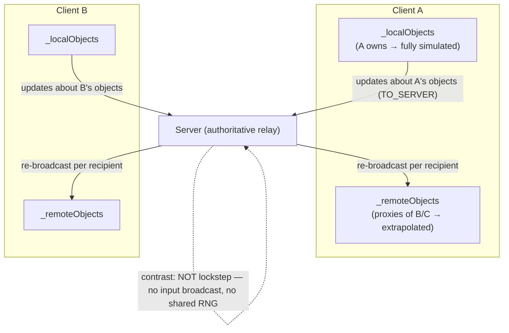
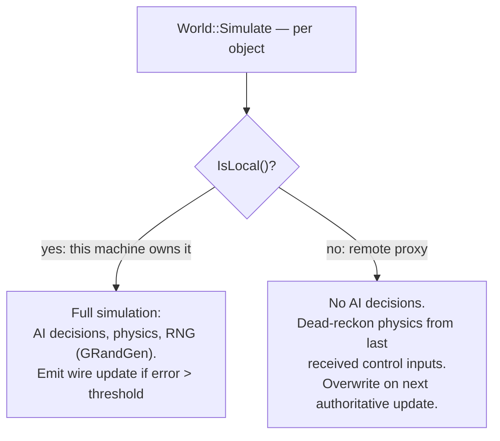
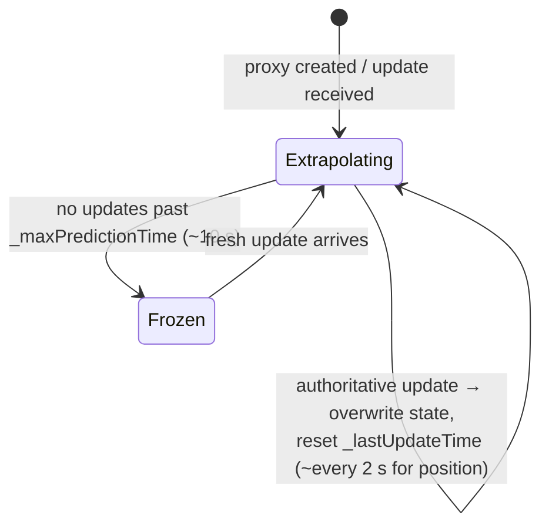
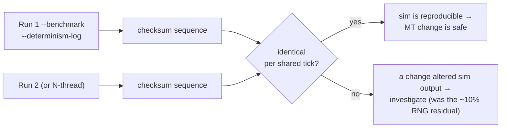
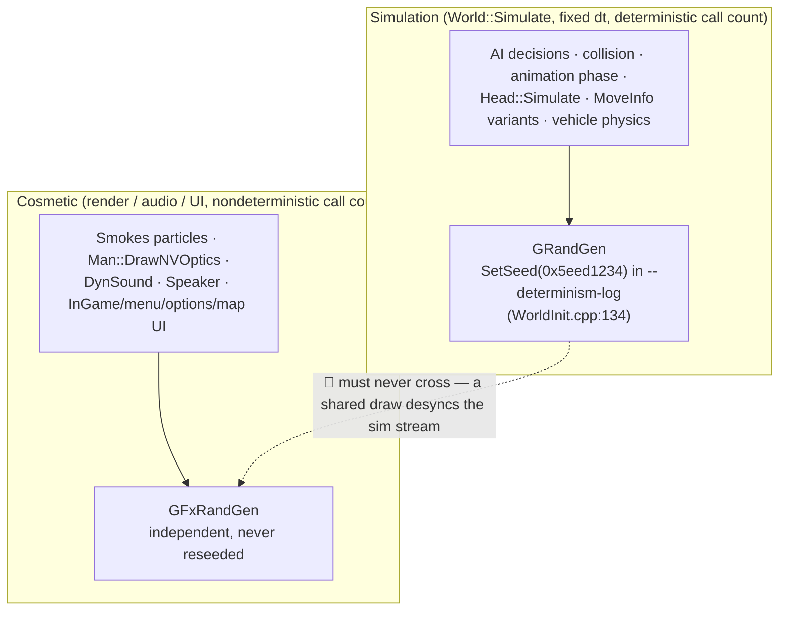

# MP network architecture & determinism (CWR-CE / Poseidon)

How multiplayer sync, object ownership, dead-reckoning, and the `--determinism-log`
gate fit together — and why the sim/cosmetic RNG split (`GRandGen` vs `GFxRandGen`)
matters for the multi-thread work but was never an MP bug in the shipped game.

All file:line citations are against `~/CWR-CE/engine/Poseidon`. Written 2026-07-27.

## TL;DR

- MP is **server-authoritative state relay** (a hub/star), **not** deterministic
  lockstep. Machines synchronize *state*, not *inputs*.
- Every object is **local** (this machine owns and fully simulates it) or **remote**
  (a proxy of an object owned elsewhere). AI/decision code runs **only on the owner**
  (`if (!IsLocal()) return;`). Remote proxies dead-reckon via physics and are
  **overwritten** by authoritative updates.
- Therefore **cross-machine RNG determinism is NOT required for MP**. A client's local
  RNG stream can differ from everyone else's; the owner's authoritative updates correct
  any drift within ~2 s. The shipped 20-year-old game relied on this and was fine.
- The `--determinism-log` **gate** is a *single-machine reproducibility* tool built for
  the multithreading effort (verify 1-thread == N-thread, run == run). It does **not**
  touch the wire protocol. Its value: catch a parallelization change that alters sim
  output. The shared-RNG bug (below) was *gate noise*, not an MP defect.

## 1. Authority model — server-authoritative relay (star), not lockstep

Roles are decided by which pointer is non-null (`NetworkImpl.hpp:34,36`):
`IsServer() = _server != nullptr`, `IsClient() = _client != nullptr`. Clients send
updates about their locally-owned objects **to the server** (`TO_SERVER`,
`NetworkClientActions.cpp:2408`); the server re-broadcasts per recipient
(`NetworkServerMission.cpp:1648`). State is synchronized, not input — there is no
per-frame command-broadcast lockstep loop.

## 2. Object locality — the `IsLocal()` flag drives everything

Locality is a per-object boolean, not a global machine role
(`NetworkObject.hpp:138-140`: `IsLocal()` / `SetLocal()`). Each client keeps
`_localObjects` (this machine simulates them) and `_remoteObjects` (proxies).
Ownership can transfer at runtime (`NMTChangeOwner`,
`NetworkClientOnMessage.cpp:1308-1389`): on gaining ownership the object is
`SetLocal(true)` and moved into `_localObjects`; on losing it, `SetLocal(false)` and
moved back. Identity is `NetworkId{creator, id}` (`NetworkObject.hpp:128-130`).

The sim branches on this: AI decisions early-out on non-owners
(`AIUnitImpl.cpp:80` `if (!IsLocal()) return;`, also 138/142/225/887/902/1907), and
only local objects generate outgoing updates
(`CreateObjectsList` iterates `_localObjects`, `NetworkClientActions.cpp:2373`).

## 3. State sync & dead-reckoning — error-threshold send + delta encoding

The `error += …` accumulation (seen in `SoldierOldAI.cpp:2561-2610`) is a
**send-decision heuristic**: compare the object's *current* state to the *last state
already put on the wire*; send only if it has drifted enough.

- Threshold: `MinErrorToSend = 0.01f` (`Network.cpp:98`; "below this, no update sent").
- Client gate: `NetworkClientActions.cpp:2412,2431` — `error = object->CalculateError(ctx)`
  then send `if (!(error <= MinErrorToSend))` (the `!(<=)` also fires on NaN).
- Server gate: same logic, distance-scaled by `errCoef` (`NetworkServerMission.cpp:1725-1753`).
- **Time-forced resend:** error accrues with elapsed time so a perfectly-tracking object
  is still resent — `CalculateError` adds `ERR_COEF_TIME_POSITION * (Glob.time - msgTime)`
  (`Network.cpp:432-441`); `ERR_COEF_TIME_POSITION = 0.005` ⇒ **position forced ~every 2 s**;
  generic state ~every 5 s (`NetworkImpl.hpp:257-260`).
- **Distance relevance:** `CalculateErrorCoef = min(1, 20²/dist²)` — near objects full
  error, far objects damped (`Network.cpp:443-462`).
- **Encoding:** per-class messages (`NMCUpdatePosition`, `NMCUpdateGeneric`, …,
  `NetworkObject.hpp:27`); soldiers pack wanted aim/head angles into 8-bit quantized
  fields (`EncodeRot8b`/`DecodeRot8b`, `SoldierOldAI.cpp:2499-2525`). Receiver assigns
  decoded values directly into object fields (no interpolation buffer) and stamps
  `_lastUpdateTime`/`_maxPredictionTime` (`Network.cpp:423-427`).

## 4. Remote proxy lifecycle — extrapolate, overwrite, freeze

Remote objects are **not** snapped-and-held; they keep running their own physics from
the last-received "wanted" control inputs (dead-reckoning), guarded by
`CheckPredictionFrozen()` (`Network.cpp:387-394`: `Glob.time > _maxPredictionTime` for
remotes; default window **10 s**, `Network.cpp:380-385`). Correction is
**overwrite-on-next-update**, not visual lerp (no receive-side smoothing found).

This overwrite-within-~2 s is exactly why local RNG drift is invisible to MP: any
divergence a proxy accumulates is erased by the owner's next authoritative update long
before it matters.

## 5. Join-in-progress (JIP) — ordered full-state replay

Gated by mission flag `joinInProgress` (`NetworkServerMission.cpp:316-325`; late joiners
rejected if off, `NetworkServerMsg.cpp:223-232`). `SendWorldState`
(`NetworkServerMission.cpp:917-1008`) does a **6-pass ordered creation replay** (non-AI
objects → AI centers → groups → subgroups → units → commands/waypoints) so parents exist
before children, then replays the current per-class update messages, then queued
`_jipMessages`. Client finishes via `initJIP.sqs` (`NetworkClientOnMessage.cpp:1903`).
`SaveWorldState`/`LoadWorldState` reuse the same replay queue.

## 6. Why RNG determinism is NOT required for MP (the crux)

- AI decisions run **only on the owning machine** (`if (!IsLocal()) return;`). Non-owners
  never re-run those RNG-consuming paths — they receive authoritative results and
  extrapolate physics from control inputs. A different RNG stream on a non-owner cannot
  desync an object it doesn't own, because it isn't deciding that object's behavior.
- The extrapolation horizon is short vs the update cadence (~2 s position resend, 10 s
  hard cutoff). Between updates a proxy only integrates physics from the last "wanted"
  values; it does **not** roll RNG to invent new AI actions for remote objects.
- `GRandGen` in the network layer is only for machine-local, non-lockstep concerns:
  corpse spawn orientation (`NetworkClient.cpp:399`), integrity-check jitter
  (`NetworkServerIntegrity.cpp:477`, `NetworkServerMsg.cpp:777`).

**Conclusion:** MP correctness = authoritative state relay + short-horizon extrapolation,
**not** cross-machine RNG lockstep. This is the opposite of a lockstep RTS. The shared
`GRandGen` (sim + cosmetic) that caused the gate residual was therefore never an MP defect.

## 7. The determinism gate — a single-machine reproducibility tool

`World::Simulate`, `World.cpp:122-174`, under `ENGINE_CONFIG.determinismLog`:

- Forces a fixed 50 Hz step (`deltaT = 0.02f`) so frame timing can't perturb the sim.
- Each tick computes an **order-independent** checksum of dynamic-entity transforms:
  XOR over per-entity FNV-1a of `ID()` + the 12 `WorldTransform()` affine floats, across
  `_vehicles` + `_fastVehicles`; logs `DETERMINISM: tick=… n=… sum=…`.
- Purpose (per its comments): verify a change didn't make the sim non-reproducible —
  specifically that two `--benchmark` runs, or 1-thread vs N-thread once the sim loops
  are parallelized, produce an identical checksum sequence.

It is a **developer regression tool guarding the multithreading refactor**, not a runtime
MP mechanism. "MP-critical" in the comments means "keep the local sim reproducible," which
is a debugging aid; per §6 the live wire sync does not depend on it.

## 8. The two RNG streams — the fix that made the gate trustworthy

`RandomGenerator` values come from `_valueTable[_seed++]` (`randomGen.cpp:22`) — an
argless `RandomValue()`/`Gauss`/`PlusMinus` result depends only on the **global call
count** `_seed`. So *how many times* the RNG is drawn, by *anyone*, shifts the whole
stream. (Positional `RandomValue(x,z[,y])` is stateless — no `_seed++` — and safe.)

**The bug:** cosmetic particle effects (`Smokes.cpp`) drew argless `RandomValue()` a
*nondeterministic number of times per rendered frame* (particle spawn/lifecycle depends
on camera/visibility/frame-timing) from the **same global `GRandGen`** the sim uses. That
desynced the sim RNG stream from tick ~6, and rarely (~10%) shifted an AI soldier's
head-look timer by one tick → different skinned head collision geometry → different
collision response → checksum divergence at tick 872. Client-only (no particles under
`--simulate`); the fixed seed didn't help because the *consumption count*, not the seed,
was the variable.

**The fix:** a second singleton `GFxRandGen` (`randomGen.hpp`) for cosmetic render/audio/UI
effects; the simulation owns `GRandGen` exclusively. `GFxRandGen` is never reseeded to the
sim seed (independent wall-clock stream — correct, since it feeds nothing the sim reads).

**Rule for the MT work:** nothing outside `World::Simulate` may draw from `GRandGen`.
The 2026-07-27 audit swept all 228 stateful sites: ~213 are sim-path (correctly on
`GRandGen`); the cosmetic ones above were moved to `GFxRandGen`. `DynSound`'s draw count
is `prec`/camera-gated — a genuine latent leak masked only by the benchmark's scripted
camera — so moving it shifted the benchmark checksum baseline (still 0/N, now truly
isolated).

## Cross-references

- `PERF-multithread-scope.md` — the MT scope + "RESOLVED (2026-07-27)" bug writeup.
- `DEBUGGING.md` — determinism gate commands + the (dead-end) valgrind heap workflow.
- Memory: `cwr-determinism-shared-rng.md`, `cwr-benchmark-command.md`.

### Caveat (not exhaustively verified)

No explicit receive-side positional smoothing/lerp was found — updates apply by direct
field assignment, corrected by physics extrapolation + overwrite. If a smoothing layer
exists it would be in per-vehicle `Simulate`/`SimulatePost`; Car and Ship were sampled,
not every vehicle type read end to end.
