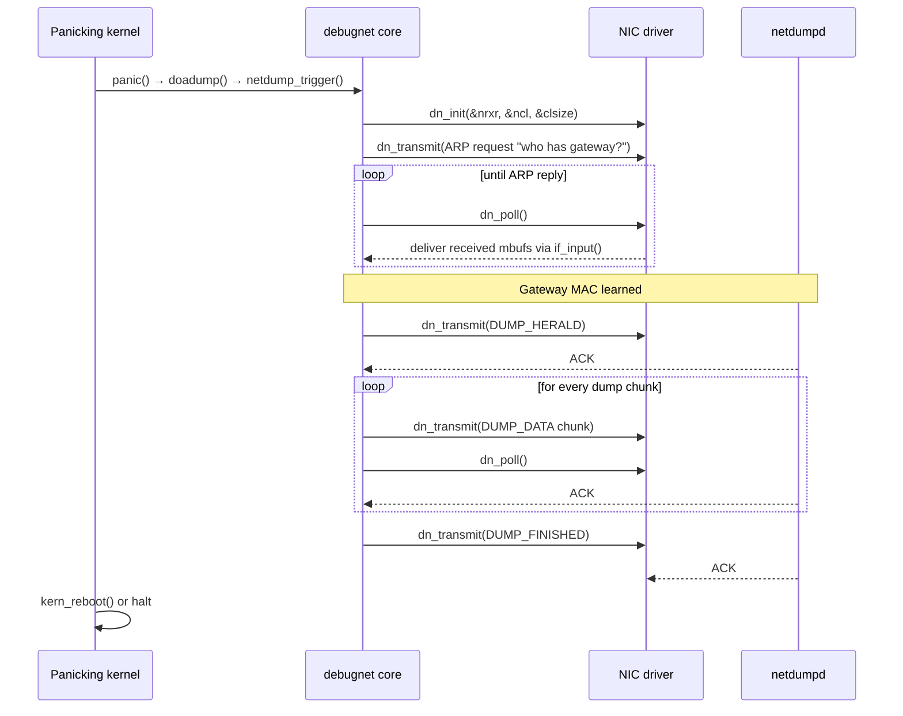
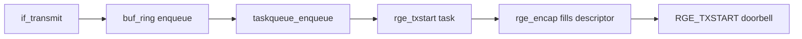
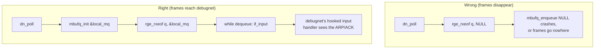
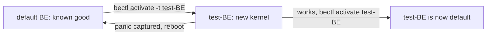
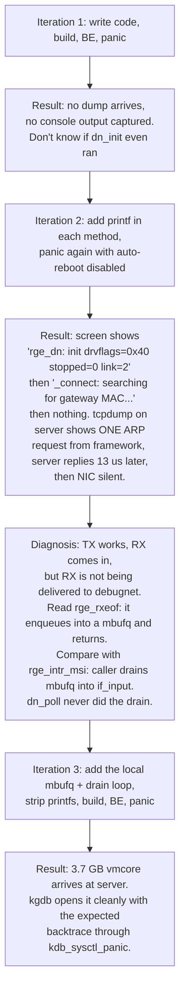

# Adding debugnet/netdump support to a FreeBSD network driver

*A worked example using rge(4), with lessons that apply to any NIC.*

*Author: Claude (Anthropic Claude Opus 4)*

---

## What this document is for

When a FreeBSD kernel panics, all you usually have left is the screen — and
on modern UEFI consoles even that scrolls a 4K backtrace off the top before
you can read it. **netdump** solves this by streaming a full kernel core
dump over the network to a remote `netdumpd(8)` server while the kernel is
half-dead. The catch: the NIC driver has to know how to send and receive
packets *from inside `panic()`*, with interrupts off, taskqueues frozen,
and most of the kernel unsafe to touch.

The **debugnet KPI** is the contract that every driver implements to
participate. This document walks through:

1. The basic concepts — what debugnet is, what constraints panic context
   imposes, what four methods you must implement.
2. How it works — the lifecycle of a panic dump, end to end.
3. A code walk-through of the rge(4) implementation.
4. The testing journey — the workflow we used (Boot Environments, dumpon,
   tcpdump on the server, `printf` instrumentation) and the bug it
   uncovered, which is the most important teaching moment in this doc.

The goal is that after reading it, you can add debugnet to **any other**
NIC driver and know what failure modes to expect.

---

## 1. Basic concepts

### 1.1 The debugnet KPI

`<net/debugnet.h>` defines four function pointers that the network stack
calls when it wants to send a panic dump through your NIC:

| Method        | Called when                              | What it must do                                                |
|---------------|------------------------------------------|----------------------------------------------------------------|
| `dn_init`     | Once, when debugnet is starting up       | Report RX ring sizing so the stack can pre-allocate mbufs      |
| `dn_event`    | On state transitions (round start/end)   | Optional housekeeping; usually empty                           |
| `dn_transmit` | For every outgoing packet (ARP / dump)   | Synchronously enqueue one mbuf to the wire                     |
| `dn_poll`     | Repeatedly while debugnet is waiting     | Reap TX completions, deliver received frames via `if_input()`  |

You wire them in with two macros:

```c
#include <net/debugnet.h>

#ifdef DEBUGNET
DEBUGNET_DEFINE(rge);   /* file scope, near the top */
#endif

/* ... in the attach path, after if_attach: ... */
#ifdef DEBUGNET
    DEBUGNET_SET(sc->sc_ifp, rge);
#endif
```

`DEBUGNET_DEFINE(name)` expands to four `static` function declarations
named `name_debugnet_init`, `name_debugnet_event`, etc. — you implement
those four. `DEBUGNET_SET(ifp, name)` registers the method table on the
ifnet so the framework can find it.

### 1.2 What "panic context" actually means

This is the part that catches most people. When `dn_transmit` and
`dn_poll` run, the kernel is in a very restricted state:

- **No interrupts.** The NIC's IRQ will not fire. You must not wait for
  one.
- **No taskqueues.** Anything queued through `taskqueue_enqueue()` will
  never run. A driver that hands TX off to a deferred task is dead in the
  water here.
- **No sleeping.** No `msleep`, no `tsleep`, no blocking mutex acquisition
  that could deadlock with whatever was holding a lock when the panic
  fired.
- **One CPU.** Other cores have been stopped.
- **The mbuf allocator and bus_dma still work** — debugnet relies on this
  and pre-arranges enough headroom.

So the rule is: every operation must be **synchronous and polled**. If
your driver normally writes to a TX ring and waits for a "TX done"
interrupt, in debugnet mode you write to the ring, kick the doorbell, and
later you poll for completion in `dn_poll`. Same for RX — you don't wait
for "RX available" interrupts, you just check the descriptor ring every
time `dn_poll` is called.

### 1.3 The shape of a netdump session



Two pieces of this are worth remembering:

- **debugnet does its own ARP.** It sends an ARP request and parses the
  reply itself; the regular kernel ARP table is not consulted. So
  `dn_poll` *must* deliver received frames somewhere debugnet can see
  them — that means `if_input()`, because debugnet has hooked the ifnet's
  input handler.
- **Every chunk is acknowledged.** netdump is request/response, not
  fire-and-forget. If your `dn_poll` drops RX frames silently, the dump
  stalls waiting for the first ACK and times out.

---

## 2. How it works inside the driver

### 2.1 The TX path

In normal operation, `rge(4)` (like many modern drivers) sends packets
asynchronously:



In panic context, steps B–D are not allowed (taskqueues are dead). The
debugnet TX path collapses them into one synchronous call:


That's all `rge_debugnet_transmit` does — it checks there's room in the
TX ring, calls the same `rge_encap()` the production path uses, and pokes
the same doorbell register. No locks, no taskqueue, no buf_ring.

### 2.2 The RX path — and the easy mistake

Now the bit that bit me, and that I think bites everyone.

In `rge(4)`, `rge_rxeof()` does **not** call `if_input()` itself. It
walks the RX descriptor ring, pulls mbufs off, and **enqueues them into a
caller-provided `struct mbufq`**. The interrupt handler is responsible for
draining that mbufq into `if_input()` *after dropping the driver lock*:

```c
/* sys/dev/rge/if_rge.c, rge_intr_msi(): */
mbufq_init(&rx_mq, RGE_RX_LIST_CNT);
... rge_rxeof(q, &rx_mq); ...
RGE_UNLOCK(sc);
while ((m = mbufq_dequeue(&rx_mq)) != NULL) {
    sc->sc_drv_stats.recv_input_cnt++;
    if_input(sc->sc_ifp, m);
}
```

This pattern — **rxeof enqueues, the caller drains** — is common in
modern FreeBSD drivers because it lets you do the lock-sensitive ring
work under the driver mutex and the stack-touching `if_input()` call
without it. It's good design for the production path.

It's also a footgun for debugnet, because:



**This is exactly the bug we hit.** First version of `rge_debugnet_poll`
called `rge_rxeof(q, NULL)`. The first ARP went out, the gateway replied
(visible on the server's tcpdump), but the dump never started — the reply
mbuf was never delivered to debugnet's input hook. The fix is six lines:

```c
struct mbufq rx_mq;
struct mbuf *m;
...
mbufq_init(&rx_mq, RGE_RX_LIST_CNT);
(void)rge_rxeof(q, &rx_mq);
while ((m = mbufq_dequeue(&rx_mq)) != NULL)
    if_input(ifp, m);
```

> **Generalized rule:** when porting debugnet to a new driver, find where
> the **interrupt handler** delivers RX frames to the stack. Whatever it
> does between "ring is drained" and "frames are at if_input" is what
> your `dn_poll` has to reproduce. If that step is implicit (rxeof calls
> if_input itself) you get it for free; if it's explicit (rxeof fills a
> mbufq and the caller drains), you have to copy the drain into dn_poll.

---

## 3. Code walk-through: the rge(4) implementation

The full diff is 87 lines added to `sys/dev/rge/if_rge.c`. Here it is in
chunks.

### 3.1 Header and registration

```c
#include <net/debugnet.h>

#ifdef DEBUGNET
DEBUGNET_DEFINE(rge);
#endif
```

`DEBUGNET_DEFINE` declares the four static method symbols. `DEBUGNET` is
defined globally when `options DEBUGNET` is in the kernel config —
GENERIC has it, so 99% of users get it automatically. The `#ifdef`
keeps custom kernels without DEBUGNET (rare, but possible) building
cleanly.

Registration goes in the attach path, right after `if_setsendqready`:

```c
#ifdef DEBUGNET
    DEBUGNET_SET(sc->sc_ifp, rge);
#endif
```

### 3.2 `dn_init` — sizing

```c
static void
rge_debugnet_init(if_t ifp, int *nrxr, int *ncl, int *clsize)
{
    struct rge_softc *sc;

    sc = if_getsoftc(ifp);
    RGE_LOCK(sc);
    *nrxr = RGE_RX_LIST_CNT;        /* number of RX rings worth of mbufs */
    *ncl = DEBUGNET_MAX_IN_FLIGHT;  /* extra clusters for in-flight reqs */
    *clsize = MCLBYTES;             /* cluster size (2 KiB) */
    RGE_UNLOCK(sc);
}
```

`debugnet` uses these three numbers to allocate a private mbuf pool
*before* the panic-time path runs, so `m_get*()` can succeed without
contending with the (potentially corrupted) regular allocator. Match the
RX ring depth, set `*ncl` to `DEBUGNET_MAX_IN_FLIGHT`, and set `*clsize`
to whatever cluster size your RX path expects (`MCLBYTES` for standard
2 KiB; jumbo-frame drivers may want `MJUMPAGESIZE`).

### 3.3 `dn_event` — usually nothing

```c
static void
rge_debugnet_event(if_t ifp __unused, enum debugnet_ev event __unused)
{
}
```

Some drivers use this to flush hardware state at the start/end of each
debugnet round (e.g., disable RSS, force a single queue). rge(4) is
single-queue and needs no special handling, so this is empty. Don't omit
the function — `DEBUGNET_DEFINE` requires it to exist.

### 3.4 `dn_transmit` — synchronous send

```c
static int
rge_debugnet_transmit(if_t ifp, struct mbuf *m)
{
    struct rge_softc *sc;
    struct rge_queues *q;
    int idx, free, used;

    sc = if_getsoftc(ifp);
    if ((if_getdrvflags(ifp) & IFF_DRV_RUNNING) == 0 ||
        sc->sc_stopped)
        return (EBUSY);

    q = sc->sc_queues;
    idx = q->q_tx.rge_txq_prodidx;
    free = q->q_tx.rge_txq_considx;
    if (free <= idx)
        free += RGE_TX_LIST_CNT;
    free -= idx;
    if (free < RGE_TX_NSEGS + 2)
        return (ENOBUFS);

    used = rge_encap(sc, q, m, idx);
    if (used <= 0) {
        m_freem(m);
        return (ENOBUFS);
    }

    idx += used;
    if (idx >= RGE_TX_LIST_CNT)
        idx -= RGE_TX_LIST_CNT;
    q->q_tx.rge_txq_prodidx = idx;

    RGE_WRITE_2(sc, RGE_TXSTART, RGE_TXSTART_START);
    return (0);
}
```

Three things to notice:

1. **The early `IFF_DRV_RUNNING` / `sc_stopped` check.** Returning
   `EBUSY` lets debugnet retry; returning `ENXIO` would abort the dump.
2. **No locking.** Single CPU, no concurrent callers — taking the driver
   mutex here is unnecessary and can deadlock if the panic happened while
   that mutex was held.
3. **Reuse `rge_encap` and the existing TX descriptor layout.**
   `rge_debugnet_transmit` is intentionally a thin wrapper; do not
   duplicate the descriptor-fill code, you'll desync from the production
   path the first time someone updates it.

### 3.5 `dn_poll` — drain TX, deliver RX

```c
static int
rge_debugnet_poll(if_t ifp, int count __unused)
{
    struct rge_softc *sc;
    struct rge_queues *q;
    struct mbufq rx_mq;
    struct mbuf *m;

    sc = if_getsoftc(ifp);
    if ((if_getdrvflags(ifp) & IFF_DRV_RUNNING) == 0 ||
        sc->sc_stopped)
        return (EBUSY);

    q = sc->sc_queues;
    rge_txeof(q);
    mbufq_init(&rx_mq, RGE_RX_LIST_CNT);
    (void)rge_rxeof(q, &rx_mq);
    while ((m = mbufq_dequeue(&rx_mq)) != NULL)
        if_input(ifp, m);
    return (0);
}
```

This is the heart of it. Every call:

1. `rge_txeof(q)` — recycle completed TX descriptors so the next
   `dn_transmit` finds free slots.
2. `rge_rxeof(q, &rx_mq)` — pull whatever the NIC has placed into the RX
   ring since last call into a *local* mbufq.
3. Drain that mbufq into `if_input()` so debugnet's hooked handler sees
   the frames.

The local mbufq lifetime is one `dn_poll` call; nothing escapes the
function.

---

## 4. The testing journey

This is where the rest of the time goes. Your code can be flawless and
still not produce a dump because the test harness is wrong, the dump
configuration is wrong, the network is wrong, or — as in our case — a
subtle behavioral bug only shows up on the wire.

### 4.1 The setup

Two machines on the same Ethernet subnet, **no NAT, no router between
them**:

- **framework** (192.168.100.7) — Framework 13 laptop, Realtek RTL8126
  2.5GbE, the panic victim.
- **bigone** (192.168.100.2) — server running `netdumpd(8)` listening on
  UDP/20023, dumps written to `/var/crash/framework/`.

`netdumpd` only needs to be reachable; it doesn't have to share an L2
segment with the client, but it makes diagnosis easier because you can
just `tcpdump -i ix0 host 192.168.100.7` and see everything.

### 4.2 Boot Environments — the safety harness

Testing a panic-time code path means rebooting into the test kernel
*intentionally*. ZFS Boot Environments are the right tool:

```sh
# create a BE from the current root
bectl create rge-debugnet
# clone it as the next-boot target without making it permanent
bectl mount rge-debugnet /mnt
make installkernel DESTDIR=/mnt KERNCONF=GENERIC
bectl umount rge-debugnet
bectl activate -t rge-debugnet   # -t = temporary, one boot only
reboot
```

Key property of `-t`: if the new kernel panics on boot before you get to
configure dumpon, the *next* reboot falls back to your previous BE
automatically. You cannot brick yourself this way.



### 4.3 Configuring the dump

After booting the test kernel:

```sh
# tell the kernel where to dump
dumpon -v -s 192.168.100.2 -c 192.168.100.7 -g 192.168.100.2 igc0
# or for our case (rge0 on framework):
dumpon -v -s 192.168.100.2 -c 192.168.100.7 -g 192.168.100.2 rge0
# disable auto-reboot so you can READ the screen if it fails
sysctl kern.panic_reboot_wait_time=-1
```

`-g` is the gateway MAC to ARP for. On the same subnet you can use the
server's own IP — that just means "ARP the server directly".
`panic_reboot_wait_time=-1` means halt at the panic prompt forever; this
is essential during debugging because UEFI consoles don't scroll.

On the server, before you panic:

```sh
service netdumpd onestart
tcpdump -i ix0 -w /tmp/panic.pcap host 192.168.100.7
```

Capture both ARP and the netdump traffic. ARP is the canary — if the
client's ARP request is on the wire and the server's reply is on the
wire and *the dump still doesn't start*, the bug is in your `dn_poll`.

### 4.4 Triggering the panic

```sh
sysctl debug.kdb.panic=1
```

Watch the screen and the server's tcpdump simultaneously.

### 4.5 The diagnostic loop we actually walked

Three iterations:



The instrumentation that broke the case open was just:

```c
printf("rge_dn: init drvflags=0x%x stopped=%d link=%d\n",
    if_getdrvflags(ifp), sc->sc_stopped, sc->sc_link_state);
printf("rge_dn: init returning nrxr=%d ncl=%d clsize=%d\n",
    *nrxr, *ncl, *clsize);
printf("rge_dn: tx len=%d ifrunning=%d\n",
    m->m_pkthdr.len, !!(if_getdrvflags(ifp) & IFF_DRV_RUNNING));
printf("rge_dn: poll\n");
```

Combined with `kern.panic_reboot_wait_time=-1` so the screen actually
stayed put, this told us:

- `dn_init` was being called → registration is correct.
- `dn_transmit` was being called → debugnet thinks the link is up.
- `dn_poll` was being called too — but no frames were ever observed
  passing through it to `if_input`.

The tcpdump on the server confirmed the missing piece: the ARP reply was
*on the wire* and reaching the framework's NIC. So the bug was strictly
between "frame in RX ring" and "frame at if_input". That's exactly the
mbufq drain.

### 4.6 Validation

```sh
# on bigone, after the panic
ls -l /var/crash/framework/
# vmcore.192.168.100.7.0 = 3902087168 bytes
# info.192.168.100.7.0   = "Header Parity Check: Pass", "Dump complete"

kgdb /boot/kernel/kernel /var/crash/framework/vmcore.192.168.100.7.0
(kgdb) bt
# #0  doadump
# #1  kern_reboot
# #2  vpanic
# #3  panic
# #4  kdb_sysctl_panic
# #5  sysctl_root_handler_locked
# #6  sysctl_root
# #7  userland_sysctl
```

That's the canonical panic backtrace for `sysctl debug.kdb.panic=1`.
3.7 GB matches the laptop's RAM. Header parity passes. We're done.

---

## 5. Generalizing — a checklist for your driver

When you sit down to add debugnet to a new NIC driver, work through this
list:

1. **Find the production interrupt handler.** Identify exactly where it
   calls `rge_rxeof` / your equivalent, and exactly where the resulting
   mbufs get into `if_input()`. That is the pattern your `dn_poll` must
   reproduce.
2. **Find the production TX function.** Identify the inner-most function
   that fills a descriptor and writes the doorbell. That is what your
   `dn_transmit` should call. Skip every layer above it (buf_ring,
   taskqueue, send queue) — those are the parts that don't work in panic
   context.
3. **Check for taskqueues, callouts, sleeps anywhere in the path you're
   reusing.** If any are present, you have to inline a synchronous
   alternative.
4. **Pre-flight on a live machine.** Make sure regular traffic works on
   the new kernel. If `iperf3` doesn't run, dumpon won't either.
5. **Configure dumpon, set `kern.panic_reboot_wait_time=-1`, start
   `tcpdump` on the server, panic.** If the dump fails:
   - **No ARP on the wire** → `dn_transmit` not running, or running but
     not poking the doorbell. Check the early `IFF_DRV_RUNNING` guard
     isn't returning EBUSY by mistake.
   - **ARP on the wire, no reply** → server-side problem. Wrong subnet,
     firewall, no gateway.
   - **ARP request and reply on the wire, dump doesn't start** → this is
     the rge bug. RX frames are reaching the NIC but not `if_input()`.
     Re-check your `dn_poll` against the production interrupt handler's
     RX delivery path.
   - **Dump starts, then stalls partway** → flow control or descriptor
     leak in `dn_transmit`. Check that `dn_poll` is correctly recycling
     completed TX descriptors with the equivalent of `rge_txeof`.
6. **Once it works, strip every diagnostic `printf`.** Debugnet path
   `printf` calls go to the framebuffer in panic context and slow the
   dump down significantly. Production code should be silent.

The total addition for rge(4) was 87 lines. Every working
debugnet-capable driver in `sys/dev/` is in the same ballpark. The hard
part is not the volume of code — it's making sure your `dn_poll`
mirrors the interrupt handler's RX delivery, and validating it against
real hardware with a server you can `tcpdump` on the other side.

---

## Full patch

The complete commit as a `git format-patch` file is in this directory:
[`rge.debugnet.patch`](rge.debugnet.patch). Apply with `git am
rge.debugnet.patch` from the top of the FreeBSD source tree.

## References

- `sys/net/debugnet.h`, `sys/net/debugnet.c` — the KPI and its core.
- `sys/dev/re/if_re.c` — the closest reference driver; rge is its
  modern sibling.
- `sys/dev/ix/if_ix.c`, `sys/dev/igc/if_igc.c` — Intel examples with
  multi-queue handling for `dn_event`.
- `share/man/man9/debugnet.9` — the manual page.
- `usr.sbin/netdumpd/` — the server.
- `sbin/dumpon/dumpon.8` — client-side configuration.
