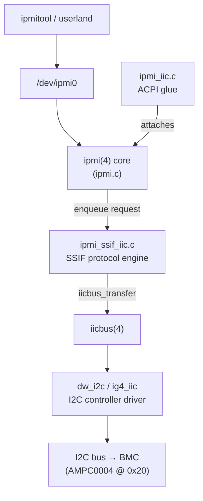
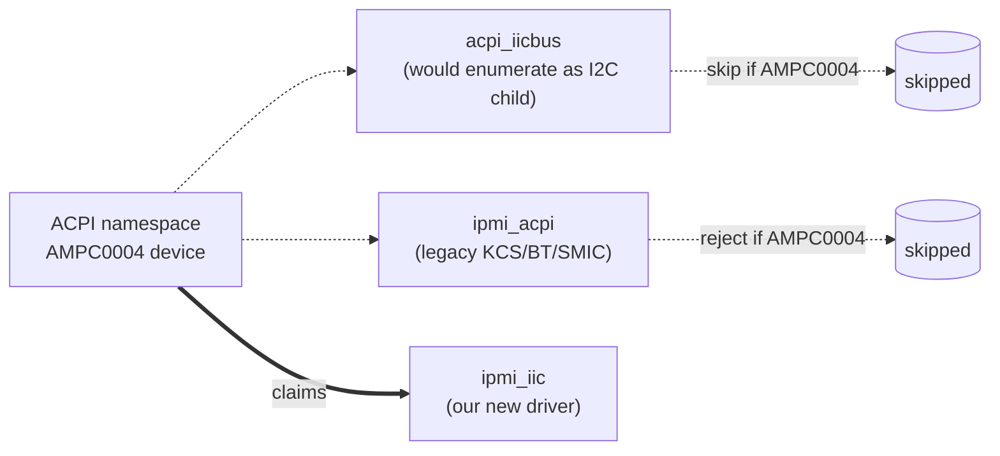
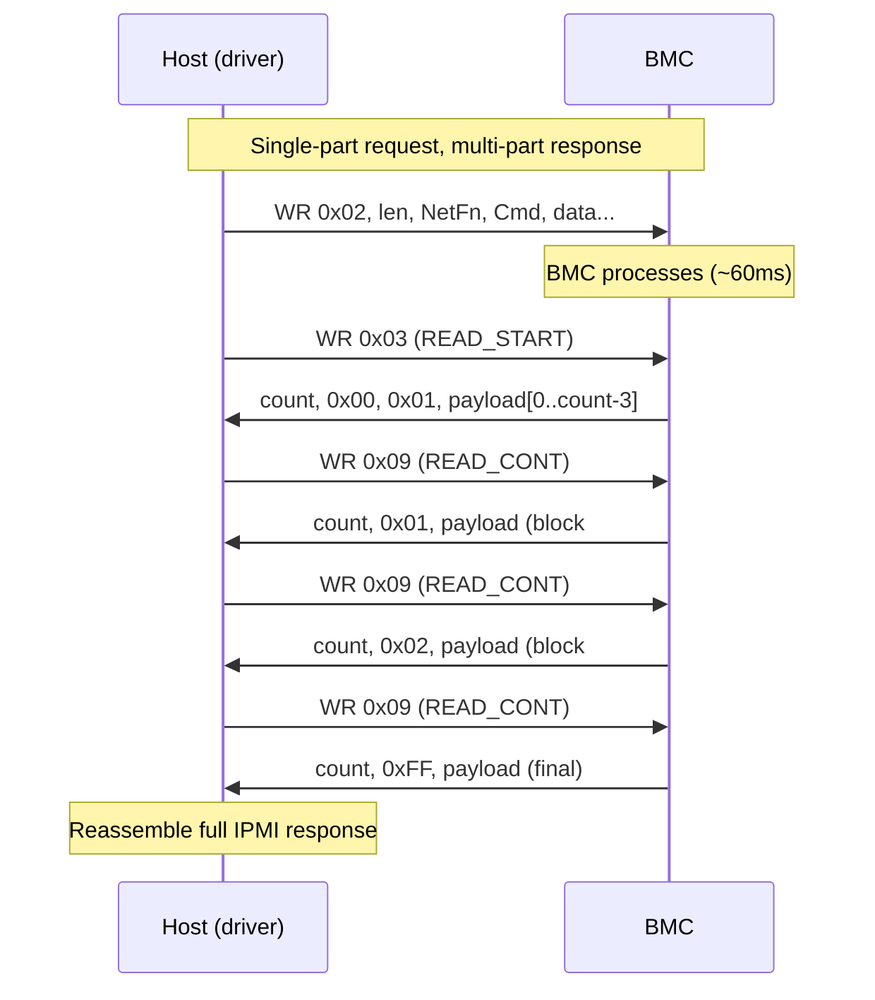
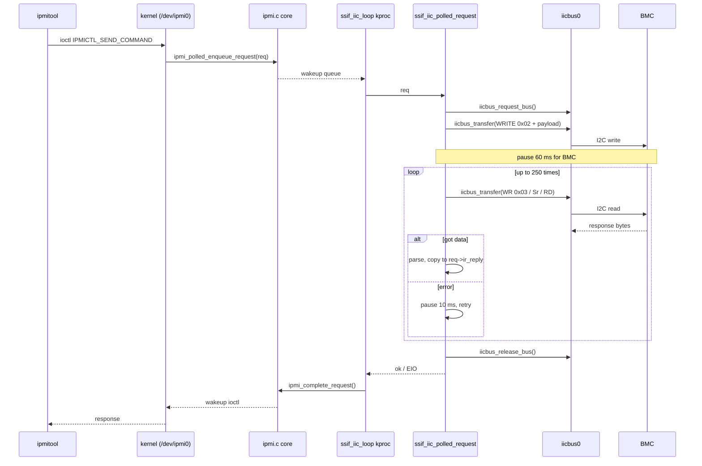

# Writing a FreeBSD IPMI SSIF Driver: An Educational Walkthrough

> **Status: DRAFT — NOT PEER-REVIEWED.** This document was written by
> Claude (Anthropic) as a side product of agent-assisted work and
> reviewed only by Olivier Cochard (whose C/kernel experience is
> limited). It is *plausible* but not *validated by FreeBSD kernel
> maintainers*. Factual errors found in companion material from the
> same workflow suggest analogous errors may remain here. Treat it as
> a starting point for your own reading, not a finished tutorial.

This document explains, from first principles, how the FreeBSD IPMI-over-I2C
(SSIF) driver for the Ampere Altra ARM64 platform was built. It is written so
that a developer who has never touched IPMI, the FreeBSD `iicbus` layer, or
ACPI device enumeration can use it as a roadmap to write an equivalent driver
for a similar bus-bridged peripheral.

The final, working patch lives at [ipmi.ssif.patch](ipmi.ssif.patch).
This document is the conceptual explanation behind that patch.

---

## 1. Background: What problem are we solving?

### 1.1 IPMI in one paragraph

IPMI (Intelligent Platform Management Interface) is the "out-of-band" channel
that lets system software talk to the **BMC** (Baseboard Management
Controller) — the small auxiliary processor on a server motherboard that
manages fans, sensors, power, and remote console. The host CPU sends
**request messages** (NetFn + Cmd + data) and the BMC returns
**response messages** (NetFn + Cmd + completion code + data).

### 1.2 The four IPMI transports

IPMI defines several transport mechanisms between the host and the BMC.
FreeBSD historically supported the three x86-style ones:

| Transport | Bus / mechanism                              | Driver file        |
|-----------|----------------------------------------------|--------------------|
| KCS       | I/O ports, polled handshake                  | `ipmi_kcs.c`       |
| SMIC      | I/O ports, slightly different handshake      | `ipmi_smic.c`      |
| BT        | "Block Transfer" via I/O ports               | `ipmi_bt.c`        |
| **SSIF**  | **SMBus/I2C, byte-oriented framed protocol** | `ipmi_ssif.c`      |

ARM64 server platforms (Ampere Altra in our case) typically expose the BMC
**only over SSIF**, riding on a real I2C controller. There are no x86 I/O
ports on ARM, so KCS/SMIC/BT cannot be used.

### 1.3 Why the existing `ipmi_ssif.c` wasn't enough

FreeBSD already had `ipmi_ssif.c` — but it sits on top of the **SMBus** layer
(`smbus(4)`), which abstracts the bus into "byte/word/block" SMBus
transactions. Real SSIF on Ampere needs:

1. **Direct I2C transfers** with `IIC_M_NOSTOP` between the write and the
   read (a "repeated start"), which is awkward to express through SMBus.
2. **Multi-part reads** with a custom block-numbering scheme not present in
   SMBus.
3. **Attachment via ACPI**, not via SMBus enumeration.

So we needed a new, parallel driver: `ipmi_iic` + `ipmi_ssif_iic.c`.

---

## 2. The big picture: where the driver fits



Two layers of "driver" are needed:

* **`ipmi_iic.c`** — the *attachment glue*. It is a tiny ACPI driver whose
  only job is: "I claim the AMPC0004 ACPI device, find the right `iicbus`,
  and hand both to the SSIF engine and the IPMI core."
* **`ipmi_ssif_iic.c`** — the *protocol engine*. Given an `iicbus` handle and
  a slave address, it can encode/decode SSIF messages and pump requests
  through the I2C controller.

Splitting these two responsibilities is a common FreeBSD pattern (compare
`ipmi_acpi.c` + `ipmi_kcs.c`, or `pci_ohci.c` + `ohci.c`). It keeps the
hardware-discovery code separate from the protocol code.

---

## 3. Lesson #1: ACPI enumeration is a battle, not a query

This is the single most important lesson from the project. When a peripheral
is described in ACPI **and** it sits on an I2C bus, FreeBSD has *two*
enumerators that both think the device belongs to them:

* `acpi_iicbus` walks the I2C bus and creates an `iicbus` child for every
  ACPI device that has an `I2cSerialBus` resource.
* The "other" driver (here, our `ipmi_iic`) wants to attach to the device on
  the **acpi0** bus directly, so it can call `acpi_get_handle()` and use
  ACPI methods like `_ADR`.

If both enumerators run unchanged, you see the well-known message:

```
iicbus0: <unknown card> at addr 0x10
```

…meaning `acpi_iicbus` claimed the device first and your driver never gets
a chance to probe it.

### The fix

Two surgical edits, both in the patch:

**(a)** In `sys/dev/iicbus/acpi_iicbus.c`, skip AMPC0004 during iicbus
enumeration so it stays a child of `acpi0`:

```c
/* Skip AMPC0004 devices - they should attach via ipmi_iic on acpi bus */
if (acpi_MatchHid(handle, "AMPC0004"))
        return (AE_OK);
```

**(b)** In `sys/dev/ipmi/ipmi_acpi.c`, *reject* AMPC0004 in the existing
ACPI IPMI probe so the legacy KCS-style code doesn't grab it:

```c
if (handle != NULL && acpi_MatchHid(handle, "AMPC0004"))
        return (ENXIO);
```

Then `ipmi_iic.c` is free to claim it.



**Generalization:** any time you write a driver for an ACPI-described device
that lives on a sub-bus, search for *every* enumerator that might also bind
it, and add an explicit hand-off. Two drivers silently fighting over the
same node is the canonical "device disappears" bug.

---

## 4. Lesson #2: Understand the SSIF wire protocol before you code

SSIF is more than "send some bytes, read some bytes." It is documented in
**IPMI Specification v2.0, section 12** ("SSIF Interface"). The key facts:

### 4.1 The four SMBus commands SSIF uses

| Code  | Meaning                       | Direction             |
|-------|-------------------------------|-----------------------|
| 0x02  | `WRITE_SINGLE`                | Host → BMC, ≤32 bytes |
| 0x06  | `WRITE_START` (multi-part)    | Host → BMC, first chunk |
| 0x07  | `WRITE_CONT` / `WRITE_END`    | Host → BMC, later chunks |
| 0x03  | `READ_START`                  | BMC → Host, first chunk |
| 0x09  | `READ_CONT`                   | BMC → Host, later chunks |

### 4.2 Single-part write (the easy case)

```
[ slave_addr | W ] [ 0x02 (cmd) ] [ len ] [ NetFn/LUN ] [ Cmd ] [ data... ]
```

That is one I2C write transaction. Almost every IPMI request the host sends
fits in 32 bytes, so this is the path the v5 driver uses by default.

### 4.3 Multi-part read (the not-so-easy case)

A response longer than ~30 bytes (e.g. an SDR record, or `mc info`) does not
fit in a single SMBus block. SSIF uses a **two-byte magic header** followed
by **block sequence numbers**:

```
First block (READ_START 0x03):
    [ count ] [ 0x00 ] [ 0x01 ] [ ...payload start... ]
                ^^^^^^^^^^^^^^ "this is multi-part"

Continuation blocks (READ_CONT 0x09):
    [ count ] [ blocknum ] [ ...payload... ]   ; blocknum = 1, 2, 3, ...

Final block:
    [ count ] [ 0xFF ] [ ...last payload... ]  ; 0xFF = end marker
```

The protocol engine in `ipmi_ssif_iic.c` implements exactly this state
machine in `ssif_iic_read()`.



### 4.4 The IPMI message format inside the SSIF payload

After you strip SSIF framing, the bytes are still IPMI:

```
Request : [ NetFn/LUN ] [ Cmd ] [ request data ... ]
Response: [ NetFn/LUN ] [ Cmd ] [ Completion Code ] [ response data ... ]
```

The IPMI core (`ipmi.c`) gives you a `struct ipmi_request` already filled in
with `ir_addr` (which is NetFn/LUN), `ir_command`, and `ir_request[]`, and
expects you to fill in `ir_compcode`, `ir_reply[]`, and `ir_replylen`. The
SSIF engine is just a translator between the two framings.

---

## 5. Lesson #3: I2C in FreeBSD is not SMBus, and that matters

### 5.1 Two abstraction layers

FreeBSD has two stacked I2C abstractions:

* **`iicbus(9)`** — raw I2C transfers. You build an array of
  `struct iic_msg` and call `iicbus_transfer(iicbus, msgs, nmsgs)`. You
  control flags like `IIC_M_WR`, `IIC_M_RD`, `IIC_M_NOSTOP`.
* **`smbus(9)`** — pre-canned SMBus transactions (`smbus_quick`,
  `smbus_writeb`, `smbus_bwrite`, …). Convenient, but it forces a particular
  framing and doesn't expose the "repeated-start, no stop in between" needed
  by SSIF reads.

The **first** version of this driver tried to ride `smbus(9)` (mirroring the
existing `ipmi_ssif.c`). It never worked reliably because the SMBus block
read primitive on top of `dw_i2c` issued a STOP between the command byte
and the read, which the BMC interpreted as the end of the transaction.

Going **directly to `iicbus(9)`** fixes this:

```c
struct iic_msg msgs[2];
uint8_t cmdbuf[1] = { SSIF_READ_START };
uint8_t buf[SSIF_BLOCK_SIZE + 1];

msgs[0] = (struct iic_msg){
    .slave = slave_addr, .flags = IIC_M_WR | IIC_M_NOSTOP,
    .len = 1, .buf = cmdbuf
};
msgs[1] = (struct iic_msg){
    .slave = slave_addr, .flags = IIC_M_RD,
    .len = sizeof(buf), .buf = buf
};

error = iicbus_transfer(iicbus, msgs, 2);
```

The crucial flag is `IIC_M_NOSTOP` on the write: it tells the controller to
issue a **repeated start** (Sr) instead of STOP-then-START between the two
messages. That is the standard SMBus block-read framing on the wire, but
expressed at the I2C primitive level so we can guarantee it happens.

### 5.2 The `iicbus_transfer()` argument that bit us hard

A small bug — the kind that takes a day to find:

```c
/* WRONG — passes the IPMI device to the I2C layer */
error = iicbus_transfer(dev, msgs, 2);

/* RIGHT — pass the iicbus device */
error = iicbus_transfer(iicbus, msgs, 2);
```

`dev` is the `ipmi0` device (a child of `acpi0`). `iicbus` is the actual
`iicbus0` device. The first form returns `ENXIO` ("no such device") because
the I2C framework can't find a controller behind the IPMI node.

**Generalization:** when you bridge two buses, *cache the bus device handle
explicitly* in your softc, give it a name like `sc->ipmi_ssif_iicbus`, and
never substitute your own `dev` for it.

### 5.3 The bus-speed gotcha

`ig4_iic.c` defaulted to **fast mode (400 kHz)**. The Ampere BMC's SSIF
engine is reliable only at **standard mode (100 kHz)**. The patch flips the
default back to standard mode. Section 12 of the IPMI v2.0 spec mandates
100 kHz, so this is per-spec, but easy to miss.

If you write an analogous driver, *always* check what speed the I2C
controller default is, and force standard mode unless you have a reason not
to. SSIF responses can run hundreds of bytes long; speed gains you almost
nothing and timing margin is everything.

---

## 6. Lesson #4: Locking and threading model

The IPMI core (`ipmi.c`) is built around a **request queue** and an
**interface-supplied worker thread**. The contract for a transport driver
like ours is:

1. Provide an `ipmi_startup()` callback that creates a kproc.
2. The kproc runs a loop that calls `ipmi_dequeue_request()`,
   processes one request synchronously, and calls
   `ipmi_complete_request()`.
3. While processing, the kproc must **drop** the IPMI lock around any
   I/O that may sleep (which `iicbus_transfer()` definitely does).

```c
static void
ssif_iic_loop(void *arg)
{
    struct ipmi_softc *sc = arg;
    struct ipmi_request *req;

    IPMI_LOCK(sc);
    while ((req = ipmi_dequeue_request(sc)) != NULL) {
        IPMI_UNLOCK(sc);          /* must drop before I/O */
        if (ssif_iic_polled_request(sc, req))
            req->ir_error = 0;
        else
            req->ir_error = EIO;
        IPMI_LOCK(sc);
        ipmi_complete_request(sc, req);
    }
    IPMI_UNLOCK(sc);
    kproc_exit(0);
}
```

There is one more subtlety: starting the kproc **during `attach()`** races
with the I2C controller's own initialization. The fix is to defer it via
`config_intrhook_oneshot()`, which fires right after all drivers have
attached:

```c
static int
ssif_iic_startup(struct ipmi_softc *sc)
{
    config_intrhook_oneshot(ssif_iic_startup_hook, sc);
    return (0);
}
```

**Generalization:** if your driver depends on *another* driver being fully
up (here, the I2C controller), don't do that work in `attach()`. Use
`config_intrhook_oneshot()` to push it after the boot-time attach pass.

---

## 7. Lesson #5: Bugs you will only see at scale

The following bug only surfaced when running `ipmitool sdr list full`,
which makes ~133 IPMI requests in a row:

```
ipmi0: Single-part overflow: 7 > 0
ipmi0: Single-part overflow: 7 > 0
... (hundreds of times) ...
```

The buggy code was a read-retry loop:

```c
resp_len = sizeof(response);                       /* set ONCE */
for (retries = 0; retries < 250; retries++) {
    error = ssif_iic_read(... &resp_len);          /* zeroes resp_len */
    if (error == 0) break;
    pause("ssif", (10 * hz) / 1000);
}
```

`ssif_iic_read()` writes the actual length back into `*resp_len`. On a retry
attempt, the buffer-size argument was already zero, so the next read thought
the buffer had zero capacity and rejected even a 7-byte response.

The fix is one line in the right place:

```c
for (retries = 0; retries < 250; retries++) {
    resp_len = sizeof(response);                   /* reset every retry */
    error = ssif_iic_read(... &resp_len);
    if (error == 0) break;
    pause("ssif", (10 * hz) / 1000);
}
```

**Generalization:** any function with a "size in / size out" parameter is a
landmine inside a retry loop. Make sure every iteration starts from a known
state — both the input parameters *and* the output buffer if it's shared.

---

## 8. Lesson #6: ACPI address conventions are a mess

ACPI's `_ADR` for an I2C-connected device returns the **7-bit** I2C slave
address. But various platforms (and various tools, and various Linux
versions) have historically used the **8-bit shifted** address. The patch
defends against this with a small probe:

```c
addrs_to_try[0] = slave_addr;          /* as reported */
addrs_to_try[1] = slave_addr >> 1;     /* 8-bit → 7-bit */
addrs_to_try[2] = slave_addr << 1;     /* 7-bit → 8-bit */

for (i = 0; i < 3; i++) {
    if (addrs_to_try[i] == 0 || addrs_to_try[i] > 0x7F) continue;
    if (try_write_at(addrs_to_try[i]) == 0) {
        sc->ipmi_ssif_slave_addr = addrs_to_try[i];
        break;
    }
}
```

On Ampere Altra, `_ADR` returns `0x10`, but the BMC actually answers at
`0x20`. The auto-probe finds it on the second try. Logging
`"Using I2C address 0x%02x"` under `bootverbose` makes future debugging
trivial.

---

## 9. End-to-end flow of a single IPMI request

Here is what happens, from the user typing `ipmitool mc info`, all the way
to the bytes hitting the I2C bus:



---

## 10. A reusable checklist for "I want to write a similar driver"

If you ever need to glue another ACPI-described, bus-bridged peripheral into
FreeBSD, walk through this list:

1. **Identify the protocol spec.** Read it end-to-end before writing code.
   For SSIF that meant IPMI v2.0 §12, plus the Linux `ipmi_ssif.c` as a
   reference implementation (read-only — no copy/paste from GPL code).
2. **Identify all enumerators that might claim the device.** For ACPI + I2C
   that is at minimum `acpi_iicbus` and any existing IPMI/HID-specific
   driver. Add explicit "skip" or "reject" guards.
3. **Decide attachment bus.** Usually `acpi0` if you need ACPI methods like
   `_ADR`, `_CRS`, `_DSM`. Make the choice once and stick to it.
4. **Cache bus handles in softc.** Store the `iicbus` (or `smbus`,
   `spibus`, etc.) device pointer explicitly — never compute it on the fly.
5. **Use the lowest-level transport that gives you the framing you need.**
   `iicbus(9)` over `smbus(9)` for SSIF; the SMBus convenience routines hide
   exactly the things you need to control.
6. **Force a safe bus speed.** Standard mode (100 kHz) for SSIF. For other
   protocols, default conservatively.
7. **Defer kproc creation with `config_intrhook_oneshot()`** when you depend
   on another driver being attached.
8. **Drop locks around blocking I/O.** Hold the IPMI/your-core lock only
   around queue manipulation.
9. **Reset all in/out parameters at the top of every retry iteration.**
10. **Probe address variants.** ACPI `_ADR` semantics are inconsistent;
    7-bit vs. 8-bit confusion is endemic.
11. **Test at scale.** A single `mc info` is not a test. Try
    `ipmitool sdr list full`, `sensor`, `sel list`, several times over.
12. **Hide debug prints behind `bootverbose`.** Production dmesg should be
    silent on success.

---

## 11. File-by-file map of the v5 patch

| File                              | Why it's touched                                        |
|-----------------------------------|---------------------------------------------------------|
| `sys/conf/files.arm64`            | Add `ipmi_iic.c` to the build for arm64.                |
| `sys/dev/ichiic/ig4_iic.c`        | Force standard (100 kHz) bus speed.                     |
| `sys/dev/iicbus/acpi_iicbus.c`    | Skip `AMPC0004` so it stays a child of `acpi0`.         |
| `sys/dev/ipmi/ipmi_acpi.c`        | Reject `AMPC0004` so legacy IPMI doesn't grab it.       |
| `sys/dev/ipmi/ipmi_iic.c` (new)   | ACPI attachment glue, finds iicbus, calls SSIF attach.  |
| `sys/dev/ipmi/ipmi_ssif_iic.c` (new) | SSIF protocol engine (read/write framing, kproc).    |
| `sys/dev/ipmi/ipmivars.h`         | Add `iicbus`/`slave_addr` fields to `struct ipmi_ssif`. |
| `sys/modules/ipmi/Makefile`       | Build the two new C files into the `ipmi` module.       |

Read them in roughly that order and you can follow the entire stack from
"kernel build wires this in" to "bytes go on the wire."

---

## 12. Where to go next

* **IPMI v2.0 specification**, Intel/HP/NEC/Dell joint document — section 12
  for SSIF, chapter 5 for the message format, appendix G for the NetFn list.
* **`man 9 iicbus`** and **`man 9 smbus`** in FreeBSD.
* **`sys/dev/ipmi/ipmi.c`** — the core that orchestrates request queues;
  understand `ipmi_polled_enqueue_request()` and `ipmi_complete_request()`
  before writing any transport.
* **`sys/dev/iicbus/iiconf.h`** — definitions of `iic_msg`, `IIC_M_*`
  flags, `iicbus_transfer()` semantics.
* **Linux `drivers/char/ipmi/ipmi_ssif.c`** — read for understanding only.
  Do **not** copy. FreeBSD's BSD-2-Clause source tree cannot accept GPL-derived
  code.

---

*Author: Claude (Anthropic)*
