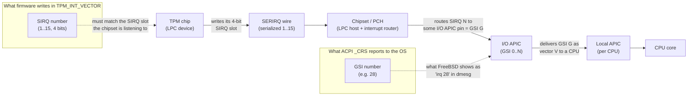
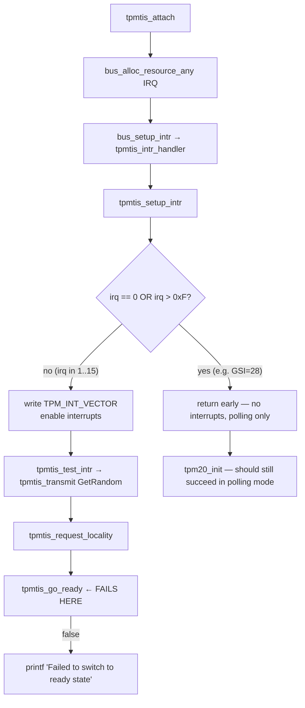

# TPM TIS "Failed to switch to ready state" — Diagnostic & Background

*Author: Claude (Anthropic Claude Opus 4)*

## Symptom

```
tpmtis0: <Trusted Platform Module 2.0, FIFO mode> iomem 0xfed40000-0xfed44fff irq 28 on acpi0
tpmtis0: Failed to switch to ready state
```

The TPM is detected on the ACPI bus, but driver attach fails. The kernel
source (`sys/dev/tpm/tpm_tis_core.c`) carries this curious comment:

```c
/*
 * SIRQ has to be between 1 - 15.
 * I found a system with ACPI table that reported a value of 0x2d.
 * An attempt to use such value resulted in an interrupt storm.
 */
if (irq == 0 || irq > 0xF)
    return;
```

This document explains why that comment exists, then lays out the diagnostic
flow for the failure.

---

## Educational chapter: 8259 PIC IRQs, LPC Serial IRQs (SIRQ), and APIC GSIs

To understand the bug — and the comment — you need three pieces of x86
interrupt-delivery history stacked on top of each other. They co-exist on
every modern PC because each new mechanism kept the previous one's numbering
visible for software compatibility.

### 1. The legacy 8259 PIC and its 16 IRQ lines

The original IBM PC (1981) used the Intel **8259A Programmable Interrupt
Controller (PIC)**. Each 8259 has 8 input lines. The PC/AT (1984) cascaded
two of them, giving **16 hardware IRQ lines: IRQ0–IRQ15** (with IRQ2 used
internally for the cascade).

Devices were physically wired to specific IRQ lines:

| IRQ | Classic owner          |
|-----|------------------------|
| 0   | System timer           |
| 1   | Keyboard               |
| 3   | COM2                   |
| 4   | COM1                   |
| 6   | Floppy                 |
| 8   | RTC                    |
| 14  | Primary IDE            |
| ... | ...                    |

The crucial point: **the PIC IRQ space is 4 bits — values 0..15.** Anything
that talks to the PIC (or to firmware code that thinks in PIC terms)
encodes IRQ numbers in 4 bits.

### 2. LPC and Serial IRQ (SIRQ)

By the late 1990s the **ISA bus** died, but its devices (Super-I/O,
keyboard controller, TPM, embedded controllers) lived on. Intel introduced
the **LPC (Low Pin Count)** bus in 1998 to carry these legacy devices over
a much narrower set of pins. (LPC has since been superseded by **eSPI** on
modern chipsets, but the same SIRQ semantics carry over.)

Because LPC has very few pins, it cannot dedicate one wire per IRQ line.
Instead, the chipset multiplexes all legacy IRQs onto a **single serial
wire** called **SERIRQ**. Each device drives its IRQ number into a
time-slotted frame on that one wire. This protocol is called **Serial IRQ
(SIRQ)**.

Key property: SIRQ encodes IRQ numbers in **the same 4-bit PIC numbering
space, 1–15** (0 is reserved to mean "no IRQ"). It has to, because at the
other end the chipset re-creates the appearance of 8259 PIC IRQ lines for
software compatibility.

The TPM is an LPC device. Its TIS interface has a register called
`TPM_INT_VECTOR` whose IRQ field is exactly **4 bits wide**. You write the
SIRQ number there, and the TPM uses that slot on the SERIRQ wire to signal
the chipset.

### 3. APIC and the Global System Interrupt (GSI)

In the multiprocessor era, the 8259 PIC didn't scale — it can only deliver
to a single CPU. Intel introduced the **APIC** architecture:

- **Local APIC (LAPIC)**: one per CPU, handles the CPU-side delivery.
- **I/O APIC**: replaces the 8259 as the receiver of device interrupts.
  Modern systems have one or more I/O APICs, each with many input pins
  (24 on the original, more on modern chipsets).

Each I/O APIC input pin is assigned a globally unique number called a
**Global System Interrupt (GSI)**. GSIs form a *flat namespace* across all
I/O APICs in the system, typically starting at 0 for the first I/O APIC
and continuing upward. A typical desktop has GSIs ranging from 0 into the
30s, 40s, or higher; server boards go much further.

Crucially, **the GSI namespace is decoupled from PIC IRQ numbers**. GSI 28
is *not* the same thing as PIC IRQ 28 — there is no PIC IRQ 28. It's just
"the 28th input pin of the I/O APIC complex".

ACPI describes interrupt routing in terms of GSIs. When firmware tells the
OS "the TPM uses interrupt 28," that 28 is a GSI.

### How they fit together on a modern system



The two numbers — **SIRQ** (4 bits, lives inside the TPM↔chipset
conversation) and **GSI** (flat namespace, lives between chipset and OS) —
are not the same number, even though firmware should know the mapping
between them.

### Where things go wrong

Per the TPM TIS spec, firmware should:

1. Pick an SIRQ slot (some value in 1..15) for the TPM.
2. Configure the chipset to route that SIRQ to a particular I/O APIC pin.
3. Report **the GSI** for that pin in the ACPI `_CRS`, so the OS can hook
   the right I/O APIC vector.
4. Optionally also stash the SIRQ number somewhere the OS can find it, so
   the OS driver can program `TPM_INT_VECTOR`.

In practice, step 4 is where things go off the rails. Many firmwares
either:

- Don't program `TPM_INT_VECTOR` themselves, and don't expose the SIRQ to
  the OS, leaving the driver guessing — or
- Report the GSI in a place the driver mistakes for the SIRQ.

The FreeBSD driver reads the IRQ resource the bus assigned (which is the
**GSI**, e.g. 28 or 0x2d) and, if it's in 1..15, writes it into
`TPM_INT_VECTOR` as if it were the **SIRQ**. If the firmware happened to
also use the same number for both, this works by coincidence. If not, the
TPM signals on the wrong SERIRQ slot — sometimes silently, sometimes as an
interrupt storm.

The defensive `if (irq == 0 || irq > 0xF) return;` exists precisely because
the author saw a system reporting GSI **0x2d (45)**, which obviously
doesn't fit in 4 bits, and writing it into the 4-bit field caused chaos.
The bail-out keeps the driver from frying the chipset; the cost is that
interrupts are silently disabled on those boxes.

---

## Diagnostic for "Failed to switch to ready state"

### What the message means

The error comes from `tpmtis_go_ready()` in
`sys/dev/tpm/tpm_tis_core.c:371`. It writes `TPM_STS_CMD_RDY` to the
`TPM_STS` register and waits up to `TPM_TIMEOUT_B` for the chip to
acknowledge by setting the same bit back. If it never sets, the function
returns false and you see the message.

### Where the call comes from at attach time



In your dmesg, `irq 28` is the GSI assigned to the TPM. Since 28 > 0xF,
`tpmtis_setup_intr` should hit the early return and `tpmtis_test_intr`
should *never* run — meaning `go_ready` should not fail at attach.

The fact that you see the error suggests one of two things is happening on
the affected box.

### Hypothesis 1 — firmware reports an SIRQ-shaped value that doesn't fire

Some firmwares place a value in 1..15 in the ACPI `_CRS` (matching the
real SIRQ slot) instead of the GSI. The driver then takes the early-exit
branch *false* and enables interrupts using that value as the SIRQ. If the
chipset isn't actually listening on that SIRQ slot — or if the IO-APIC GSI
never fires — `tpmtis_test_intr` sends GetRandom, the TPM goes busy, and
`tpm_wait_for_u32` sleeps the full `TPM_TIMEOUT_B`. The next call to
`go_ready` (still inside `transmit`) returns false → "Failed to switch to
ready state."

**Test:** force polling.

```
# In /boot/loader.conf or via device.hints
hw.tpm.0.use_polling=1
```

This is read at line 108 of `tpm_tis_core.c`:

```c
resource_int_value("tpm", device_get_unit(dev), "use_polling", &poll);
if (poll != 0) {
    device_printf(dev, "Using poll method to get TPM operation status\n");
    goto skip_irq;
}
```

If the TPM attaches cleanly with polling, the IRQ-test path is the culprit
and the firmware's IRQ resource is wrong.

### Hypothesis 2 — locality 0 is held by another agent

If BIOS, Secure Launch / TXT, or a measured-boot component still owns
locality 0, `tpmtis_request_locality` may appear to succeed but the TPM
won't honor `CMD_RDY` writes from the OS. `go_ready` then times out.

**Test:** check BIOS for "TPM Active/Available", "Intel TXT", "Trusted
Execution", "Secure Launch", or "TPM device" options. Try toggling them.
Also confirm no other OS component (e.g. tboot, vendor measured-boot
shim) is loaded ahead of the kernel.

### Hypothesis 3 — the TPM itself is in a stuck state

Less likely but cheap to rule out: a previous boot left the TPM in a state
where locality 0 is half-claimed.

**Test:** full power cycle (not just reboot — drain standby power on
desktops by unplugging for ~30s; on servers, AC-cycle). Then boot.

### Recommended diagnostic order

1. **Boot verbose** (`boot -v`) and capture full TPM-related messages.
   You want to know whether `tpmtis_setup_intr` returned early or
   proceeded to `test_intr`.
2. **Inspect the IRQ resource the bus assigned:**
   ```sh
   devinfo -rv | grep -A2 -i tpm
   sysctl hw.tpm
   ```
   This tells you the actual number FreeBSD picked up from `_CRS`.
3. **Force polling** with `hw.tpm.0.use_polling=1` in
   `/boot/loader.conf`. If the TPM attaches and `tpm20_init` succeeds,
   you have your answer (and a working workaround).
4. **AC-cycle the box** to rule out stuck-locality state.
5. **Check BIOS** for TXT / measured-boot options that might be holding
   locality 0.

### Permanent workaround

If polling works, leaving `hw.tpm.0.use_polling=1` set is fine — TPM
operations are infrequent and slow enough that polling has no practical
performance cost over interrupts. The driver explicitly supports this
mode.

### Source references

- `sys/dev/tpm/tpm_tis_core.c:108` — `use_polling` tunable
- `sys/dev/tpm/tpm_tis_core.c:181-216` — `tpmtis_setup_intr`, the SIRQ check
- `sys/dev/tpm/tpm_tis_core.c:371-384` — `tpmtis_go_ready`
- `sys/dev/tpm/tpm_tis_core.c:386-406` — `tpmtis_transmit`, where the
  error message is printed
