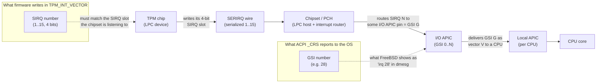
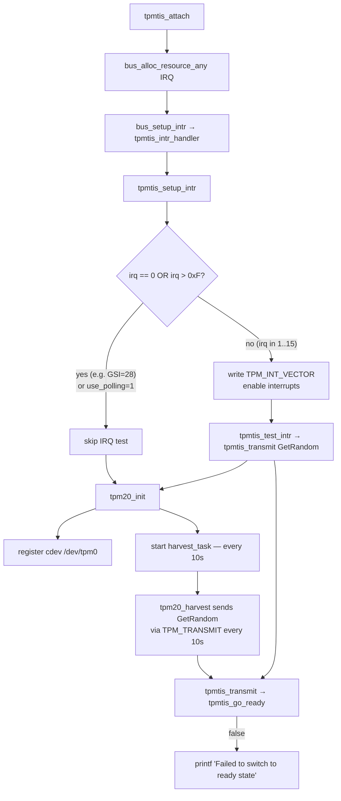

# TPM TIS "Failed to switch to ready state" — Diagnostic & Background

*Author: Claude (Anthropic Claude Opus 4)*

> **Status: DRAFT — NOT PEER-REVIEWED.** This document was written by
> the agent as a side product of agent-assisted work and reviewed only
> by Olivier Cochard (whose C/kernel experience is limited). It is
> *plausible* but not *validated by FreeBSD kernel maintainers*.
> Factual errors found in companion material from the same workflow
> suggest analogous errors may remain here. Treat it as a starting
> point for your own reading, not a finished tutorial.

## Symptom

```
tpmtis0: <Trusted Platform Module 2.0, FIFO mode> iomem 0xfed40000-0xfed44fff irq 28 on acpi0
tpmtis0: Failed to switch to ready state
```

The TPM is detected on the ACPI bus, but driver attach fails. The kernel
source (`sys/dev/tpm/tpm_tis_core.c`) carries this curious comment:

```c
/*
 * SIRQ has to be between 1 - 15.
 * I found a system with ACPI table that reported a value of 0x2d.
 * An attempt to use such value resulted in an interrupt storm.
 */
if (irq == 0 || irq > 0xF)
    return;
```

This document explains why that comment exists, then lays out the diagnostic
flow for the failure.

---

## Educational chapter: 8259 PIC IRQs, LPC Serial IRQs (SIRQ), and APIC GSIs

To understand the bug — and the comment — you need three pieces of x86
interrupt-delivery history stacked on top of each other. They co-exist on
every modern PC because each new mechanism kept the previous one's numbering
visible for software compatibility.

### 1. The legacy 8259 PIC and its 16 IRQ lines

The original IBM PC (1981) used the Intel **8259A Programmable Interrupt
Controller (PIC)**. Each 8259 has 8 input lines. The PC/AT (1984) cascaded
two of them, giving **16 hardware IRQ lines: IRQ0–IRQ15** (with IRQ2 used
internally for the cascade).

Devices were physically wired to specific IRQ lines:

| IRQ | Classic owner          |
|-----|------------------------|
| 0   | System timer           |
| 1   | Keyboard               |
| 3   | COM2                   |
| 4   | COM1                   |
| 6   | Floppy                 |
| 8   | RTC                    |
| 14  | Primary IDE            |
| ... | ...                    |

The crucial point: **the PIC IRQ space is 4 bits — values 0..15.** Anything
that talks to the PIC (or to firmware code that thinks in PIC terms)
encodes IRQ numbers in 4 bits.

### 2. LPC and Serial IRQ (SIRQ)

By the late 1990s the **ISA bus** died, but its devices (Super-I/O,
keyboard controller, TPM, embedded controllers) lived on. Intel introduced
the **LPC (Low Pin Count)** bus in 1998 to carry these legacy devices over
a much narrower set of pins. (LPC has since been superseded by **eSPI** on
modern chipsets, but the same SIRQ semantics carry over.)

Because LPC has very few pins, it cannot dedicate one wire per IRQ line.
Instead, the chipset multiplexes all legacy IRQs onto a **single serial
wire** called **SERIRQ**. Each device drives its IRQ number into a
time-slotted frame on that one wire. This protocol is called **Serial IRQ
(SIRQ)**.

Key property: SIRQ encodes IRQ numbers in **the same 4-bit PIC numbering
space, 1–15** (0 is reserved to mean "no IRQ"). It has to, because at the
other end the chipset re-creates the appearance of 8259 PIC IRQ lines for
software compatibility.

The TPM is an LPC device. Its TIS interface has a register called
`TPM_INT_VECTOR` whose IRQ field is exactly **4 bits wide**. You write the
SIRQ number there, and the TPM uses that slot on the SERIRQ wire to signal
the chipset.

### 3. APIC and the Global System Interrupt (GSI)

In the multiprocessor era, the 8259 PIC didn't scale — it can only deliver
to a single CPU. Intel introduced the **APIC** architecture:

- **Local APIC (LAPIC)**: one per CPU, handles the CPU-side delivery.
- **I/O APIC**: replaces the 8259 as the receiver of device interrupts.
  Modern systems have one or more I/O APICs, each with many input pins
  (24 on the original, more on modern chipsets).

Each I/O APIC input pin is assigned a globally unique number called a
**Global System Interrupt (GSI)**. GSIs form a *flat namespace* across all
I/O APICs in the system, typically starting at 0 for the first I/O APIC
and continuing upward. A typical desktop has GSIs ranging from 0 into the
30s, 40s, or higher; server boards go much further.

Crucially, **the GSI namespace is decoupled from PIC IRQ numbers**. GSI 28
is *not* the same thing as PIC IRQ 28 — there is no PIC IRQ 28. It's just
"the 28th input pin of the I/O APIC complex".

ACPI describes interrupt routing in terms of GSIs. When firmware tells the
OS "the TPM uses interrupt 28," that 28 is a GSI.

### How they fit together on a modern system



The two numbers — **SIRQ** (4 bits, lives inside the TPM↔chipset
conversation) and **GSI** (flat namespace, lives between chipset and OS) —
are not the same number, even though firmware should know the mapping
between them.

### Where things go wrong

Per the TPM TIS spec, firmware should:

1. Pick an SIRQ slot (some value in 1..15) for the TPM.
2. Configure the chipset to route that SIRQ to a particular I/O APIC pin.
3. Report **the GSI** for that pin in the ACPI `_CRS`, so the OS can hook
   the right I/O APIC vector.
4. Optionally also stash the SIRQ number somewhere the OS can find it, so
   the OS driver can program `TPM_INT_VECTOR`.

In practice, step 4 is where things go off the rails. Many firmwares
either:

- Don't program `TPM_INT_VECTOR` themselves, and don't expose the SIRQ to
  the OS, leaving the driver guessing — or
- Report the GSI in a place the driver mistakes for the SIRQ.

The FreeBSD driver reads the IRQ resource the bus assigned (which is the
**GSI**, e.g. 28 or 0x2d) and, if it's in 1..15, writes it into
`TPM_INT_VECTOR` as if it were the **SIRQ**. If the firmware happened to
also use the same number for both, this works by coincidence. If not, the
TPM signals on the wrong SERIRQ slot — sometimes silently, sometimes as an
interrupt storm.

The defensive `if (irq == 0 || irq > 0xF) return;` exists precisely because
the author saw a system reporting GSI **0x2d (45)**, which obviously
doesn't fit in 4 bits, and writing it into the 4-bit field caused chaos.
The bail-out keeps the driver from frying the chipset; the cost is that
interrupts are silently disabled on those boxes.

---

## Diagnostic for "Failed to switch to ready state"

### What the message means

The error comes from `tpmtis_go_ready()` in
`sys/dev/tpm/tpm_tis_core.c:371`. It writes `TPM_STS_CMD_RDY` to the
`TPM_STS` register and waits up to `TPM_TIMEOUT_B` for the chip to
acknowledge by setting the same bit back. If the bit never sets, the
function returns false and you see the message.

### Two distinct callers — both can print this

`tpmtis_go_ready` is reached from `tpmtis_transmit` (`tpm_tis_core.c:402`).
There are two callers of `tpmtis_transmit` at runtime, and **both** can
emit this error:



The harvest task is registered unconditionally in `tpm20_init`
(`tpm20.c:202-204`) when the kernel is built with `TPM_HARVEST` or
`RANDOM_ENABLE_TPM`. It fires every 10 seconds (`TPM_HARVEST_INTERVAL`)
and sends `TPM_CC_GetRandom` through the same `tpmtis_transmit` →
`tpmtis_go_ready` path. Polling does **not** disable it — `use_polling`
only short-circuits the `tpmtis_test_intr` call at attach.

So if `hw.tpm.0.use_polling=1` doesn't make the message go away, the
problem is **not** the IRQ test path. It is the TPM itself failing to
acknowledge `CMD_RDY`.

### What polling did, and didn't, prove

Setting `hw.tpm.0.use_polling=1` was confirmed on the affected machine to
have **no effect** on the error. This rules out the IRQ-test hypothesis
that was originally hypothesis 1. The chip is genuinely not responding to
`TPM_STS_CMD_RDY` writes — locality is the prime suspect.

### Hypothesis 1 (most likely) — locality 0 not actually granted

`tpmtis_request_locality()` polls for `TPM_ACCESS_ACTIVE_LOCALITY`. On
some firmwares this bit is reported as set (because firmware took
locality earlier and didn't release it cleanly, or because Intel TXT /
Boot Guard / DRTM holds locality > 0 and locality 0 ends up gated), but
subsequent register writes are still ignored by the TPM. Then
`tpmtis_go_ready` writes `CMD_RDY` into the void and times out.

A related variant: the TPM needs `TPM2_Startup(CLEAR|STATE)` after every
power-on. The FreeBSD driver does **not** issue Startup itself — it
relies on firmware. If the previous OS executed `TPM2_Shutdown(STATE)`
and your firmware didn't re-issue `Startup` on the next boot, the chip
sits in a half-initialized state where `TPM_STS` writes are no-ops.

**Tests:**

1. Full **AC power cycle** (drain standby power on desktops, AC-cycle on
   servers) to force firmware to re-run Startup.
2. In BIOS, look for and try toggling:
   - "Security Device Support" / "TPM Device" — must be **Enabled** (not
     just "Available")
   - "TPM State" — **Enabled**
   - "Pending TPM operation" — set to **None**
   - "Clear TPM" — try once (the OS isn't using it yet, nothing to lose)
   - "Intel PTT" vs discrete TPM — make sure only one is active
   - "TXT", "Boot Guard", "DRTM", "Trusted Execution" — **disable**
3. Make sure no other measured-boot shim (tboot, vendor pre-OS agent) is
   loaded ahead of the FreeBSD loader.

### Hypothesis 2 (rule out cheaply) — MMIO not actually responding

`fed40000-fed44fff` is the standard TPM TIS window, so this is unlikely,
but if reads return `0xFFFFFFFF` then writes are no-ops by definition.

**Test:** instrument `tpmtis_go_ready` to print the `TPM_STS` register
value before and after the write:

```c
static bool
tpmtis_go_ready(struct tpm_sc *sc)
{
	uint32_t mask, sts_before, sts_after;

	mask = TPM_STS_CMD_RDY;
	sc->intr_type = TPM_INT_STS_CMD_RDY;

	sts_before = TPM_READ_4(sc->dev, TPM_STS);
	TPM_WRITE_4(sc->dev, TPM_STS, TPM_STS_CMD_RDY);
	TPM_WRITE_BARRIER(sc->dev, TPM_STS, 4);
	sts_after = TPM_READ_4(sc->dev, TPM_STS);
	device_printf(sc->dev, "go_ready: sts before=%#x after=%#x\n",
	    sts_before, sts_after);
	if (!tpm_wait_for_u32(sc, TPM_STS, mask, mask, TPM_TIMEOUT_B))
		return (false);

	return (true);
}
```

Interpretation of the printed values:

| `sts_before`               | `sts_after`                    | Meaning                                                                   |
|----------------------------|--------------------------------|---------------------------------------------------------------------------|
| `0xffffffff`               | `0xffffffff`                   | MMIO not responding — chip dark, SMM/firmware blocking the window.        |
| `0x00000000`               | `0x00000000`                   | Locality 0 not actually granted; firmware/locality issue (Hypothesis 1).  |
| Plausible bits set         | `CMD_RDY` not set              | Chip alive but rejecting commands — almost always missing `TPM2_Startup`. |
| Plausible bits set         | `CMD_RDY` set                  | Race / interrupt-path issue, not a chip-state issue.                      |

### Hypothesis 3 — stuck locality from previous boot

A previous OS may have left locality state half-claimed. Cheap to rule
out: full **AC-cycle** (warm reboot is not enough — the TPM keeps state
across a warm reset).

### Recommended diagnostic order (revised)

1. **AC-cycle the box.** Cheapest and rules out the most common cause.
2. **Check BIOS** for TPM and TXT/Boot-Guard/DRTM options as listed in
   Hypothesis 1.
3. **Try Clear TPM in BIOS** (safe — the OS isn't using it yet).
4. **Boot verbose** (`boot -v`) and capture all TPM-related messages.
5. **Inspect the IRQ resource the bus assigned** (still useful context):
   ```sh
   devinfo -rv | grep -A2 -i tpm
   sysctl hw.tpm
   ```
6. **Instrument `tpmtis_go_ready`** as shown above to read `TPM_STS`
   before/after — the table tells you which hypothesis is real.

### What `use_polling` does and does not do

`hw.tpm.0.use_polling=1` only affects the **attach-time IRQ test**
(`tpmtis_test_intr`). The harvest task and any user-space access through
`/dev/tpm0` go through the same `tpmtis_transmit` path regardless. If
`go_ready` fails for chip-state reasons, polling cannot help.

If you do *not* want repeated harvest-task errors filling dmesg while you
debug, build a kernel without `TPM_HARVEST` / `RANDOM_ENABLE_TPM`, or
detach `tpmtis0` after attach.

### Source references

- `sys/dev/tpm/tpm_tis_core.c:108` — `use_polling` tunable
- `sys/dev/tpm/tpm_tis_core.c:181-216` — `tpmtis_setup_intr`, the SIRQ check
- `sys/dev/tpm/tpm_tis_core.c:371-384` — `tpmtis_go_ready`
- `sys/dev/tpm/tpm_tis_core.c:386-406` — `tpmtis_transmit`, where the
  error message is printed
- `sys/dev/tpm/tpm20.c:182-209` — `tpm20_init`, registers harvest_task
- `sys/dev/tpm/tpm20.c:267-310` — `tpm20_harvest`, runs every 10s and
  goes through the same transmit/go_ready path
