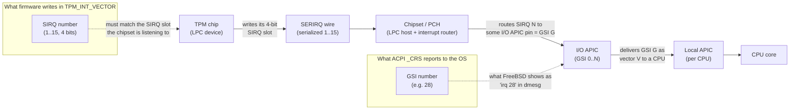
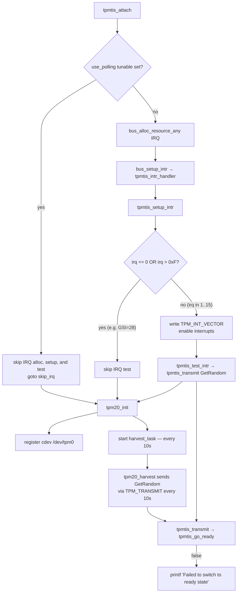

# TPM TIS "Failed to switch to ready state" — Diagnostic & Background

*Author: Claude (Anthropic Claude Opus 4)*

> **Status: PARTIALLY CONFIRMED.** Hypothesis 4 (missing trailing
> `CMD_RDY` write on STMicro ST33-series parts) has been independently
> confirmed on hardware: a reporter testing
> **ST33KTPM2X32CKE3** on FreeBSD 14.2 (and current main) arrived at
> the same fix described in that section — writing
> `TPM_STS_CMD_RDY` near the end of `tpmtis_transmit`, before
> `tpmtis_relinquish_locality()` — and confirms that with it
> `go_ready` returns good status regularly and `tpm2_*` userspace
> commands work. Hypotheses 1–3 remain unverified for this incident
> and are retained as a differential diagnosis for other chips and
> firmwares producing the same symptom. The educational background
> chapter has not been independently reviewed by FreeBSD kernel
> maintainers — treat it as a starting point, not a finished
> tutorial.

## TL;DR — confirmed fix for STMicro ST33-series TPMs

If your chip is an **STMicro ST33KTPM2X32CKE3** (or a related ST33-series
part) and you see `Failed to switch to ready state` ~10 seconds after a
clean attach, apply this patch to
`sys/dev/tpm/tpm_tis_core.c`, inside `tpmtis_transmit`, just before the
existing `tpmtis_relinquish_locality(sc)` call near the end of the
function:

```diff
        if (!tpmtis_read_bytes(sc, bytes_available - TPM_HEADER_SIZE,
            &priv->buf[TPM_HEADER_SIZE])) {
                device_printf(dev,
                    "Failed to read response\n");
                return (EIO);
        }
+
+       /* Park the chip in CMD_RDY before relinquishing locality.
+        * Required for STMicro ST33KTPM2X32CKE3 and similar parts that
+        * do not transition cleanly out of "response available" on
+        * their own. Mirrors Linux's tpm_tis_ready(). */
+       TPM_WRITE_4(sc->dev, TPM_STS, TPM_STS_CMD_RDY);
+       TPM_WRITE_BARRIER(sc->dev, TPM_STS, 4);
        tpmtis_relinquish_locality(sc);
        priv->offset = 0;
        priv->len = bytes_available;
```

This fix was independently verified on hardware against FreeBSD 14.2
and applies cleanly to current main. The patch is purely additive —
it adds two lines and does not touch any existing control flow.
After applying, `go_ready` returns success regularly and `tpm2_*`
userspace commands work normally.

The rest of this document explains *why* this works (Hypothesis 4),
covers three other hypotheses that produce the same symptom on
different hardware (Hypotheses 1–3), and provides the educational
background for the original `irq > 0xF` defensive check in the
driver.

## Symptom

```
tpmtis0: <Trusted Platform Module 2.0, FIFO mode> iomem 0xfed40000-0xfed44fff irq 28 on acpi0
tpmtis0: Failed to switch to ready state
```

The TPM is detected on the ACPI bus, but driver attach fails. The kernel
source (`sys/dev/tpm/tpm_tis_core.c`) carries this curious comment:

```c
/*
 * SIRQ has to be between 1 - 15.
 * I found a system with ACPI table that reported a value of 0x2d.
 * An attempt to use such value resulted in an interrupt storm.
 */
if (irq == 0 || irq > 0xF)
    return;
```

This document explains why that comment exists, then lays out the diagnostic
flow for the failure.

---

## Educational chapter: 8259 PIC IRQs, LPC Serial IRQs (SIRQ), and APIC GSIs

To understand the bug — and the comment — you need three pieces of x86
interrupt-delivery history stacked on top of each other. They co-exist on
every modern PC because each new mechanism kept the previous one's numbering
visible for software compatibility.

### 1. The legacy 8259 PIC and its 16 IRQ lines

The original IBM PC (1981) used the Intel **8259A Programmable Interrupt
Controller (PIC)**. Each 8259 has 8 input lines. The PC/AT (1984) cascaded
two of them, giving **16 hardware IRQ lines: IRQ0–IRQ15** (with IRQ2 used
internally for the cascade).

Devices were physically wired to specific IRQ lines:

| IRQ | Classic owner          |
|-----|------------------------|
| 0   | System timer           |
| 1   | Keyboard               |
| 3   | COM2                   |
| 4   | COM1                   |
| 6   | Floppy                 |
| 8   | RTC                    |
| 14  | Primary IDE            |
| ... | ...                    |

The crucial point: **the PIC IRQ space is 4 bits — values 0..15.** Anything
that talks to the PIC (or to firmware code that thinks in PIC terms)
encodes IRQ numbers in 4 bits.

### 2. LPC and Serial IRQ (SIRQ)

By the late 1990s the **ISA bus** died, but its devices (Super-I/O,
keyboard controller, TPM, embedded controllers) lived on. Intel introduced
the **LPC (Low Pin Count)** bus in 1998 to carry these legacy devices over
a much narrower set of pins. (LPC has since been superseded by **eSPI** on
modern chipsets, but the same SIRQ semantics carry over.)

Because LPC has very few pins, it cannot dedicate one wire per IRQ line.
Instead, the chipset multiplexes all legacy IRQs onto a **single serial
wire** called **SERIRQ**. Each device drives its IRQ number into a
time-slotted frame on that one wire. This protocol is called **Serial IRQ
(SIRQ)**.

Key property: SIRQ encodes IRQ numbers in **the same 4-bit PIC numbering
space, 1–15** (0 is reserved to mean "no IRQ"). It has to, because at the
other end the chipset re-creates the appearance of 8259 PIC IRQ lines for
software compatibility.

The TPM is an LPC device. Its TIS interface has a register called
`TPM_INT_VECTOR` whose IRQ field is exactly **4 bits wide**. You write the
SIRQ number there, and the TPM uses that slot on the SERIRQ wire to signal
the chipset.

### 3. APIC and the Global System Interrupt (GSI)

In the multiprocessor era, the 8259 PIC didn't scale — it can only deliver
to a single CPU. Intel introduced the **APIC** architecture:

- **Local APIC (LAPIC)**: one per CPU, handles the CPU-side delivery.
- **I/O APIC**: replaces the 8259 as the receiver of device interrupts.
  Modern systems have one or more I/O APICs, each with many input pins
  (24 on the original, more on modern chipsets).

Each I/O APIC input pin is assigned a globally unique number called a
**Global System Interrupt (GSI)**. GSIs form a *flat namespace* across all
I/O APICs in the system, typically starting at 0 for the first I/O APIC
and continuing upward. A typical desktop has GSIs ranging from 0 into the
30s, 40s, or higher; server boards go much further.

Crucially, **the GSI namespace is decoupled from PIC IRQ numbers**. GSI 28
is *not* the same thing as PIC IRQ 28 — there is no PIC IRQ 28. It's just
"the 28th input pin of the I/O APIC complex".

ACPI describes interrupt routing in terms of GSIs. When firmware tells the
OS "the TPM uses interrupt 28," that 28 is a GSI.

### How they fit together on a modern system



The two numbers — **SIRQ** (4 bits, lives inside the TPM↔chipset
conversation) and **GSI** (flat namespace, lives between chipset and OS) —
are not the same number, even though firmware should know the mapping
between them.

### Where things go wrong

Per the TPM TIS spec, firmware should:

1. Pick an SIRQ slot (some value in 1..15) for the TPM.
2. Configure the chipset to route that SIRQ to a particular I/O APIC pin.
3. Report **the GSI** for that pin in the ACPI `_CRS`, so the OS can hook
   the right I/O APIC vector.
4. Optionally also stash the SIRQ number somewhere the OS can find it, so
   the OS driver can program `TPM_INT_VECTOR`.

In practice, step 4 is where things go off the rails. Many firmwares
either:

- Don't program `TPM_INT_VECTOR` themselves, and don't expose the SIRQ to
  the OS, leaving the driver guessing — or
- Report the GSI in a place the driver mistakes for the SIRQ.

The FreeBSD driver reads the IRQ resource the bus assigned (which is the
**GSI**, e.g. 28 or 0x2d) and, if it's in 1..15, writes it into
`TPM_INT_VECTOR` as if it were the **SIRQ**. If the firmware happened to
also use the same number for both, this works by coincidence. If not, the
TPM signals on the wrong SERIRQ slot — sometimes silently, sometimes as an
interrupt storm.

The defensive `if (irq == 0 || irq > 0xF) return;` exists precisely because
the author saw a system reporting GSI **0x2d (45)**, which obviously
doesn't fit in 4 bits, and writing it into the 4-bit field caused chaos.
The bail-out keeps the driver from frying the chipset; the cost is that
interrupts are silently disabled on those boxes.

---

## Diagnostic for "Failed to switch to ready state"

### What the message means

The error comes from `tpmtis_go_ready()` in
`sys/dev/tpm/tpm_tis_core.c:370`. It writes `TPM_STS_CMD_RDY` to the
`TPM_STS` register and waits up to `TPM_TIMEOUT_B` for the chip to
acknowledge by setting the same bit back. If the bit never sets, the
function returns false and you see the message.

### Two distinct callers — both can print this

`tpmtis_go_ready` is reached from `tpmtis_transmit` (`tpm_tis_core.c:402`).
There are two callers of `tpmtis_transmit` at runtime, and **both** can
emit this error:



The harvest task is registered unconditionally in `tpm20_init`
(`tpm20.c:200-205`) when the kernel is built with `TPM_HARVEST` or
`RANDOM_ENABLE_TPM`. It fires every 10 seconds (`TPM_HARVEST_INTERVAL`)
and sends `TPM_CC_GetRandom` through the same `tpmtis_transmit` →
`tpmtis_go_ready` path. Polling does **not** disable the harvest —
`use_polling` only changes attach-time IRQ setup (it short-circuits IRQ
resource allocation and the attach-time `tpmtis_test_intr` call), but
every subsequent transmit still goes through `tpmtis_go_ready` regardless.

So if `hint.tpm.0.use_polling="1"` doesn't make the message go away,
the problem is **not** the IRQ test path. It is the TPM itself failing
to acknowledge `CMD_RDY`.

### What polling did, and didn't, prove

Setting `hint.tpm.0.use_polling="1"` in `/boot/device.hints` (or via
`kenv hint.tpm.0.use_polling=1` before the driver attaches) was
reported to have **no effect** on the error. Because `use_polling`
only bypasses attach-time IRQ setup (see *What `use_polling` does and
does not do* below) and the harvest path still calls
`tpmtis_go_ready` on every tick, this rules out the IRQ-test
hypothesis but does not distinguish between Hypotheses 1, 3, and 4 —
all of which produce a chip-not-acknowledging-`CMD_RDY` failure
inside `tpmtis_go_ready` itself.

### Hypothesis 1 (most likely) — locality 0 not actually granted

`tpmtis_request_locality()` polls for `TPM_ACCESS_LOC_ACTIVE |
TPM_ACCESS_VALID` (`tpm_tis_core.c:334`). On some firmwares the
`LOC_ACTIVE` bit is reported as set (because firmware took locality
earlier and didn't release it cleanly, or because Intel TXT / Boot
Guard / DRTM holds locality > 0 and locality 0 ends up gated), but
subsequent register writes are still ignored by the TPM. Then
`tpmtis_go_ready` writes `CMD_RDY` into the void and times out.

A related variant: the TPM needs `TPM2_Startup(CLEAR|STATE)` after every
power-on. At initial attach the FreeBSD driver does **not** issue
Startup — `tpm20_init` (`tpm20.c:183-209`) sets up the cdev and
harvest task but does not transmit `TPM_CC_Startup`, so it relies on
firmware having issued Startup before handing control to the OS.
(The driver does issue Startup on resume — `tpm20_restart` at
`tpm20.c:311-345` sends `TPM_CC_Startup` (0x144), called from
`tpm20_resume` — but not on cold boot.) If the previous OS executed
`TPM2_Shutdown(STATE)` and your firmware didn't re-issue Startup on
the next boot, the chip sits in a half-initialized state where
`TPM_STS` writes are no-ops.

**Tests:**

1. Full **AC power cycle** (drain standby power on desktops, AC-cycle on
   servers) to force firmware to re-run Startup.
2. In BIOS, look for and try toggling:
   - "Security Device Support" / "TPM Device" — must be **Enabled** (not
     just "Available")
   - "TPM State" — **Enabled**
   - "Pending TPM operation" — set to **None**
   - "Clear TPM" — try once (the OS isn't using it yet, nothing to lose)
   - "Intel PTT" vs discrete TPM — make sure only one is active
   - "TXT", "Boot Guard", "DRTM", "Trusted Execution" — **disable**
3. Make sure no other measured-boot shim (tboot, vendor pre-OS agent) is
   loaded ahead of the FreeBSD loader.

### Hypothesis 2 (rule out cheaply) — MMIO not actually responding

`fed40000-fed44fff` is the standard TPM TIS window, so this is unlikely,
but if reads return `0xFFFFFFFF` then writes are no-ops by definition.

**Test:** instrument `tpmtis_go_ready` to print the `TPM_STS` register
value before and after the write:

```c
static bool
tpmtis_go_ready(struct tpm_sc *sc)
{
	uint32_t mask, sts_before, sts_after;

	mask = TPM_STS_CMD_RDY;
	sc->intr_type = TPM_INT_STS_CMD_RDY;

	sts_before = TPM_READ_4(sc->dev, TPM_STS);
	TPM_WRITE_4(sc->dev, TPM_STS, TPM_STS_CMD_RDY);
	TPM_WRITE_BARRIER(sc->dev, TPM_STS, 4);
	sts_after = TPM_READ_4(sc->dev, TPM_STS);
	device_printf(sc->dev, "go_ready: sts before=%#x after=%#x\n",
	    sts_before, sts_after);
	if (!tpm_wait_for_u32(sc, TPM_STS, mask, mask, TPM_TIMEOUT_B))
		return (false);

	return (true);
}
```

Interpretation of the printed values:

| `sts_before`               | `sts_after`                    | Meaning                                                                   |
|----------------------------|--------------------------------|---------------------------------------------------------------------------|
| `0xffffffff`               | `0xffffffff`                   | MMIO not responding — chip dark, SMM/firmware blocking the window.        |
| `0x00000000`               | `0x00000000`                   | Locality 0 not actually granted; firmware/locality issue (Hypothesis 1).  |
| Plausible bits set         | `CMD_RDY` not set              | Chip alive but rejecting commands — almost always missing `TPM2_Startup`. |
| Plausible bits set         | `CMD_RDY` set                  | Race / interrupt-path issue, not a chip-state issue.                      |

### Hypothesis 3 — stuck locality from previous boot

A previous OS may have left locality state half-claimed. Cheap to rule
out: full **AC-cycle** (warm reboot is not enough — the TPM keeps state
across a warm reset).

### Hypothesis 4 (CONFIRMED for ST33KTPM2X32CKE3) — chip state not cleared between commands (à la Linux `tpm_tis_ready`)

> **Independently confirmed on hardware.** A reporter testing
> ST33KTPM2X32CKE3 on FreeBSD 14.2 (and current main) confirms the
> diagnosis below: adding a `TPM_STS_CMD_RDY` write near the end of
> `tpmtis_transmit`, before `tpmtis_relinquish_locality()`, makes
> `go_ready` return good status regularly, and `tpm2_*` userspace
> commands work normally. See *Confirmed fix* at the end of this
> section for the exact diff.

Some TPMs — notably STMicro parts like the **ST33KTPM2X32CKE3** — require
the host to explicitly put the chip back into `CMD_RDY` after consuming a
response, not just relinquish locality. The TIS state machine on these
chips does **not** transition cleanly out of "response available" on its
own: it sits with `STS.dataAvail` asserted (or in an intermediate state)
until the host writes `TPM_STS_CMD_RDY` again, which both cancels any
leftover state and parks the chip ready for the next command.

Linux's `drivers/char/tpm/tpm_tis_core.c` handles this by calling
`tpm_tis_ready(chip)` — a write of `TPM_STS_COMMAND_READY` to `TPM_STS`
— on the way *out* of every transmit, after the response has been read.
FreeBSD's `tpmtis_transmit` does **not** do this. It calls
`tpmtis_go_ready()` only at the *start* of a transmit (to prepare the
chip for a new command) and in the timeout cancel path; the successful
path falls through to `tpmtis_relinquish_locality()` and returns,
leaving the chip in its post-response state.

The consequence: the **first** transmit (the `tpmtis_test_intr`
`GetRandom` at attach time) succeeds, because the chip is in a clean
post-boot state. The **next** transmit — typically the first
`tpm20_harvest` call ~10 seconds later — finds the chip still holding
the previous response's state, the leading `tpmtis_go_ready()` write of
`CMD_RDY` is ignored, the bit never echoes back, and `tpm_wait_for_u32`
times out with `Failed to switch to ready state`. From then on every
harvest tick repeats the same failure.

This matches the symptom pattern observed on ST33KTPM2X32CKE3: clean
attach, then failures starting roughly one harvest interval later.

**Fix (mirror Linux's `tpm_tis_ready`):** call `tpmtis_go_ready()` near
the end of `tpmtis_transmit`, **before** `tpmtis_relinquish_locality()`
— the `CMD_RDY` write must happen while the driver still owns
locality 0, otherwise the TPM ignores it. Treat its return value as
advisory (log, don't fail the transmit) — at that point a valid
response is already in `priv->buf` and the caller is entitled to it.
Linux's `tpm_tis_ready()` is `void` for exactly this reason.

Sketch:

```c
    /* ... after reading the response into priv->buf ... */

    /*
     * Park the chip in CMD_RDY before relinquishing locality. Some TPMs
     * (e.g. STMicro ST33KTPM2X32CKE3) won't accept the next command's
     * CMD_RDY write otherwise. Mirrors Linux's tpm_tis_ready(). Failure
     * here is non-fatal: we already have the response.
     */
    if (!tpmtis_go_ready(sc))
        device_printf(dev, "post-transmit go_ready failed (non-fatal)\n");

    tpmtis_relinquish_locality(sc);
    priv->offset = 0;
    priv->len = bytes_available;

    return (0);
```

**How to confirm this is your bug before patching:**

1. Boot verbose and watch the timing: does the first failure land
   ~10 s after attach (one `TPM_HARVEST_INTERVAL`)?
2. Add the `sts_before`/`sts_after` instrumentation from Hypothesis 2.
   On the *second* transmit, you should see `sts_before` with bits like
   `STS_VALID | STS_DATA_AVAIL` still asserted from the previous
   response — that's the smoking gun for this hypothesis (and rules out
   Hypothesis 1, where `sts_before` would be `0x00000000`).

**Confirmed fix (reported against FreeBSD 14.2, applies to current main):**

The minimal patch verified on ST33KTPM2X32CKE3 hardware. Inserted at
the end of `tpmtis_transmit` in `sys/dev/tpm/tpm_tis_core.c`, just
before the existing `tpmtis_relinquish_locality(sc)` call (around
line 477 in current main):

```diff
        if (!tpmtis_read_bytes(sc, bytes_available - TPM_HEADER_SIZE,
            &priv->buf[TPM_HEADER_SIZE])) {
                device_printf(dev,
                    "Failed to read response\n");
                return (EIO);
        }
+
+       /* Park the chip in CMD_RDY before relinquishing locality.
+        * Required for STMicro ST33KTPM2X32CKE3 and similar parts that
+        * do not transition cleanly out of "response available" on
+        * their own. Mirrors Linux's tpm_tis_ready(). */
+       TPM_WRITE_4(sc->dev, TPM_STS, TPM_STS_CMD_RDY);
+       TPM_WRITE_BARRIER(sc->dev, TPM_STS, 4);
        tpmtis_relinquish_locality(sc);
        priv->offset = 0;
        priv->len = bytes_available;
```

Notes on the confirmed patch versus the sketch above:

- The reporter writes `TPM_STS_CMD_RDY` directly via `TPM_WRITE_4`
  rather than calling `tpmtis_go_ready(sc)`. The two are equivalent
  for the happy path, but the direct write skips the
  `tpm_wait_for_u32` echo check. This matches Linux's `void
  tpm_tis_ready()` literally (which also does not check the bit
  echoes back). It also means there is no diagnostic log on the rare
  case where the chip ignores this final write.
- The reporter's original diff was against an older tree using the
  macros `WR4` / `bus_barrier` and the file name `tpm_tis.c`. The
  diff above is the same change translated to the current
  `tpm_tis_core.c` macros (`TPM_WRITE_4` / `TPM_WRITE_BARRIER`).
- The patch is purely additive — it does not change any existing
  control flow. The TIS state machine treats writing `CMD_RDY` to a
  chip already in ready state as a no-op (this is what Linux relies
  on by calling `tpm_tis_ready()` unconditionally at the end of every
  transmit), so the patch should be safe on TPMs that don't need it,
  but this has not been independently retested on non-STMicro parts
  as part of this report.

### Recommended diagnostic order (revised)

1. **Identify the TPM vendor/part.** If the chip is an STMicro
   ST33-series part (e.g. ST33KTPM2X32CKE3), skip straight to
   Hypothesis 4 — its fix is confirmed on that family and the patch is
   purely additive. The DID/VID can be read from `TPM_DID_VID`
   (offset `0xF00`) via the driver, or inferred from board
   documentation.
2. **Boot verbose** (`boot -v`) and capture all TPM-related messages.
   Note the *timing* of the first `Failed to switch to ready state`: if
   it lands ~10 s after a clean attach (one `TPM_HARVEST_INTERVAL`),
   that is the timing signature of Hypothesis 4 regardless of vendor.
3. **AC-cycle the box.** Cheapest way to rule out Hypotheses 1 and 3
   (stuck locality, missing post-power-on Startup) before patching.
4. **Check BIOS** for TPM and TXT/Boot-Guard/DRTM options as listed in
   Hypothesis 1.
5. **Try Clear TPM in BIOS** (safe — the OS isn't using it yet).
6. **Inspect the IRQ resource the bus assigned** (still useful context):
   ```sh
   devinfo -rv | grep -A2 -i tpm
   kenv | grep -i tpm   # the driver registers no hw.tpm sysctls
   ```
7. **Instrument `tpmtis_go_ready`** as shown above to read `TPM_STS`
   before/after — the table tells you which hypothesis is real. Compare
   `sts_before` on the *first* vs *second* transmit: leftover
   `STS_VALID | STS_DATA_AVAIL` on the second points squarely at
   Hypothesis 4.
8. **If Hypothesis 4 is confirmed**, apply the trailing `CMD_RDY` write
   from the *Confirmed fix* sub-section and retest. This matches what
   the Linux TIS driver does for the same family of chips (STMicro
   ST33-series).

### What `use_polling` does and does not do

`use_polling` is a **device hint**, not a sysctl. It is read once at
attach by `tpmtis_attach` at `tpm_tis_core.c:108` via
`resource_int_value("tpm", unit, "use_polling", &poll)`. The driver
registers no `hw.tpm.*` sysctls, so it cannot be toggled at runtime.
Set it before boot, e.g.:

```
# /boot/device.hints
hint.tpm.0.use_polling="1"
```

or via `kenv hint.tpm.0.use_polling=1` before the module loads.

When set non-zero, `tpmtis_attach` jumps directly to `skip_irq:` and
bypasses `bus_alloc_resource_any` for the IRQ, `bus_setup_intr`, and
the entire `tpmtis_setup_intr` → `tpmtis_test_intr` sequence. The
harvest task and any user-space access through `/dev/tpm0` still go
through the same `tpmtis_transmit` path, which still calls
`tpmtis_go_ready` at its head. If `go_ready` fails for chip-state
reasons (Hypotheses 1, 3, or 4), the hint cannot help.

If you do *not* want repeated harvest-task errors filling dmesg while you
debug, build a kernel without `TPM_HARVEST` / `RANDOM_ENABLE_TPM`, or
detach `tpmtis0` after attach.

### Source references

Line numbers verified against FreeBSD main as of 2026-05-21.

- `sys/dev/tpm/tpm_tis_core.c:108-112` — `use_polling` tunable read in
  `tpmtis_attach`; on non-zero value, jumps to `skip_irq:` and bypasses
  IRQ resource allocation, `bus_setup_intr`, and `tpmtis_setup_intr`
- `sys/dev/tpm/tpm_tis_core.c:181-216` — `tpmtis_setup_intr`, the SIRQ
  4-bit range check (`if (irq == 0 || irq > 0xF) return;` at line 194)
- `sys/dev/tpm/tpm_tis_core.c:370-384` — `tpmtis_go_ready`
- `sys/dev/tpm/tpm_tis_core.c:386-482` — `tpmtis_transmit`; the
  "Failed to switch to ready state" message is printed at line 404
  (head of transmit) and the timeout-cancel `go_ready` is at line 446
- `sys/dev/tpm/tpm20.c:183-209` — `tpm20_init`, registers
  `harvest_task` at lines 200-205. Does **not** issue
  `TPM_CC_Startup` at attach — relies on firmware.
- `sys/dev/tpm/tpm20.c:266-308` — `tpm20_harvest`, runs every
  `TPM_HARVEST_INTERVAL` (10 s, defined at `tpm20.c:40`) and goes
  through the same `TPM_TRANSMIT` → `tpmtis_transmit` →
  `tpmtis_go_ready` path
- `sys/dev/tpm/tpm20.c:311-345` — `tpm20_restart`, the only place the
  driver issues `TPM_CC_Startup` (0x144); called from
  `tpm20_resume` (`tpm20.c:227-241`), not at initial attach
