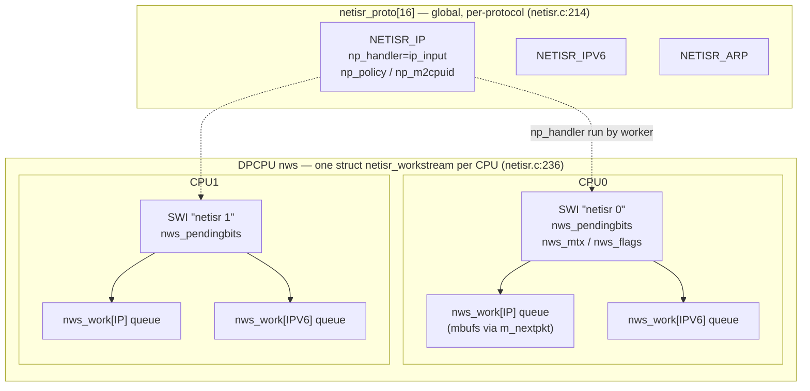
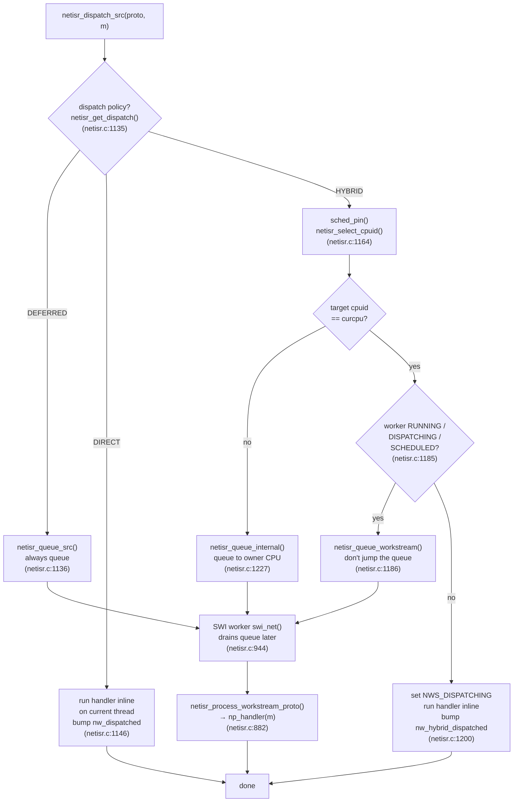

# FreeBSD `netisr(9)` — the kernel's deferred network dispatch service

This note explains `netisr` in FreeBSD: what it is, the data
structures it is built from, how a packet gets from a NIC driver to a
protocol handler, the three ordering policies and four dispatch
policies, and the knobs (`net.isr.*`) that a router operator actually
turns. It is the software-side counterpart to the `options RSS`
note — RSS decides *which CPU owns a flow*; netisr is *the machinery
that runs the flow's processing on a CPU at all*.

> **Status: DRAFT — verified against source but NOT peer-reviewed.**
> Every assertion below is cited to a file and line in `/usr/src` as
> of **FreeBSD 16.0-CURRENT** (`sys/conf/newvers.sh`: `REVISION="16.0"`,
> `BRANCH="CURRENT"`). Line numbers drift between checkouts — treat
> them as "look here", re-`grep` if they don't line up. This was
> written by an agent reading the code, not by a netisr maintainer;
> read the source yourself before relying on any claim.

## 1. What netisr is, in one paragraph

`netisr` (network interrupt service routine) is a **deferred
execution environment for inbound network processing**. Protocols
(IP, IPv6, ARP, the routing socket, IGMP, ethernet demux) register a
handler function; packet sources (mostly `ether_input()`) hand a
packet plus a protocol id to netisr, which either runs the handler
*right now on the current thread* (direct dispatch) or *queues it to a
per-CPU worker thread* (deferred dispatch). The header states this
directly (`sys/net/netisr.h:36-44`):

> The netisr [...] provides a deferred execution evironment in which
> (generally inbound) network processing can take place. Protocols
> register handlers which will be executed directly, or via deferred
> dispatch, depending on the circumstances. [...] it is now
> implemented via a software ithread (SWI).

The whole subsystem lives in three files:

| File | Role |
|---|---|
| `sys/net/netisr.h` | public API + policy/dispatch constants |
| `sys/net/netisr_internal.h` | private structs (`netisr_proto`, `netisr_work`, `netisr_workstream`), exposed only for crashdump tools |
| `sys/net/netisr.c` | the implementation (~1560 lines) |

It was written by Robert N. M. Watson under contract to Juniper
Networks, 2007–2011 (copyright header, `sys/net/netisr.c:4-9`). The
Juniper lineage is why it is so router-shaped: ordering, CPU affinity,
and per-CPU queues are first-class concerns.

## 1b. How old is this, and is it still current?

netisr is one of the oldest ideas in the BSD network stack *and* still
the live inbound-dispatch path in 16-CURRENT — but the version you're
reading is not the original. There are two distinct eras, both provable
from `git log` in `/usr/src`:

| Era | When | Commit | What |
|---|---|---|---|
| BSD software ISR | pre-2002 (4.x BSD lineage) | — | the original single-queue "schedule a soft interrupt to run protocol input" idea |
| Moved to its own file | 2002-09-22 | `e3b6e33c07b1` | netisr code split out of `kern/kern_intr.c` into `net/netisr.c` |
| Direct dispatch added | 2003-03-04 | `1cafed3941f1` | packets *may* be dispatched directly instead of queued (default off then) |
| **Parallel rewrite ("netisr2")** | **2009-06-01, FreeBSD 8.0** | **`d4b5cae49bff`** | the current design: per-CPU **workstreams**, `NETISR_POLICY_*`, `net.isr.maxthreads`/`bindthreads`, DPCPU queues |
| **Per-protocol dispatch policies** | **2011-05-24, FreeBSD 9.0** | **`f2d2d69438ed`** | `NETISR_DISPATCH_{DEFERRED,HYBRID,DIRECT}` and `net.isr.dispatch` as we know them |
| Old sysctls retired | 2013-09-06 | `933e681d933c` | `net.isr.direct` / `direct_force` removed (replaced by `net.isr.dispatch`) — **watch out: old tuning guides still reference these** |
| **Default `maxthreads` flipped `-1`→`1`** | **2015-04-25** | **`a9467c3c45b0`** | the compiled-in default changed from *all CPUs* to *one CPU*, and `-1` was introduced as the "all CPUs" tunable value. **This is the single most consequential line for a router operator** (§4). |

Both big commits (`d4b5cae`, `f2d2d69`) were Robert Watson's
Juniper-funded work — the same lineage as `options RSS`. So the
**architecture is ~15 years old (2009–2011)** and has been the default
ever since.

### The design tension: netisr predates multiqueue/RSS hardware

This history matters for *understanding the knobs*. The **original**
BSD software ISR was born in the single-queue, single-CPU NIC era: one
interface, one interrupt, one input queue, processed by one soft
interrupt. There was no hardware to spread packets across CPUs, so
netisr didn't try to — a single serialized queue was the *whole point*
(it decoupled the driver's hard interrupt from protocol processing).

The default is **one workstream** today (`netisr_maxthreads = 1`,
`sys/net/netisr.c:169`) — but this is not the original behaviour and
not merely a "conservative descendant." The compiled default was
**`-1` (all CPUs) until 2015**, when commit `a9467c3c45b0`
(2015-04-25) flipped it to `1`. So an out-of-the-box multi-core
FreeBSD router shipped *multi-threaded* netisr for years, then silently
became *single-threaded* by default. Any router that "worked great
before, without touching net.isr" was likely running an era where the
default was `-1`, or a kernel/appliance that set it explicitly. That
2015 flip is why the tuning suddenly matters on a fresh 16-CURRENT box.

Multiqueue NICs and RSS arrived *later*. The 2009 parallel rewrite
(`d4b5cae`) was written precisely to bolt the old single-queue model
onto new multiqueue hardware without breaking protocol ordering. That
is the origin of the `NETISR_POLICY_FLOW` design: the NIC now hands up
a hardware hash (`m->m_pkthdr.flowid`, set by the driver —
`sys/net/iflib.c:2877,2881`), and netisr's job became "consume that
hash to pick a CPU" rather than "compute everything itself." Then
`options RSS` (newer still) closed the loop by making the *kernel's*
notion of the flow→CPU map identical to the *NIC's*.

So the layering is chronological:

1. **netisr (old):** one deferred queue, one CPU. Decouples IRQ from
   protocol work. No parallelism.
2. **netisr2 (2009) + multiqueue NIC:** many workstreams, FLOW policy
   consumes the NIC's RSS hash to spread across CPUs. Kernel and NIC
   *don't* agree on the exact mapping, but both spread.
3. **`options RSS` (later):** CPU policy + `rss_*_m2cpuid`, kernel and
   NIC agree exactly, IRQs pinned. (See the companion RSS doc.)

The practical consequence: **since 2015 the default is a single
workstream** (`a9467c3c45b0`, §1b table), but your hardware is era 2 or
3 — a NIC that can feed 16 queues sitting on top of one default
consumer. That mismatch is exactly why a router operator has to touch
`net.isr.maxthreads` at all (§4). Before 2015 the default was `-1` (all
CPUs), so the same hardware parallelised out of the box — which is why
a long-time operator may only now be discovering this knob.

Is it still valid today? Yes — `git log sys/net/netisr.c` shows 84
commits total, with substantive fixes as recent as **2025-01-16**
(`38d947b`, `a1be797`: VIMAGE fixes) and `2024-07-26` (`1d897d1`:
`ffs(0)` bug). It is not deprecated and there is no replacement; every
received IP/IPv6/ARP packet on a stock kernel still flows through
`netisr_dispatch()`. The one thing that *has* changed underneath it is
CPU bring-up: with modern `options EARLY_AP_STARTUP`
(`sys/conf/options:639`, default on x86/arm64) all CPUs exist when
netisr initialises, so it starts every workstream in `netisr_init()`
via the `cpuhead` walk (`sys/net/netisr.c:1333-1342`) rather than the
old two-phase `netisr_start()` SYSINIT (`sys/net/netisr.c:1346-1366`,
now `#ifndef EARLY_AP_STARTUP`). Functionally identical for tuning
purposes.

Caveat for old docs: anything telling you to set `net.isr.direct=1`
or `net.isr.direct_force=1` is pre-2013 and those sysctls no longer
exist — the modern equivalent is `net.isr.dispatch=direct` (which is
already the default).

## 2. Why defer at all? (the two reasons in the code)

Direct-calling a protocol handler from the driver's RX path is the
fast path, but the comment at `sys/net/netisr.c:41-47` gives the two
cases where you must *not*:

> - Whether directly dispatching a netisr handler lead to code
>   reentrance or lock recursion, such as entering the socket code
>   from the socket code.
> - Whether directly dispatching a netisr handler lead to recursive
>   processing, such as when decapsulating several wrapped layers of
>   tunnel information (IPSEC within IPSEC within ...).

So netisr is the seam that lets the stack say "not on this stack
frame — put it on a queue and let a worker pick it up." That same
seam is where per-CPU parallelism and flow affinity get inserted.

## 3. The three data structures

### `struct netisr_proto` — one per registered protocol

Global, indexed by protocol number, `NETISR_MAXPROT = 16` entries
(`sys/net/netisr_internal.h:59-70`, array at `sys/net/netisr.c:214`).
Holds the handler pointer, the two optional callbacks (`np_m2flow`,
`np_m2cpuid`), the queue limit, and the two policies (`np_policy`,
`np_dispatch`). Filled in by `netisr_register()`
(`sys/net/netisr.c:437-452`).

### `struct netisr_work` — one per (protocol, CPU)

The actual mbuf queue: `nw_head` / `nw_tail` linked by `m_nextpkt`,
plus `nw_len`, `nw_qlimit`, `nw_watermark`, and five 64-bit counters
(`nw_dispatched`, `nw_hybrid_dispatched`, `nw_qdrops`, `nw_queued`,
`nw_handled`) — `sys/net/netisr_internal.h:77-95`. Those counters are
exactly what `netstat -Q` prints (see §8).

### `struct netisr_workstream` — one per CPU

One worker per CPU (`sys/net/netisr_internal.h:107-119`). Each holds:

- `nws_intr_event` / `nws_swi_cookie` — the SWI (software interrupt
  thread) this workstream runs in.
- `nws_mtx` — the mutex protecting everything mutable in the stream.
- `nws_cpu` — the CPU this stream is pinned to.
- `nws_flags` — `NWS_RUNNING`, `NWS_DISPATCHING`, `NWS_SCHEDULED`
  (`sys/net/netisr_internal.h:124-126`).
- `nws_pendingbits` — a bitmask of which protocols have queued work
  (bit `proto` set ⇒ that protocol's queue is non-empty).
- `nws_work[NETISR_MAXPROT]` — the per-protocol queues from above.

The struct is `__aligned(CACHE_LINE_SIZE)` so per-CPU streams don't
false-share (`sys/net/netisr_internal.h:119`). It is allocated with
`DPCPU_DEFINE(struct netisr_workstream, nws)`
(`sys/net/netisr.c:236`) — i.e. one instance in every CPU's private
per-CPU area.



The `netisr_proto[]` array is global and holds *how* to process each
protocol; the per-CPU `nws` workstreams hold the *queues and workers*
that actually run it. `nws_array[]` (`netisr.c:243`) maps a contiguous
index onto real CPU ids so callers can do `index % nws_count` without
worrying about CPU-id gaps.

`nws_array[]` maps a contiguous 0..`nws_count`-1 index onto real CPU
ids (`sys/net/netisr.c:243`), so callers can do
`nws_array[flowid % nws_count]` without caring whether CPU ids are
contiguous. `nws_count` is the number of live workstreams
(`sys/net/netisr.c:249`).

## 4. How many workers? (`net.isr.maxthreads` — the #1 knob)

**By default netisr runs on ONE CPU only.** This is the single most
important operational fact and the most common misconfiguration on
routers.

`sys/net/netisr.c:169`:

```c
static int	netisr_maxthreads = 1;		/* Max number of threads. */
```

The comment above it (`sys/net/netisr.c:160-168`) spells it out:

> By default we initialize this to 1 which would assign just 1 cpu
> (cpu0) and therefore only 1 workstream. If set to -1, netisr would
> use all cpus (mp_ncpus) and therefore would have those many
> workstreams.

`netisr_init()` resolves the tunable at boot
(`sys/net/netisr.c:1305-1313`):

```c
if (netisr_maxthreads == 0 || netisr_maxthreads < -1 )
    netisr_maxthreads = 1;		/* default behavior */
else if (netisr_maxthreads == -1)
    netisr_maxthreads = mp_ncpus;	/* use max cpus */
if (netisr_maxthreads > mp_ncpus) {
    printf("netisr_init: forcing maxthreads from %d to %d\n", ...);
    netisr_maxthreads = mp_ncpus;
}
```

It is a `CTLFLAG_RDTUN` (`sys/net/netisr.c:170`) — **read-only at
runtime, set only as a loader tunable**. To get multi-CPU deferred
processing you must put this in `/boot/loader.conf`:

```
net.isr.maxthreads="-1"      # one workstream per CPU
net.isr.bindthreads="1"      # pin each workstream to its CPU
```

`net.isr.bindthreads` (default 0, `sys/net/netisr.c:174-176`) controls
whether each SWI is bound to its CPU via `intr_event_bind()`
(`sys/net/netisr.c:1279-1284`). Without it the scheduler may move the
worker around, defeating the cache-affinity point.

### `bindthreads` vs RSS — they pin *different threads*

A common misconception: "I have `options RSS`, so I don't need
`net.isr.bindthreads`." Wrong — they pin two **different** kernel
threads in the RX path, and RSS has no authority over the netisr one.

There are two threads that touch a received packet:

| Thread | What it does | Pinned by | Knows about RSS? |
|---|---|---|---|
| **NIC RX ithread** (hard IRQ / MSI-X vector per RX queue) | runs the driver, `ether_input()` → `netisr_dispatch()`, and (under direct/hybrid) the inline protocol handler | **`options RSS`**, via the *driver* calling `bus_bind_intr(..., rss_getcpu(...))` — e.g. `sys/dev/cxgbe/t4_main.c:7034-7035,7051-7052` | yes |
| **netisr SWI worker** (`netisr N`) | drains the *deferred* netisr queue and runs the protocol handler for queued packets | **`net.isr.bindthreads` only** (`sys/net/netisr.c:1279`) | **no** |

The decisive proof: **`grep -i rss sys/net/netisr.c` returns
nothing.** netisr has zero references to RSS. RSS pins the interrupt
thread; it cannot and does not pin the netisr worker. Only
`bindthreads` does that (`intr_event_bind()` binds both the IRQ and the
ithread — `sys/kern/kern_intr.c:384-387`).

**Whether the gap matters depends on the dispatch policy** (§7):

- **DIRECT / successful HYBRID** — the protocol handler runs *inline on
  the RX ithread*, which RSS already pinned. The netisr SWI worker
  barely runs (`netstat -Q` shows the traffic under `HDisp'd` /
  `Disp'd` with `Queued` ≈ 0). In this mode `bindthreads` has **little
  measurable effect** — the work isn't in the SWI thread.
- **DEFERRED, or any hybrid fall-back to queueing** (worker already
  running, wrong CPU, or a burst) — the packet goes to the SWI queue
  and the **worker** runs `ip_input()`. That worker is pinned *only* by
  `bindthreads`. Without it, the worker can migrate off the
  bucket-owning CPU and you eat the exact cross-core cache miss and
  lock migration RSS was placing the PCB to avoid.

Bottom line: **RSS pins the interrupt, `bindthreads` pins the deferred
worker.** If you run `net.isr.dispatch=deferred` (or hit bursts that
overflow the hybrid fast path), you want *both*. If you stay in
direct/hybrid with `Queued`≈0, `bindthreads` is cheap insurance rather
than a throughput win. It costs nothing on a balanced-flow router, so
setting it is reasonable either way — just don't expect it to move the
needle while all your traffic shows up as `HDisp'd`.

### Why an RSS kernel *forces* you to raise `maxthreads`

This is the crux, and it is easy to get wrong (I did). On a plain
kernel, IP registers as `NETISR_POLICY_FLOW` + default dispatch, and
the global default dispatch is **DIRECT** (§7). Under DIRECT, IPv4
transit forwarding runs *inline on the RX ithread* and **never touches
a netisr queue** — so on a non-RSS box `maxthreads` genuinely does
nothing for pure forwarding, and a benchmark will (correctly) show "no
difference." That is the historically common case.

`options RSS` changes the registration itself. With RSS compiled in,
`ip_input.c:143-149` hardwires IP (and IPv6) to:

```c
#ifdef	RSS
	.nh_m2cpuid = rss_soft_m2cpuid_v4,
	.nh_policy  = NETISR_POLICY_CPU,
	.nh_dispatch = NETISR_DISPATCH_HYBRID,   /* <- overrides net.isr.dispatch */
#else
	.nh_policy  = NETISR_POLICY_FLOW,        /* -> global default = direct */
#endif
```

So on an RSS kernel **IP no longer honours `net.isr.dispatch=direct`;
it is pinned to HYBRID** (this is exactly what `netstat -Q` shows: the
`ip` row reads `Dispatch = hybrid` even while the global policy is
`direct`). And HYBRID queues: in `netisr_dispatch_src()` the target CPU
is chosen from the RSS software hash, and

```c
if (cpuid != curcpu)
    goto queue_fallback;     /* sys/net/netisr.c:1170 -> netisr_queue_internal() */
```

Any packet whose RSS-computed owner CPU differs from the RX ithread's
CPU is **queued to that owner's workstream** instead of run inline.
Because the NIC's RX-queue→CPU assignment and the software RSS hash do
not agree packet-for-packet, a large fraction of forwarded traffic hits
this cross-CPU branch. With `maxthreads=1` there is exactly one
workstream (cpu0), so *every* cross-CPU hybrid packet funnels onto that
single queue → it overflows → `QDrops`. Raising `maxthreads` to the
core count gives each RSS bucket its own workstream and the queueing
spreads.

**Net effect:** enabling `options RSS` is precisely what makes
`net.isr.maxthreads` mandatory for a forwarder. Without RSS,
forwarding is inline/direct and `maxthreads` is a no-op for transit;
with RSS, forwarding is hybrid/queued and `maxthreads=1` throttles the
whole box to one CPU's queue. If you "never had to set this before,"
you very likely never ran `options RSS` before (or ran a pre-2015
kernel whose default was already `-1`).

This was measured, not theorised — see the apu2-2 case study in §8:
`maxthreads=1` gave 181 M `QDrops` and ~56–91 kpps; `maxthreads=-1`
gave 0 drops, even load across all four CPUs, and ~576 kpps (~10×).

### Is `options RSS` even worth it on a router?

Fair question, because everything above shows RSS *adds* a failure mode.
The short answer: **RSS is fine on a router, but it is not free and it
is not mandatory. What is fatal is RSS with the default
`maxthreads=1`** — that combination is strictly worse than no RSS at
all, because RSS forces IP to hybrid (cross-CPU queued) while a single
workstream gives it nowhere to spread. You pay the queueing cost and
get none of the parallelism (the §8 funnel).

Ranked, for pure IPv4 forwarding:

| Config | IP dispatch | Forwarding spread | Verdict |
|---|---|---|---|
| RSS + `maxthreads=-1` + `bindthreads=1` | hybrid, N workstreams | best: kernel+NIC agree, IRQs pinned | **correct** |
| **no** RSS + `maxthreads=-1` | direct, inline on RX ithread | good: spread by the NIC's RX-queue→CPU map | fine, simpler, often as fast |
| **RSS + `maxthreads=1` (default)** | hybrid, 1 workstream | none — all funnels to cpu0 | **the trap — avoid** |

Two things that decide it for a given box:

- **RSS is a compile-time `options RSS`, not a sysctl.** On an appliance
  image (BSDRP) it is baked in — you cannot back it out at runtime. So
  if your kernel *has* it, `net.isr.maxthreads="-1"` is **non-optional**,
  not a tuning nicety. There is no "just turn RSS off" escape hatch
  short of a different kernel.
- **What RSS actually buys** is the kernel and NIC agreeing on the
  *exact* flow→CPU map, plus IRQ pinning. That matters for **terminated**
  traffic (TCP/UDP sockets whose PCB you want cache-local to the RX
  CPU) and for RSS-aware consumers. For **pure passthrough forwarding**
  it buys much less: a non-RSS kernel with `maxthreads=-1` already
  spreads via the NIC's own multiqueue distribution and runs the
  forward path inline (no cross-CPU hybrid queueing at all), so it can
  match or beat a tuned RSS config with less machinery.

Rule of thumb:

- **Kernel already has `options RSS`** (most appliances) → you *must*
  set `maxthreads="-1"`; then it's a good config.
- **Building your own kernel, box is a pure forwarder** → you can skip
  `options RSS` entirely and just run `maxthreads="-1"`; simpler, and
  no hybrid-queue funnel to misdiagnose.
- **Box terminates significant traffic** (proxy, VPN endpoint, host
  services) → RSS's exact affinity is worth having; keep it, tune
  `maxthreads`.

### The `nws_count == 1` fast path

When only one workstream exists, CPU selection is skipped entirely
(`sys/net/netisr.c:810-813`):

```c
if (nws_count == 1) {
    *cpuidp = nws_array[0];
    return (m);
}
```

So with the default `maxthreads=1`, **all the policy machinery in §6
does nothing** — every packet lands on the single cpu0 workstream (or
is direct-dispatched on the calling CPU). RSS, flow hashing, `m2cpuid`
— none of it spreads load until you raise `maxthreads`. This is the
trap: people enable `options RSS`, see one CPU pegged in `top -SHP`,
and conclude RSS is broken. It isn't; netisr is still single-threaded.

## 5. Registration: `netisr_register()`

A protocol fills a `struct netisr_handler` and calls
`netisr_register()` (`sys/net/netisr.c:384-472`). The function
validates the handler with a wall of `KASSERT`s
(`sys/net/netisr.c:400-426`) that encode the API's invariants:

- `nh_handler` must be non-NULL.
- `nh_policy` must be one of SOURCE / FLOW / CPU.
- `nh_m2flow` may only be set with `NETISR_POLICY_FLOW`
  (`sys/net/netisr.c:409-412`).
- `nh_m2cpuid` **must** be set iff `nh_policy == NETISR_POLICY_CPU`
  (`sys/net/netisr.c:413-418`) — CPU policy without a mapping
  function is a panic.

It then copies the fields into `netisr_proto[proto]`, resolves the
queue limit (default `net.isr.defaultqlimit` = 256 if the protocol
passed 0, capped to `net.isr.maxqlimit` = 10240 otherwise —
`sys/net/netisr.c:442-450`, constants at `sys/net/netisr.c:183-195`),
and zeroes the per-CPU work queue for every CPU
(`sys/net/netisr.c:453-457`).

### The actual registered protocols (proven, not assumed)

`grep`ing every `netisr_register()` call site and reading each
handler struct:

| Proto | `nh_name` | Policy (non-RSS) | Policy (`#ifdef RSS`) | Dispatch | Source |
|---|---|---|---|---|---|
| `NETISR_IP` (1) | `ip` | `POLICY_FLOW` | `POLICY_CPU` + `rss_soft_m2cpuid_v4` | HYBRID (RSS) / default | `sys/netinet/ip_input.c:139-150` |
| `NETISR_IGMP` (2) | `igmp` | `POLICY_SOURCE` | — | default | `sys/netinet/igmp.c:149-154` |
| `NETISR_ROUTE` (3) | `rtsock` | `POLICY_SOURCE` | — | default | `sys/net/rtsock.c:222-227` |
| `NETISR_ARP` (4) | `arp` | `POLICY_SOURCE` | — | default | `sys/netinet/if_ether.c:192-197` |
| `NETISR_ETHER` (5) | `ether` | `POLICY_SOURCE` | `POLICY_CPU` + `rss_m2cpuid` | DIRECT | `sys/net/if_ethersubr.c:694-706` |
| `NETISR_IPV6` (6) | `ip6` | `POLICY_FLOW` | `POLICY_CPU` + soft m2cpuid | HYBRID (RSS) | `sys/netinet6/ip6_input.c:138-146` |
| `NETISR_IP_DIRECT` (9) | `ip_direct` | *RSS-only* | `POLICY_CPU` | HYBRID | `sys/netinet/ip_input.c:160-167` |
| `NETISR_IPV6_DIRECT` (10) | `ip6_direct` | *RSS-only* | `POLICY_CPU` | HYBRID | `sys/netinet6/ip6_input.c:182-187` |

Proto numbers are `#define`d in `sys/net/netisr.h:52-59`. Note IP and
IPv6 flip from **FLOW** policy to **CPU** policy when `options RSS` is
compiled in — this is the exact hinge between the two docs. Without
RSS they use the NIC's flow id and a simple modulo; with RSS they call
the RSS software hash to pick the bucket-owning CPU. ARP, IGMP, and
the routing socket are always `POLICY_SOURCE` — they don't parallelise
per-flow because there's no flow to speak of.

## 6. The three ordering policies (`nh_policy`)

Chosen at registration; drives `netisr_select_cpuid()`
(`sys/net/netisr.c:797-871`), the function that answers "which CPU's
workstream does this mbuf go to?"

### `NETISR_POLICY_SOURCE` — keep per-source ordering

The fallback. CPU is chosen from the receive interface index plus a
caller-supplied `source` value (`sys/net/netisr.c:860-869`):

```c
ifp = m->m_pkthdr.rcvif;
if (ifp != NULL)
    *cpuidp = nws_array[(ifp->if_index + source) % nws_count];
else
    *cpuidp = nws_array[source % nws_count];
```

All packets from one interface (with the same `source`) stay on one
CPU and thus stay ordered. Flow ids on the mbuf are **ignored**
(`sys/net/netisr.h:150-153`). This is what ARP/IGMP/rtsock use, and
what IP/IPv6 fall back to when there's no hash.

### `NETISR_POLICY_FLOW` — hash the flow id the NIC gave us

`sys/net/netisr.c:845-858`:

```c
if (M_HASHTYPE_GET(m) == M_HASHTYPE_NONE && npp->np_m2flow != NULL) {
    m = npp->np_m2flow(m, source);      /* ask protocol to compute one */
    ...
}
if (M_HASHTYPE_GET(m) != M_HASHTYPE_NONE) {
    *cpuidp = netisr_default_flow2cpu(m->m_pkthdr.flowid);
    return (m);
}
policy = NETISR_POLICY_SOURCE;          /* no hash → fall back */
```

`netisr_default_flow2cpu()` is just `nws_array[flowid % nws_count]`
(`sys/net/netisr.c:287-292`). The flow id normally comes straight from
hardware RSS: the iflib RX path copies the NIC's hash into the mbuf
(`sys/net/iflib.c:2877,2881`):

```c
m->m_pkthdr.flowid = ri->iri_flowid;
...
M_HASHTYPE_SET(m, ri->iri_rsstype);
```

So **even without `options RSS`, a modern NIC + FLOW policy already
spreads IP/IPv6 across netisr CPUs** — provided you raised
`maxthreads`. This is the "poor man's RSS" that most people are
actually running. What `options RSS` adds on top is making the
kernel's idea of the flow→CPU map identical to the NIC's, plus IRQ
pinning (see the RSS doc).

### `NETISR_POLICY_CPU` — protocol decides, per packet

netisr delegates entirely to `np_m2cpuid`
(`sys/net/netisr.c:821-843`):

```c
if (policy == NETISR_POLICY_CPU) {
    m = npp->np_m2cpuid(m, source, cpuidp);
    if (m == NULL) return (NULL);
    if (*cpuidp != NETISR_CPUID_NONE) {
        *cpuidp = netisr_get_cpuid(*cpuidp);
        return (m);
    }
    if (dispatch_policy == NETISR_DISPATCH_HYBRID) {
        *cpuidp = netisr_get_cpuid(curcpu);   /* no opinion → stay here */
        return (m);
    }
    policy = NETISR_POLICY_SOURCE;            /* queued case → fall back */
}
```

This is the policy `options RSS` selects for IP/IPv6/ether, with
`np_m2cpuid` = one of the `rss_*_m2cpuid` functions. If the protocol
returns `NETISR_CPUID_NONE` ("I don't know"), netisr degrades
gracefully to direct dispatch (hybrid) or source ordering (queued).

## 7. The four dispatch policies (`nh_dispatch` + `net.isr.dispatch`)

Ordering policy answers *which CPU*; dispatch policy answers *now or
later*. Constants in `sys/net/netisr.h:73-76`, semantics documented at
`sys/net/netisr.c:132-149`:

| Dispatch | Meaning |
|---|---|
| `DEFERRED` | always queue to the worker, never run inline |
| `HYBRID` | direct-dispatch only if we're already on the right CPU and the worker isn't running |
| `DIRECT` | always run inline on the current thread (**the global default**) |
| `DEFAULT` | "use the global policy" — what a protocol sets when it doesn't want to override |

The global default is DIRECT (`sys/net/netisr.c:151`):

```c
#define	NETISR_DISPATCH_POLICY_DEFAULT	NETISR_DISPATCH_DIRECT
```

exposed as the **runtime-writable** tunable `net.isr.dispatch`
(`sys/net/netisr.c:155-158`, `CTLFLAG_RWTUN`). A protocol's own
`nh_dispatch` overrides the global one unless it is `DEFAULT`
(`netisr_get_dispatch()`, `sys/net/netisr.c:780-790`).

### The dispatch decision, as a flowchart

This is `netisr_dispatch_src()` (`sys/net/netisr.c:1107-1236`) drawn
out — the exact branch structure of the code:



Direct dispatch and the successful hybrid case run the handler on the
calling thread; the deferred, cross-CPU, and busy-worker cases all
converge on the SWI worker (`swi_net`), which drains the queue on the
owner CPU.

### What each dispatch path actually does

After resolving the policy:

**DEFERRED** → straight to `netisr_queue_src()`, no inline run
(`sys/net/netisr.c:1136-1137`).

**DIRECT** → run the handler immediately, "borrowing" the current
CPU's stats, no CPU selection at all
(`sys/net/netisr.c:1146-1154`):

```c
if (dispatch_policy == NETISR_DISPATCH_DIRECT) {
    nwsp = DPCPU_PTR(nws);
    npwp = &nwsp->nws_work[proto];
    npwp->nw_dispatched++;
    npwp->nw_handled++;
    netisr_proto[proto].np_handler(m);
    ...
}
```

Because DIRECT skips CPU selection, ordering is implicitly "source
ordered" (whatever CPU the driver's RX interrupt fired on) — the
comment at `sys/net/netisr.c:1141-1144` says exactly this.

**HYBRID** → the interesting one (`sys/net/netisr.c:1156-1225`).
`sched_pin()`, select the CPU, and:

- if the target CPU isn't the current one → fall through to
  `netisr_queue_internal()` (`sys/net/netisr.c:1172-1173,1227-1228`);
- if it *is* the current CPU and the worker isn't
  RUNNING/DISPATCHING/SCHEDULED → set `NWS_DISPATCHING`, run the
  handler inline, clear the flag, bump `nw_hybrid_dispatched`
  (`sys/net/netisr.c:1184-1206`);
- otherwise queue it so it doesn't jump ahead of already-queued work
  (`sys/net/netisr.c:1185-1192`).

The `NWS_DISPATCHING` flag is the ordering guard: it stops the SWI
worker and the borrowing thread from processing the same stream
concurrently and misordering it (`sys/net/netisr.c:1194-1201`).

### Why DIRECT is the default (and what it costs)

DIRECT keeps the RX interrupt thread running the whole L2→L3→L4 path
with warm caches and no context switch — lowest latency, and on a
box with `maxthreads=1` there's no other CPU to hand off to anyway.
The cost: the RX ithread does all the protocol work, so a single
busy queue can saturate one CPU. Switching `net.isr.dispatch=deferred`
pushes that work onto the netisr SWIs, which (with `maxthreads=-1`)
spreads it — at the price of a context switch and queueing latency per
packet. `hybrid` is the middle ground and is what IP/IPv6 request when
RSS is on.

## 8. The queue, the worker, and drops

### Enqueue: `netisr_queue_workstream()`

`sys/net/netisr.c:987-1026`. Under the stream lock: if
`nw_len < nw_qlimit`, append the mbuf, bump `nw_len`, set the
protocol's bit in `nws_pendingbits`, and — if the worker isn't already
running/scheduled — set `NWS_SCHEDULED` and signal it
(`sys/net/netisr.c:995-1020`). **If the queue is full, the packet is
freed and `nw_qdrops` is incremented** (`sys/net/netisr.c:1021-1025`):

```c
} else {
    m_freem(m);
    npwp->nw_qdrops++;
    return (ENOBUFS);
}
```

This is the drop you chase on a loaded router. `nw_qdrops` is
per-(proto,CPU); it shows up as the **`QDrops`** column in
`netstat -Q`, and for IP it is also mirrored in
`sysctl net.inet.ip.intr_queue_drops`.

#### Which qlimit knob to raise — global vs per-protocol

There are two ways to change a queue depth, and picking the right one
matters:

| Knob | Type | Scope | Backing code |
|---|---|---|---|
| `net.isr.defaultqlimit` | loader tunable (`RDTUN`) — **reboot required** | the fallback limit for *every* protocol that didn't set its own `nh_qlimit` | `NETISR_DEFAULT_DEFAULTQLIMIT=256`, `sys/net/netisr.c:194-198` |
| `net.inet.ip.intr_queue_maxlen` | sysctl — **runtime-writable, live** | the **IP** workstream queue only | `sysctl_netisr_setqlimit(&ip_nh, ...)`, `sys/netinet/ip_input.c:222-236` |
| `net.inet6.ip6.intr_queue_maxlen` | sysctl — **runtime-writable, live** | the **IPv6** workstream queue only | `netisr_setqlimit(&ip6_nh, ...)`, `sys/netinet6/ip6_input.c:151-166` |
| `net.isr.maxqlimit` | loader tunable | hard ceiling — any `setqlimit` above it returns `EINVAL` | `NETISR_DEFAULT_MAXQLIMIT=10240`, `sys/net/netisr.c:183`; check at `sys/net/netisr.c:579-580` |

The relationship: `ip` and `ip6` do **not** hardcode an `nh_qlimit`,
so at registration they inherit `net.isr.defaultqlimit` (that's why a
fresh box shows `QLimit 256` for both). Their dedicated
`intr_queue_maxlen` sysctls then let you retune *just that protocol*
at runtime, without touching everything else and without a reboot —
each one is a thin wrapper that calls `netisr_setqlimit()` on the
respective handler.

So, to fix an IP drop problem:

- **Targeted, live, reversible (preferred):**
  `sysctl net.inet.ip.intr_queue_maxlen=1024` — changes only the IP
  queue, takes effect immediately, easy to back out.
- **Blanket, needs reboot:** `net.isr.defaultqlimit="1024"` in
  `/boot/loader.conf` — raises the default for ip, ip6, arp, igmp,
  rtsock all at once. Use only if you want a new baseline for
  everything.

Don't just set it to the 10240 ceiling. An oversized queue trades
drops for **latency and memory** (bufferbloat): packets sit in the
queue instead of failing fast. Size by evidence — bump it, run load,
then read the `WMark` (watermark) column in `netstat -Q`, which is the
highest depth the queue actually reached (`nw_watermark`,
`sys/net/netisr.c:1006-1007`). If `WMark` stays well below the limit,
stop. 1024–2048 per queue is a sane router starting point.

Also raise `net.isr.maxthreads` **first**: on a box with `options RSS`
but a single workstream (the §4 trap), the drops are often just the
symptom of all RSS buckets piling onto one CPU's queue. Spreading them
across N workstreams divides the per-queue arrival rate by ~N and may
remove the need for any qlimit bump at all.

### The worker: `swi_net()`

The SWI handler (`sys/net/netisr.c:944-985`) locks the stream, checks
it isn't already being direct-dispatched, sets `NWS_RUNNING`, then
drains every protocol with a pending bit
(`sys/net/netisr.c:969-975`):

```c
while ((bits = nwsp->nws_pendingbits) != 0) {
    while (bits != 0) {
        prot = ffs(bits) - 1;
        bits &= ~(1 << prot);
        (void)netisr_process_workstream_proto(nwsp, prot);
    }
}
```

`netisr_process_workstream_proto()` (`sys/net/netisr.c:882-936`) does
a nice trick for fairness: it **moves the entire global queue to a
stack-local copy**, drops the lock, and processes the local copy so
new arrivals can keep queueing while it works
(`sys/net/netisr.c:908-928`). The comment notes the side effect
(`sys/net/netisr.c:901-907`): the effective max queue depth is
therefore *twice* `nw_qlimit`. For each mbuf it restores `rcvif`, sets
the correct vnet, and calls the handler
(`sys/net/netisr.c:921-927`).

### Monitoring

Three sysctls export everything for `netstat -Q`:
`net.isr.proto` (registered protocols, `sys/net/netisr.c:1371-1416`),
`net.isr.workstream` (the per-CPU streams, `sys/net/netisr.c:1421-1467`),
and `net.isr.work` (per-proto-per-CPU counters,
`sys/net/netisr.c:1473-1527`). There's also a `ddb` command
`show netisr` that dumps the same table live
(`sys/net/netisr.c:1529-1562`).

What to read in `netstat -Q`:

- **`WSID`/`CPU`** columns > 1 row ⇒ `maxthreads` took effect. One
  row only ⇒ still single-threaded (see §4).
- **`QDrops`** non-zero ⇒ queue overflow, raise qlimit or add workers.
- **`Disp'd` vs `HDisp'd` vs `Queued`** ⇒ how much is running inline
  (direct), hybrid-direct, vs deferred to the worker; tells you whether
  `net.isr.dispatch` is doing what you think.

### Verified against a live box (apu2-2, BSDRP)

The above was checked against a running APU2 router (`ident
BSDRP-AMD64`, FreeBSD 16.0-CURRENT, 4 CPUs) — and it is a textbook
example of the §4 trap. Edited `netstat -Q`:

```
Thread count            1        1          <- net.isr.maxthreads=1 (default)
Dispatch policy    direct                    <- default
Threads bound to CPUs disabled               <- net.isr.bindthreads=0 (default)

Name   Proto QLimit Policy Dispatch Flags
ip         1    256    cpu   hybrid   C--     <- RSS is compiled in: policy=cpu, C flag
ether      5    256    cpu   direct   C--
ip6        6    256    cpu   hybrid   C--

WSID CPU Name  Len WMark  Disp'd  HDisp'd     QDrops   Queued  Handled
   0   0 ip      0   256       0     3651  181210251  8681903  8685554
   0   0 ether   0     0 47512660        0        0        0 47512660
```

Everything the doc predicts is visible at once:

1. **RSS is present but doing nothing.** `sysctl net.inet.rss.buckets`
   returns 8 and `net.inet.rss.bucket_mapping` spreads them across
   cpu0-3 — yet **only `WSID 0 / CPU 0` appears.** `options RSS` set
   the protocols to `cpu` policy (the `C` flag, matching §5's table
   exactly), but `net.isr.maxthreads=1` means `nws_count==1`, so the
   §4 shortcut (`sys/net/netisr.c:810-813`) collapses all 8 buckets
   onto one workstream. This is the "RSS does nothing" failure mode
   from §10, caught in the wild.
2. **The single IP queue is drowning.** `QDrops = 181,210,251` on `ip`
   vs `Handled = 8,685,554` — 95% of IP packets to this queue were
   dropped. That's the exact `nw_qdrops++`-on-full path from §8, and
   the number matches `net.inet.ip.intr_queue_drops` (181210251) to
   the digit. `ether` shows 47.5M `Disp'd` with 0 drops because ether
   is `dispatch=direct` (§5) — it never queues, so it can't overflow;
   the drops are entirely on the deferred IP handoff.
3. **The proto/policy/dispatch table matches §5 line for line** —
   ip/ip6/ip_direct/ip6_direct = cpu/hybrid, ether = cpu/direct,
   arp/igmp/rtsock = source, all with the RSS `C` flag on the three
   that flip to CPU policy.

The fix for this box is precisely §10's router row: set
`net.isr.maxthreads="-1"` and `net.isr.bindthreads="1"` in
`/boot/loader.conf` and reboot, so RSS's 8 buckets actually land on
4 workstreams instead of one.

**This was measured, and it is decisive.** Same DUT (APU2, i210AT/`igb`,
FreeBSD 16.0-CURRENT `n311066`), same netmap `pkt-gen` min-size IPv4
forwarding load (~1.49 Mpps offered):

| State | ip workstreams | QDrops | Forwarded pps |
|---|---|---|---|
| default `maxthreads=1` | 1 (all on cpu0) | ~180 M | ~56k–91k |
| `maxthreads=-1` | 4, evenly loaded | **0** | ~576k |
| `maxthreads=-1` + `bindthreads=1` | 4, evenly loaded | **0** | ~576k |

Roughly **10×** throughput, drops to zero, load dead-even
(~7.8–7.9 M packets handled per workstream — proof the RSS hash was
always distributing fine; only the single consumer was the bottleneck).
`bindthreads=1` is throughput-neutral here vs the unbound case but is
kept to remove scheduler jitter and match the lab's proven IPsec
config. Post-fix `netstat -Q` from the live box:

```
WSID CPU Name  ...  HDisp'd  QDrops  Handled
   0   0 ip     ... 7847143       0  7847143
   1   1 ip     ... 7911149       0  7911149
   2   2 ip     ... 7875880       0  7875880
   3   3 ip     ... 7803516       0  7803516
```

Note the mechanism: the drops were **not** a queue-depth problem, so
raising `intr_queue_maxlen` would not have fixed them — a bigger queue
on one CPU still saturates that one CPU. The fix is *more workstreams*,
because IP is hybrid (§4) and cross-CPU-hashed packets need somewhere
to land. Only reach for `sysctl net.inet.ip.intr_queue_maxlen=1024`
(the targeted knob, not the global `defaultqlimit`) if `QDrops` still
climbs *after* the workstreams are balanced — i.e. genuine per-CPU
overload, not the funnel effect.

Provenance: `AMD_GX-412TC_4Cores/Intel_i210AT/firewalls/results/
fbsd16-n311066/` in the netbenches tree. The absolute pps is honest for
this APU2/FreeBSD-16 combo but not comparable across generators — the
load-bearing results are the *ratio* (~10×) and the *mechanism*.

## 9. `netisr` end-to-end: a received IPv4 packet

Putting the pieces together for a plain (non-RSS) multi-queue NIC with
`maxthreads=-1`:

1. NIC RX interrupt → driver → `ether_input()`
   (`sys/net/if_ethersubr.c:755`), which splits any mbuf chain and
   calls `netisr_dispatch(NETISR_ETHER, m)` per packet
   (`sys/net/if_ethersubr.c:802`).
2. ether is `POLICY_SOURCE` + `DISPATCH_DIRECT` (non-RSS,
   `sys/net/if_ethersubr.c:703-704`) → `ether_nh_input()` runs inline
   on the RX thread and demuxes to L3.
3. For IPv4, ethersubr calls `netisr_dispatch(NETISR_IP, m)`
   (`sys/net/if_ethersubr.c:897`). `ip_nh` is `POLICY_FLOW`
   (`sys/netinet/ip_input.c:148`) with the global default dispatch
   (DIRECT).
4. Under DIRECT, `ip_input()` also runs inline — one CPU does the
   whole path. To spread IP processing on a **non-RSS** kernel you set
   `net.isr.dispatch=deferred`; then `netisr_select_cpuid()` hashes
   `m->m_pkthdr.flowid` (the NIC's RSS hash, copied in by
   `sys/net/iflib.c:2877`) via `netisr_default_flow2cpu()` and queues
   to that CPU's workstream, whose SWI later runs `ip_input()`.

### The same packet on a kernel with `options RSS`

This is the case most real routers hit, and it behaves differently
enough to be worth spelling out. With RSS compiled in, IP is
`POLICY_CPU` + **HYBRID** (§4, `ip_input.c:143-149`), *regardless* of
`net.isr.dispatch`:

1. ether arrives DIRECT on the RX ithread (CPU chosen by the NIC's
   RX-queue→MSI-X mapping, pinned by RSS via the driver's
   `bus_bind_intr(..., rss_getcpu(...))`).
2. ether hands to IP via `netisr_dispatch(NETISR_IP, m)`. IP is hybrid,
   so `netisr_select_cpuid()` runs `rss_soft_m2cpuid_v4` to compute the
   *software* RSS owner CPU for this flow.
3. **If that owner CPU == the current RX CPU**, `ip_input()` (and thus
   `ip_forward()`) runs inline — counted as `HDisp'd`.
4. **If it differs** (the common case, because the NIC's queue
   assignment and the software hash needn't agree), the packet is
   *queued* to the owner's workstream (`netisr.c:1170`) and that CPU's
   SWI runs `ip_input()` later — counted as `Queued`/`Handled`.

The consequence for tuning: on an RSS forwarder, spreading is **not**
achieved with `net.isr.dispatch=deferred` (IP ignores it — it's
hybrid). It is achieved by having enough workstreams for step 4 to land
on, i.e. `net.isr.maxthreads=-1`. `deferred` is the lever on a *non-RSS*
box; `maxthreads` is the lever on an *RSS* box. Conflating the two is
the classic misdiagnosis.

> **IPv6 asymmetry worth knowing:** IPv6 *forwarding* has an explicit
> `netisr_queue(NETISR_IPV6, m)` in `sys/netinet6/ip6_forward.c:364`,
> whereas the IPv4 forward path re-queues only for reassembly
> (`ip_reass.c` → `NETISR_IP_DIRECT`), divert, or netgraph. So IPv6
> transit can enter the netisr queue even on a non-RSS kernel, making
> `maxthreads` relevant to v6 forwarding in more configurations than
> v4.

## 10. Operator cheat-sheet for a BSDRP-style router

```
# /boot/loader.conf  (needs reboot)
net.isr.maxthreads="-1"     # one netisr workstream per CPU (default is 1!)
net.isr.bindthreads="1"     # pin each workstream to its CPU
# net.isr.defaultqlimit="1024"  # blanket per-proto default; only if you want a new baseline for ALL protocols
```

```
# runtime (writable, safe to test live)
sysctl net.isr.dispatch=deferred        # NON-RSS only: push inline IP work onto SWIs.
                                        # (RSS kernels ignore this for IP — it's hybrid; use maxthreads instead, §4)
sysctl net.inet.ip.intr_queue_maxlen=1024   # raise ONLY the IP queue if netstat -Q shows QDrops
sysctl net.inet6.ip6.intr_queue_maxlen=1024 # ditto for IPv6
netstat -Q                              # verify >1 workstream; watch QDrops and WMark
```

Prefer the per-protocol `intr_queue_maxlen` sysctls over
`net.isr.defaultqlimit`: they're live (no reboot), scoped to the queue
that's actually dropping, and easy to revert. Reach for
`defaultqlimit` only when you deliberately want to move the baseline
for every protocol. See §8's "which qlimit knob" table for the full
distinction.

### Per-use-case tuning matrix

Which `net.isr.*` values to change depends entirely on the workload.
The knobs that matter: `maxthreads`, `bindthreads` (loader-only,
reboot), `dispatch` (live), and the queue depth. For the queue depth,
the **per-protocol** `net.inet.ip.intr_queue_maxlen` /
`net.inet6.ip6.intr_queue_maxlen` (live, scoped) is preferred over the
**global** `net.isr.defaultqlimit` (loader-only, all protocols) — see
§8. "default" = leave it alone.

| Use case | maxthreads | bindthreads | dispatch | qlimit | Why |
|---|---|---|---|---|---|
| **Desktop / laptop / single-NIC server** | default (1) | default (0) | default (direct) | default | Low pps, latency-insensitive. One workstream is plenty; extra workers only add context switches. Era-1 defaults fit fine. |
| **IP router / firewall, multi-queue NIC, `options RSS`** (BSDRP, pfSense-style) | `-1` | `1` | leave default — IP is hybrid regardless (§4) | `intr_queue_maxlen` only if `QDrops>0` *after* balancing | The headline case. RSS pins IP to hybrid, so `net.isr.dispatch` is moot; the lever is `maxthreads`. Without `-1` all cross-CPU-hashed forwarding funnels onto cpu0's one workstream and drops (measured 10× loss, §8). `bindthreads=1` keeps each stream cache-hot. |
| **IP router / firewall, multi-queue NIC, non-RSS** | `-1` | `1` | `deferred` if the RX ithread saturates | `intr_queue_maxlen` if `QDrops>0` | Without RSS, IP is FLOW+direct, so transit forwarding runs inline and `maxthreads` alone won't spread it — `deferred` is what pushes IP onto the workstreams. This is the config where old "maxthreads made no difference" benchmarks were correct. |
| **High-pps forwarding, single CPU pegged in `top -SHP`** | `-1` | `1` | `deferred` | `intr_queue_maxlen` | Under DIRECT the RX ithread does all L3/L4 work inline. `deferred` pushes it onto the netisr SWIs so it spreads; costs a context switch + queue latency per packet. |
| **Latency-critical (trading, VoIP media, RTT-sensitive)** | `-1` (if multi-flow) | `1` | keep `direct` | default | DIRECT avoids the enqueue→wake→dequeue hop. Spread across CPUs via multiple workstreams, but never `deferred` — you'd add queueing jitter. |
| **VNET jail host wired with epair** | `-1` | `1` | default | default | epair forwarding is single-CPU without RSS (see RSS doc §5); more workstreams + RSS is what parallelises it. netisr must be multi-threaded first or the RSS win never materialises. |
| **`options DEVICE_POLLING` kernel** | forced to 1 | forced to 0 | n/a | default | You have no choice: `netisr_init()` clamps both (`sys/net/netisr.c:1319-1331`). Polling and parallel netisr are mutually exclusive. Migrate off polling to iflib+multiqueue if you need scale. |
| **Seeing `QDrops` in `netstat -Q`** | (already `-1`) | `1` | consider `deferred` | **`sysctl net.inet.ip.intr_queue_maxlen=1024`** (live, IP-only); `defaultqlimit` only for a global baseline | Worker can't drain fast enough, or a burst exceeded `2×qlimit` (local-queue doubling, §8). Fix `maxthreads` first (spreading across CPUs often removes the drops); then raise the per-proto queue; if drops persist the CPU is genuinely saturated → faster CPU. |
| **Diagnosing "RSS/multiqueue does nothing"** | check it's `-1`! | `1` | — | — | 90% of the time: `maxthreads` was never set, so `nws_count==1` (§4) short-circuits all CPU selection onto cpu0. Verify with `netstat -Q` showing >1 workstream row. |

Quick decision rules if the table is too much:

- **Not a router, low traffic** → change nothing.
- **A router with a real NIC** → `maxthreads="-1"` + `bindthreads="1"`
  in `/boot/loader.conf`, reboot, confirm with `netstat -Q`.
- **Still one CPU hot after that** → depends on RSS. *With* `options
  RSS`, IP is already hybrid and `dispatch` is ignored — recheck that
  `netstat -Q` shows >1 workstream and that the hash has entropy (many
  flows). *Without* RSS, `sysctl net.isr.dispatch=deferred` (live,
  reversible) is what moves inline IP work onto the workstreams.
- **`QDrops` non-zero** → fix `maxthreads` first; if still dropping,
  `sysctl net.inet.ip.intr_queue_maxlen=1024` (live, IP-only). Use
  `net.isr.defaultqlimit` only for a deliberate global baseline.
- **Everything on one CPU despite RSS** → you forgot `maxthreads`;
  §4's `nws_count == 1` shortcut is almost always the cause.

## 11. Known caveats (from the code, not folklore)

- **`maxthreads` / `bindthreads` are boot-only** (`CTLFLAG_RDTUN`,
  `sys/net/netisr.c:170,175`). No live reconfiguration; the code
  comments repeatedly note "we don't yet support dynamic
  reconfiguration" (`sys/net/netisr.c:1348-1350`,
  `sys/net/netisr.h:171-173`).
- **`DEVICE_POLLING` forces single-threaded netisr.** If your kernel
  has `options DEVICE_POLLING`, `netisr_init()` clamps `maxthreads` to
  1 and `bindthreads` to 0 with a printf
  (`sys/net/netisr.c:1319-1331`), because the polling code assumes one
  stream (`KASSERT(nws_count == 1, ...)`, `sys/net/netisr.c:956`).
  You can't have both parallel netisr and device polling.
- **Registration locking is normally compiled out.** `NETISR_LOCKING`
  is `#define`d off (`sys/net/netisr.c:127`) because taking the rmlock
  on every packet cost 3–6% on loopback ping-pong
  (`sys/net/netisr.c:110-116`); registration/unregistration is assumed
  rare. Fine in practice, worth knowing if you write a module that
  registers a netisr at runtime.
- **16 protocols max** (`NETISR_MAXPROT`,
  `sys/net/netisr_internal.h:70`) and proto numbers must be
  `0 < proto < 32` because they're used in bit shifts
  (`sys/net/netisr.h:47-51`). Only 8 are used today (§5).
- **Effective queue depth is 2× the configured limit** thanks to the
  stack-local queue swap (`sys/net/netisr.c:901-907`) — size
  monitoring/alerting accordingly.
```
