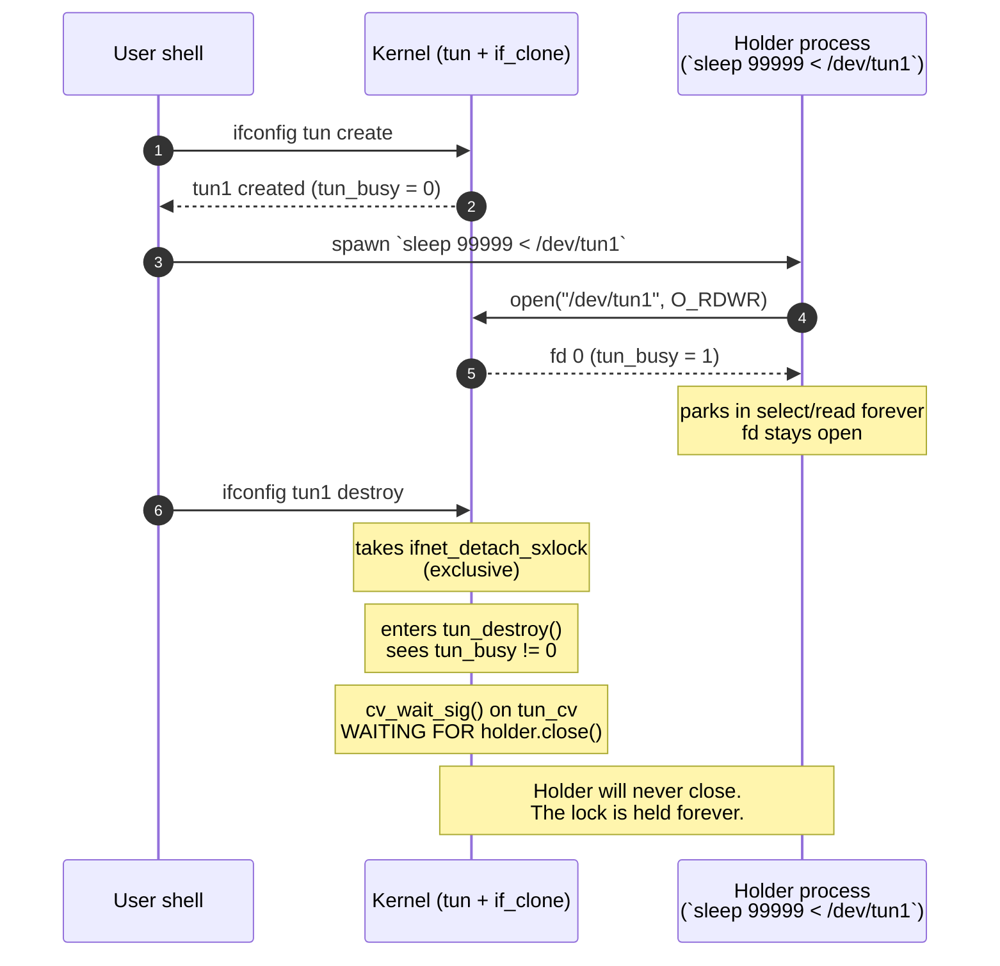
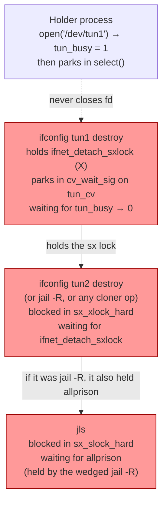
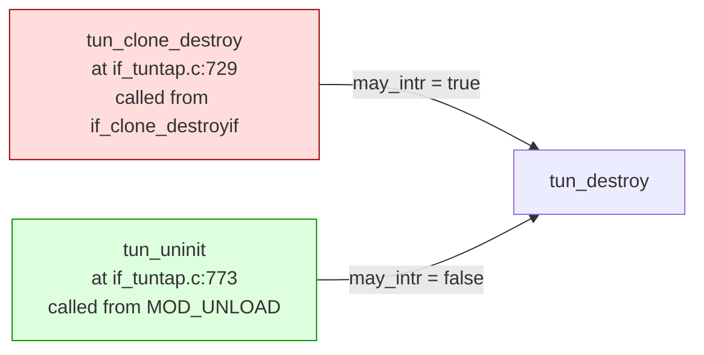
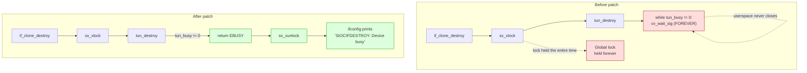
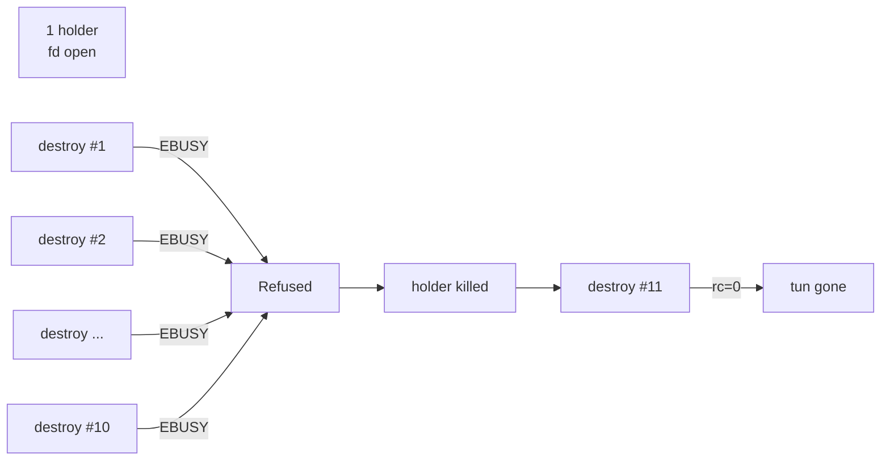

# Case study: `tun_destroy()` parks a global sx-lock on FreeBSD 16-CURRENT

A real-world kernel-locking bug, walked through from "I can reproduce
this in three lines of shell" to "here is the upstream patch and why
that exact shape is correct."

This document is written for someone learning OS programming. It assumes
you have heard of mutexes and condition variables but have not
necessarily seen them tangled up with a global reader/writer lock
before. Concepts are introduced as they appear.

- **Platform:** FreeBSD 16.0-CURRENT (mid-2026).
- **Subsystem:** `tun(4)` virtual point-to-point interface + the
  `if_clone(9)` framework that creates and destroys cloneable network
  interfaces.
- **Bug class:** a kernel thread that holds a global exclusive sx lock
  goes to sleep on a condition variable that only userspace can signal.
  If userspace does not cooperate, the lock is held forever and every
  other consumer wedges behind it.
- **Fix:** five lines (plus a comment), patch at
  [`tun_destroy_ebusy.patch`](tun_destroy_ebusy.patch).

---

## Table of contents

1. [The three-line reproducer](#1-the-three-line-reproducer)
2. [Background: what is `tun(4)` and what is `if_clone`?](#2-background-what-is-tun4-and-what-is-if_clone)
3. [What deadlocks, and what does "deadlock" even mean here?](#3-what-deadlocks-and-what-does-deadlock-even-mean-here)
4. [The lock chain in the kernel](#4-the-lock-chain-in-the-kernel)
5. [The culprit code](#5-the-culprit-code)
6. [The patch and why this shape is correct](#6-the-patch-and-why-this-shape-is-correct)
7. [Validating the fix](#7-validating-the-fix)
8. [Exercises](#8-exercises)

---

## 1. The three-line reproducer

```sh
ifconfig tun create                # → e.g. tun1
sleep 99999 < /dev/tun1 &          # holds /dev/tun1 open as fd 0
ifconfig tun1 destroy              # ← hangs forever on a buggy kernel
```

That's it. After those three lines:

- the third `ifconfig` never returns,
- every subsequent `ifconfig <anything> destroy` on the host hangs the
  same way,
- `jail -R` (jail remove) on any vnet jail that owns a cloned
  interface also hangs,
- `kill -9` on the wedged `ifconfig` does not free it,
- **only a reboot recovers.**

The script in [`FreeBSD/repro_tun_destroy_deadlock.sh`](../repro_tun_destroy_deadlock.sh)
wraps this with a timeout and a wedged-state report so you can run it
safely on a throwaway VM.

### What the reproducer actually does



The arrangement is mundane: one process opens the tun device and
parks. Another process asks the kernel to destroy that device. On
Linux or on older FreeBSD this would either succeed (kicking the
holder off) or fail cleanly with `EBUSY`. On this kernel it just
hangs, and worse, it takes a global lock down with it.

---

## 2. Background: what is `tun(4)` and what is `if_clone`?

### `tun(4)`: a network interface backed by a file descriptor

A normal network interface (e.g. `re0`) is backed by hardware: bytes
go in, bytes come out, the driver talks to a card. A `tun(4)`
interface is backed by a file descriptor. A userspace process opens
`/dev/tunN`, and from that moment:

- packets sent to the tun interface by the kernel can be `read(2)` from
  the fd,
- bytes `write(2)`-ten to the fd are injected into the kernel as if
  they arrived from a wire.

This is how userspace VPN daemons like `openvpn`, `mlvpn`, and
`wireguard-go` work: the kernel routes IP packets at them, they
encrypt/decapsulate, and send the result over a real socket.

Inside the kernel each `tun(4)` device is represented by a
`struct tuntap_softc` ("softc" = software context). Two fields matter
here:

- `tun_busy` — a refcount of open file descriptors against
  `/dev/tunN`. Bumped by `tun_open()`, decremented by `tunclose()`.
- `tun_cv` — a condition variable used by destroy to wait for
  `tun_busy` to reach zero.

### `if_clone(9)`: the framework for creatable interfaces

Some interfaces always exist (`lo0`, your physical NICs). Others can
be created and destroyed at runtime: `tun`, `tap`, `epair`, `lo`,
`vlan`, `bridge`, and others. The shared machinery for this lives in
`sys/net/if_clone.c` and exposes:

- `ifconfig X create` → calls `if_clone_create()` → calls the type's
  cloner-create callback (e.g. `tun_clone_create`).
- `ifconfig X destroy` → calls `if_clone_destroy()` →
  `if_clone_destroyif()` → the type's cloner-destroy callback
  (e.g. `tun_clone_destroy`).

To keep the interface list consistent across concurrent
create/destroy, `if_clone.c` uses a **global exclusive lock**
called `ifnet_detach_sxlock`. Every cloner destroy on the host —
across every cloner type — takes this same lock.

> **Sx locks in one paragraph.** FreeBSD's `sx(9)` is a
> reader/writer sleeping lock. Multiple threads can hold it shared
> (`sx_slock`), or one thread can hold it exclusive (`sx_xlock`). Writers
> block readers and vice versa. Because it can block, you may sleep
> while holding it — but if you do, every other thread that wants
> that lock waits for you to wake up. That is exactly the trap this
> bug is built on.

---

## 3. What deadlocks, and what does "deadlock" even mean here?

The textbook definition of deadlock is *a cycle of threads, each
waiting for a resource that the next thread in the cycle holds.*
What you have here is a slightly different shape: a **one-thread
indefinite wait**, plus a **pile-up** of unrelated threads behind it.
The community usually calls both "deadlock"; some authors prefer
"livelock" for the second case and "starvation" for the first. The
behaviour from the user's point of view is identical: the kernel is
wedged and a reboot is the only way out.

The thread chain:



Two important facts to take away:

1. **The original wedged thread is in state `S`, not `D`.** It is
   sleeping on a condition variable in `cv_wait_sig`, which is
   nominally an interruptible sleep. In production we observed that
   `SIGKILL` to that thread did not break the wait. The bug fix should
   not depend on signal delivery — *holding a global sx lock while
   sleeping for a userspace action is the real defect*.
2. **The pile-up is what makes this a system-wide outage.** If only
   the one `ifconfig` hung, you would notice and move on. Because
   every cloner destroy across every type takes the same lock, the
   first wedge takes the whole subsystem down with it.

---

## 4. The lock chain in the kernel

Let's look at the kernel side step by step.

```mermaid
sequenceDiagram
    autonumber
    participant U as Userland: ifconfig tun1 destroy
    participant CL as if_clone_destroy<br/>(sys/net/if_clone.c)
    participant TD as tun_destroy<br/>(sys/net/if_tuntap.c)
    participant CV as tun_cv<br/>(condition variable)
    participant SX as ifnet_detach_sxlock<br/>(global sx lock)

    U->>CL: ioctl SIOCIFDESTROY
    CL->>SX: sx_xlock(&ifnet_detach_sxlock)<br/>(line 480)
    Note over SX: held EXCLUSIVE by this thread
    CL->>TD: tun_clone_destroy → tun_destroy(may_intr=true)
    TD->>TD: TUN_LOCK(tp)<br/>tp->tun_flags |= TUN_DYING
    loop while tp->tun_busy != 0
        TD->>CV: cv_wait_sig(&tun_cv, &tun_mtx)
        Note over CV,TD: tun_mtx released atomically;<br/>thread sleeps
    end
    Note over SX: lock is STILL HELD — we are sleeping with it
```

Until step 8 the thread is on the CPU and the sx lock can be
released by the unlocker (us). After step 8 the thread is parked, and
only the cv signal — which only fires from `tunclose()` — can wake
it. `tunclose()` only runs when userspace `close(2)`s its fd. If it
doesn't, no progress.

### What the other waiters look like

Any other thread that calls into a cloner-destroy hits
`sx_xlock(&ifnet_detach_sxlock)` and goes to sleep waiting. This is
visible in `procstat -kk`:

```
ifconfig tun2 destroy
  mi_switch → _sx_xlock_hard → if_clone_destroyif at sys/net/if_clone.c:480
```

And a `jail -R` that owns a tun interface ends up here:

```
jail -R bird1
  mi_switch → _sx_xlock_hard → if_clone_detach → tuntap_prison_remove
                                              → osd_call → prison_deref
```

That last chain matters because `prison_deref` is itself holding
`allprison`, so once you have a wedged `jail -R`, every plain `jls`
also queues up — visible as a separate pile of threads blocked on
`_sx_slock_hard`. This is the classic cascade.

---

## 5. The culprit code

The kernel side, in `sys/net/if_tuntap.c`, looked like this (line
numbers from the pre-patch tree at `n286096-490c53e9353f`):

```c
static int                                              /* line 647 */
tun_destroy(struct tuntap_softc *tp, bool may_intr)
{
    int error;

    TUN_LOCK(tp);
    MPASS((tp->tun_flags & (TUN_DYING | TUN_TRANSIENT)) != TUN_DYING);
    tp->tun_flags |= TUN_DYING;
    error = 0;
    while (tp->tun_busy != 0) {                         /* line 659 */
        if (may_intr)
            error = cv_wait_sig(&tp->tun_cv, &tp->tun_mtx);   /* 662 */
        else
            cv_wait(&tp->tun_cv, &tp->tun_mtx);
        if (error != 0 && tp->tun_busy != 0) {
            tp->tun_flags &= ~TUN_DYING;
            TUN_UNLOCK(tp);
            return (error);
        }
    }
    /* ... carry on with the actual destroy ... */
```

Read it once and the bug looks fine — `cv_wait_sig` is interruptible,
right? In practice no, for two reasons:

1. The `ifconfig` process is wedged inside a syscall. Signals don't
   reach a process parked in `cv_wait_sig` deep in a kernel path that
   isn't checking for them frequently. Even `SIGKILL` (which usually
   wins) was observed not to dislodge it.
2. **Even if signals worked**, holding a global exclusive sx lock
   across an unbounded sleep is the wrong design. A user with no
   privileges and an unkillable VPN daemon can wedge every cloner on
   the host.

### The caller

In `sys/net/if_clone.c`:

```c
int
if_clone_destroyif(struct if_clone *ifc, struct ifnet *ifp)         /* 476 */
{
    int err;
    sx_xlock(&ifnet_detach_sxlock);                                 /* 480 */
    err = if_clone_destroyif_flags(ifc, ifp, 0);                    /* 481 */
    sx_xunlock(&ifnet_detach_sxlock);                               /* 482 */
    return (err);
}
```

So by the time `tun_destroy` enters its `while` loop on line 659, the
caller has already taken the global sx lock at line 480. That lock
will not be released until line 482 runs, which will not run until
the loop exits, which will not happen until userspace closes the fd.

### Confirming this from a real kernel dump

To make sure we weren't reading the source wrong, we used FreeBSD's
`DEADLKRES` watchdog: enable it, reproduce the wedge, wait for the
panic, then load the dump in `kgdb` and follow pointers.

The dump confirmed end-to-end that the very thread sleeping in
`tun_destroy → cv_wait_sig` is the one holding `ifnet_detach_sxlock`
exclusively, and that every other waiter is queued for that same
lock. Full kgdb transcript: [`vnet_jail_deadlock_kgdb_session.txt`](vnet_jail_deadlock_kgdb_session.txt).

The trick to read it: an sx lock's `sx_lock` field encodes
`<holder thread pointer> | <flag bits in the low 3 bits>`. We saw

    ifnet_detach_sxlock.sx_lock = 0xfffff8011f502004

so the holder td was `0xfffff8011f502000` (mask off the bottom 3
bits) — which is tid 105425, the ifconfig parked in `cv_wait_sig`.
QED.

---

## 6. The patch and why this shape is correct

There are two callers of `tun_destroy`:



- The red one (`may_intr=true`) is the path that holds
  `ifnet_detach_sxlock` exclusively. This is the one that causes the
  outage.
- The green one (`may_intr=false`) is module unload. It does **not**
  hold the global sx lock, and it has nothing useful to do until
  every device is gone, so it is fine to wait.

So the fix has two requirements:

1. The red path must not park inside `cv_wait_sig` while holding the
   global lock. Refusing with `EBUSY` is the natural answer and matches
   how the rest of the network stack signals "this is in use, try
   again later" (`vlan` on a busy parent, etc.).
2. The green path must keep its existing behaviour.

The boolean `may_intr` already discriminates between the two callers,
so we can branch on it:

```c
/*
 * If our caller is willing to be interrupted (i.e. we are reached from
 * if_clone_destroy(), holding ifnet_detach_sxlock exclusively) and
 * the device currently has an open consumer, refuse the destroy with
 * EBUSY rather than parking on tun_cv with the global sx lock held.
 * Waiting here is unbounded: tun_busy only drops to 0 when the
 * consumer close(2)s the device, and a process holding the fd open
 * in select(2) (e.g. openvpn) will not do so on demand. The result
 * is that every subsequent ifnet-clone destroy on the host wedges in
 * _sx_xlock_hard, with only a reboot to recover.
 *
 * Module unload (may_intr == false, from tun_uninit() outside the
 * ifnet-clone path) still waits, because the unload itself cannot
 * proceed past in-use devices and is not holding any global sx lock.
 */
if (may_intr && tp->tun_busy != 0) {
    TUN_UNLOCK(tp);
    return (EBUSY);
}
```

The full patch lives at [`tun_destroy_ebusy.patch`](tun_destroy_ebusy.patch).
After applying, the loop simplifies to the non-interruptible case
only — the `if (may_intr) cv_wait_sig else cv_wait` branch collapses,
and an `MPASS(!may_intr)` documents that assumption inside the loop.

### Things this patch deliberately does NOT do

- **It does not drop the sx lock around `cv_wait`.** That sounds
  appealing — sleep without the lock, retake it on wake — but in
  practice the cloner state can change underneath you (another
  destroy can race in, the softc can disappear), and getting the
  re-validation right is much harder than just refusing the request.
- **It does not add a timeout.** A timeout of `T` seconds just means
  "the system is wedged for T seconds instead of forever." That's not
  a fix, just a less-bad bug. A real configuration with an active
  openvpn on a tun should not be torn down on a timer.
- **It does not change `tunclose` or `tun_busy` accounting.** The
  open-consumer counting is already correct. The bug was on the
  destroy side, and that's where the fix lives.

### The shape of the call stack, before and after



---

## 7. Validating the fix

We rebuilt the kernel with the patch and ran three tests on a
non-production host (`framework`).

### Test 1 — does the EBUSY path actually fire?

```sh
$ sh FreeBSD/test_tun_destroy_patch.sh
[+] created tun0
[+] /dev/tun0 held open by PID 1234
[+] running 'ifconfig tun0 destroy' (timeout 5s)...
  exit code: 1
  stderr:    ifconfig: SIOCIFDESTROY: Device busy

PASS: kernel correctly returned EBUSY. Patch is live.
```

The validator script at [`FreeBSD/test_tun_destroy_patch.sh`](../test_tun_destroy_patch.sh)
returns PASS/FAIL automatically with a 5-second timeout, so it
distinguishes "fixed" from "still wedged" without ambiguity.

### Test 2 — does it still refuse, kill the holder, then destroy cleanly?

```sh
$ ifconfig tun0 destroy            # while held
ifconfig: SIOCIFDESTROY: Device busy
$ kill $HOLDER_PID                 # let the fd close
$ ifconfig tun0 destroy            # now should succeed
$ ifconfig -l | grep tun0          # gone
```

Result: rc=0, tun0 gone, no leftover state.

### Test 3 — 10 parallel destroys against the same in-use tun

```sh
TUN=$(ifconfig tun create)
sleep 99999 < /dev/$TUN &
for i in 1 2 3 4 5 6 7 8 9 10; do
    ifconfig $TUN destroy &
done
wait
```

Result: all 10 returned `Device busy`, no panic, no lock contention,
final cleanup after killing the holder succeeded normally.



If the fix had been subtly wrong (for example, if the EBUSY path had
leaked `TUN_DYING`), the second-and-later destroys would have seen
a confused softc state. They didn't.

---

## 8. Exercises

For the student. None of these require modifying the kernel further;
they are all readable from the existing sources.

1. Read `tun_open()` in `sys/net/if_tuntap.c` around line 1100 and
   trace exactly which counter `tun_busy` is, what locks protect it,
   and where it is decremented. (Hint: `tun_unbusy_locked` /
   `tunclose`.)
2. The sx lock has a field `sx_lock` that we decoded above. Look at
   `sys/sys/sx.h` and find where the bottom-bit flags are defined.
   Which flag value is `0x4`? What does it tell you about the lock
   state when set?
3. Find `if_clone_destroyif_flags` in `sys/net/if_clone.c`. It
   asserts the sx lock is held exclusively. What would happen if a
   future refactor changed `tun_destroy` to drop and retake the lock
   itself? Sketch a race that would break it.
4. The `epair(4)` cloner does *not* have this bug, even though it
   uses the same `if_clone` framework. Read `if_epair.c`'s destroy
   path. Why doesn't `epair_clone_destroy` need a `cv_wait`?
5. The pre-patch comment said `cv_wait_sig` makes the loop
   interruptible. We observed that SIGKILL didn't dislodge a wedged
   ifconfig. Read `sleepq_catch_signals` in `sys/kern/subr_sleepqueue.c`
   and propose a hypothesis why. (Hint: which lock is the syscall
   path also holding when the signal would be delivered?)

---

## References

- [`tun_destroy_ebusy.patch`](tun_destroy_ebusy.patch) — the patch.
- [`FreeBSD/repro_tun_destroy_deadlock.sh`](../repro_tun_destroy_deadlock.sh) — three-line wedge, scripted.
- [`FreeBSD/test_tun_destroy_patch.sh`](../test_tun_destroy_patch.sh) — automated PASS/FAIL validator.
- [`vnet_jail_deadlock_kgdb_session.txt`](vnet_jail_deadlock_kgdb_session.txt) — full kgdb transcript showing the lock chain.
- Source: `sys/net/if_tuntap.c`, `sys/net/if_clone.c`.
- FreeBSD manpages: `tun(4)`, `if_clone(9)`, `sx(9)`, `condvar(9)`.
