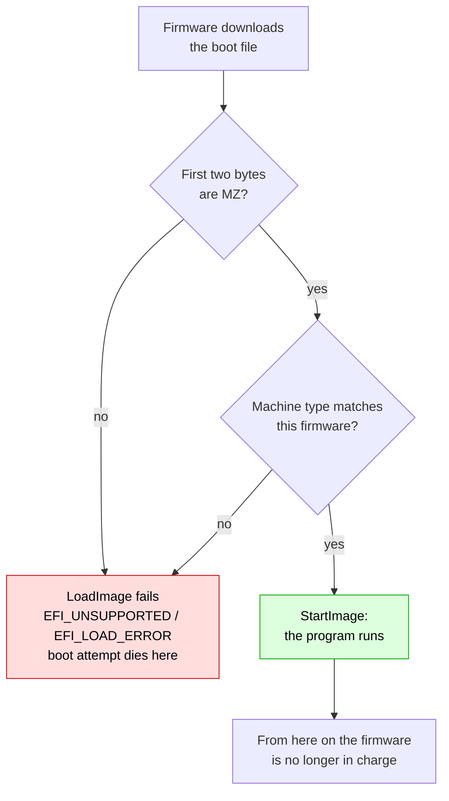
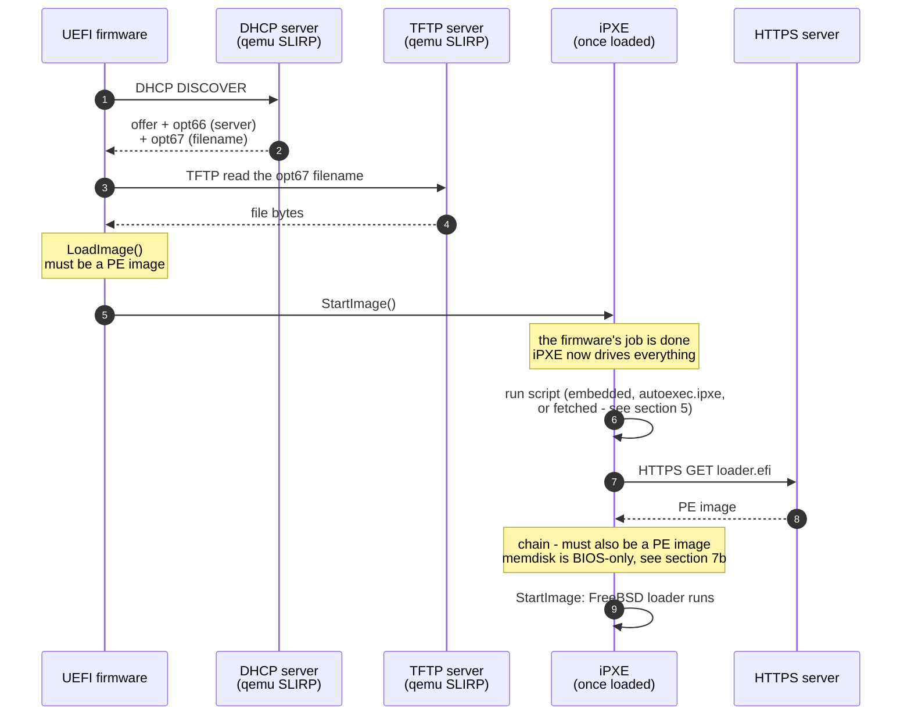
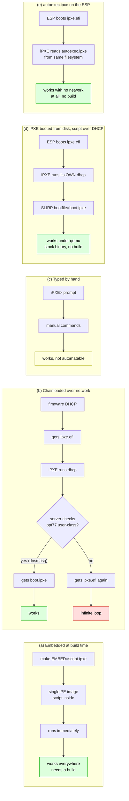
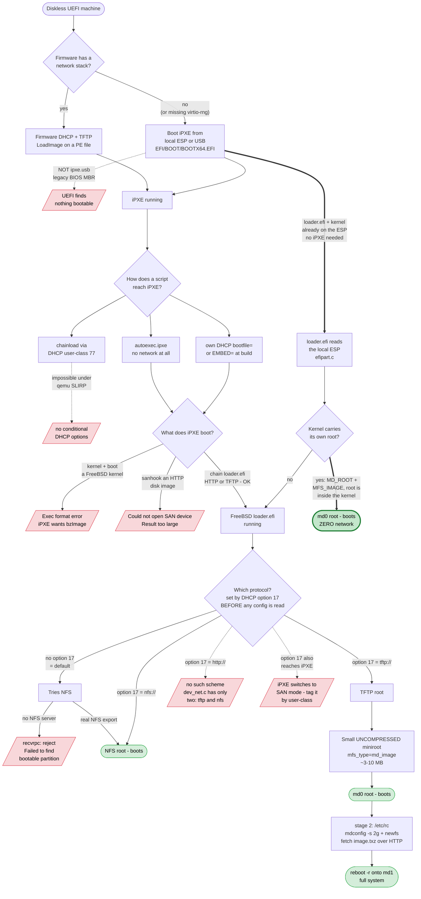

# UEFI network boot, iPXE, and FreeBSD

Scope: UEFI only. Legacy BIOS PXE (option ROMs, `undionly.kpxe`, the 16-bit
PXE stack) is deliberately not covered — none of it applies to a UEFI machine.

Written against the FreeBSD `net/ipxe` package and qemu's built-in SLIRP
networking.

---

## 1. The one idea that explains everything else

UEFI firmware can only ever do one thing with a boot payload: hand it to
`gBS->LoadImage()`. That function loads **PE images** and nothing else.

Every confusing failure in this area is the same failure: something that is
not a PE image ended up where the firmware expected one.

So the chain is always:

```
firmware --(LoadImage)--> a PE image --(that program's own logic)--> anything else
```

The firmware's part of the job ends at the first arrow. Whatever comes after
is the loaded program's business, not the firmware's.



A `#!ipxe` script takes the left branch on the very first test. That is the
whole story behind the most common failure in this area.

---

## 2. PE images

**PE** = Portable Executable, the executable format Microsoft defined for
Windows. UEFI adopted it wholesale, so every UEFI binary — from any vendor, on
any OS — is a PE file. The 64-bit variant is often written **PE32+**.

Identifying one is trivial: the first two bytes are ASCII `MZ`.

### Why "MZ"

`MZ` are the initials of **Mark Zbikowski**, the Microsoft engineer who
designed the MS-DOS executable format in 1983. He signed his own format, and
those two bytes have survived every generation since.

The lineage matters for reading hex dumps:

- MS-DOS `.exe` files began with `MZ` followed by a DOS header.
- Windows introduced PE and needed backward compatibility, so a PE file still
  starts with a complete DOS `MZ` header. At offset `0x3C` that header holds a
  pointer to the real **PE header**, which begins with the bytes `PE\0\0`.
- The DOS part usually contains a tiny stub program that prints
  "This program cannot be run in DOS mode." UEFI binaries keep the header for
  format compatibility but the stub is meaningless — no UEFI machine will ever
  execute it.

So a UEFI binary carries a 1983 DOS header purely as a structural fossil. When
firmware validates an image it reads `MZ`, follows the `0x3C` pointer, and
checks for `PE\0\0`; only then does it look at the machine type and sections.

You can see both signatures:

```console
$ od -A d -c -N 2 /boot/loader.efi | head -1
0000000    M   Z

$ off=$(od -A n -t u4 -j 60 -N 4 /boot/loader.efi | tr -d ' ')
$ od -A n -c -j $off -N 4 /boot/loader.efi
    P   E  \0  \0
```

A file that fails the first check never gets to the second.

```console
$ head -c 2 /usr/local/share/ipxe/ipxe.efi-x86_64 | od -c | head -1
0000000    M   Z

$ head -c 2 /boot/loader.efi | od -c | head -1
0000000    M   Z
```

Both are PE images. So is `netboot.xyz.efi`, and so is
`/boot/efi/EFI/BOOT/BOOTX64.EFI`. They are different programs, but structurally
the same kind of object, and the firmware treats them identically.

A PE image carries a machine-type field, which is why architecture matters:
an `x86_64` build will not load on `aarch64` firmware. Hence the separate
`ipxe.efi-i386` / `ipxe.efi-x86_64` builds in the package.

### What is *not* a PE image

A text file. Specifically, an iPXE script:

```
#!ipxe
initrd https://example.org/some.img
chain https://example.org/memdisk harddisk raw
```

This begins with `#!`, not `MZ`. `LoadImage()` rejects it — it returns an error
(`EFI_UNSUPPORTED` or `EFI_LOAD_ERROR`, depending on how far the header parse
gets) and the boot attempt fails. The firmware does not read the file, does
not notice the `#!ipxe` line, and has no concept of "script". It only ever
asked "is this a loadable PE image?", and the answer was no.

**This is the single most common mistake**: pointing DHCP option 67 at a
`.ipxe` script file. It cannot work, on any firmware, ever.

### Measured, both ways

Same firmware, same NIC, same TFTP directory — only `bootfile=` differs.

With `bootfile=chain.ipxe` (427-byte text file):

```
>>Start PXE over IPv4.
  Station IP address is 10.0.2.15
  NBP filename is chain.ipxe
  NBP filesize is 427 Bytes
 Downloading NBP file...
  NBP file downloaded successfully.
BdsDxe: failed to load Boot0001 "UEFI PXEv4 (MAC:525400123456)"
        from PciRoot(0x0)/Pci(0x3,0x0)/MAC(...)/IPv4(...): Not Found
```

With `bootfile=ipxe.efi` (the same script's job, as a PE image):

```
  NBP filename is ipxe.efi
  NBP filesize is 1170432 Bytes
  NBP file downloaded successfully.
BdsDxe: starting Boot0001 "UEFI PXEv4 (MAC:525400123456)" ...
iPXE 2.21.1+ -- Open Source Network Boot Firmware -- https://ipxe.org
```

Note what is identical: DHCP succeeded, TFTP transferred **every byte** of the
script (`downloaded successfully`), and only then did it fail. The network was
never the problem. `Not Found` is EDK2's BDS wording for "I could not load
this image" — an unhelpful message for what is really "not a PE image".

Measured on qemu 11.1.0 with the bundled `edk2-x86_64-code.fd`, `virtio-net-pci`,
and `-device virtio-rng-pci` (see §9 — without the RNG, neither case gets as
far as DHCP).

---

## 3. UEFI network boot, step by step

When you boot a UEFI machine from the network (`-boot n` in qemu, or the
"UEFI PXEv4" entry in a real firmware menu):

1. Firmware brings up the NIC and sends a **DHCP** request.
2. The DHCP reply carries, among the usual IP/mask/gateway/DNS:
   - **option 66** — TFTP server address (`next-server`)
   - **option 67** — boot filename (`filename`)
3. Firmware downloads that filename over **TFTP**.
4. Firmware calls `LoadImage()` on it, then `StartImage()`.

Step 4 is where the PE requirement bites.



Note where the protocol changes: everything above the "firmware's job is done"
line is DHCP and TFTP only. HTTPS appears only after iPXE is running, because
only iPXE can speak it.

Note what the firmware's built-in client does *not* do: HTTP, HTTPS, iSCSI,
scripting, menus, conditionals, retries against alternate servers. It does
DHCP and TFTP and then gets out of the way. (Some modern firmware implements
UEFI HTTP Boot as a separate, distinct boot method — but that is still
"download one file, LoadImage it".)

That limited feature set is the entire reason iPXE exists.

---

## 4. What iPXE actually is

**iPXE is a PE image that happens to be a network bootloader.** Nothing more
exotic than that. The firmware loads it exactly the way it would load
`loader.efi` or a Windows boot manager.

Once running, iPXE replaces the firmware's minimal capabilities with its own,
much larger set: HTTP/HTTPS, iSCSI, AoE, FCoE, wireless, VLANs, a command
shell, menus, variables, conditionals, and a scripting language.

So the useful mental model:

| | firmware PXE client | iPXE |
|---|---|---|
| how it arrives | built into the machine | loaded as a PE image |
| protocols | DHCP + TFTP | + HTTP, HTTPS, iSCSI, … |
| scripting | none | yes |
| can chain to another OS loader | yes (one file) | yes, with logic |

### PXE vs iPXE — the naming

"PXE" is the firmware's own network-boot standard. "iPXE" is an independent
open-source implementation that is far more capable and that you *boot into*
using PXE. They are not two versions of one thing; iPXE is a program that PXE
delivers.

### Which binary from the package

`/usr/local/share/ipxe/` ships several UEFI builds:

| file | use |
|---|---|
| `ipxe.efi-x86_64` | general purpose; includes iPXE's own NIC drivers |
| `snp.efi-x86_64` | uses the firmware's Simple Network Protocol instead |
| `snponly.efi-x86_64` | SNP only, bound to the NIC it was loaded from |
| `ipxe.usb` | bootable *disk* image, not a PE file — **legacy BIOS only**, no ESP, unusable under UEFI (§8) |

For qemu with virtio-net, `ipxe.efi-x86_64` is the default choice.

---

## 5. iPXE scripts, and how one reaches iPXE

A script is a plain text file starting with `#!ipxe`, followed by iPXE
commands. It is interpreted **by iPXE**, long after the firmware is done.

The problem is delivery. There are five ways a script reaches iPXE, and only
some work in a given environment.



### (a) Embedded at build time — most robust

Compile the script into the binary:

```console
make bin-x86_64-efi/ipxe.efi EMBED=myscript.ipxe
```

The result is a single PE image that runs your script immediately on start.
One file, no second download, no DHCP negotiation needed to find the script.

The packaged `ipxe.efi-x86_64` has **no** embedded script. Verify on any build:

```console
$ strings -a ipxe.efi-x86_64 | grep -B1 -A1 '^#!ipxe'
#!gpxe
#!ipxe
x86_64
```

`#!ipxe` appearing next to `#!gpxe` means these are the parser's two magic
strings — the format markers iPXE recognizes — not a script. An actually
embedded script shows your own command lines nearby.

### (b) Chainloaded over the network — needs a smart DHCP server

iPXE starts, runs `dhcp`, and is handed a filename pointing at the script:

```
chain http://server/boot.ipxe
```

The catch: iPXE re-runs DHCP, and a naive server hands back the *same*
filename that started iPXE — so iPXE loads iPXE, forever. The standard escape
is a DHCP server that inspects the request: iPXE identifies itself via
DHCP option 77 (user-class = `iPXE`), so the server returns `ipxe.efi` to the
firmware and `boot.ipxe` to iPXE.

`dnsmasq` does this in two lines:

```
dhcp-match=set:ipxe,77,iPXE
dhcp-boot=tag:!ipxe,ipxe.efi
dhcp-boot=tag:ipxe,http://server/boot.ipxe
```

**qemu's SLIRP cannot do this.** `-netdev user,...,bootfile=X` is a single
unconditional filename with no matching logic. So *this* variant — where the
firmware also netboots — loops under plain qemu user networking. Method (d)
below sidesteps the loop by not netbooting iPXE itself.

### (c) Typed by hand at the `iPXE>` prompt

Interactive. Fine for experimentation, useless for automation.

### (d) iPXE booted from disk, script fetched by iPXE's own DHCP

The key fact: **iPXE runs its own DHCP client**, independent of whatever the
firmware did. If iPXE was started from a local ESP rather than over the
network, there is no loop to fall into — the firmware never asked for a
bootfile, so SLIRP's single unconditional `bootfile=` is free to name the
script, and iPXE picks it up.

This gives full automation with the **stock packaged binary** and no build:

```console
$ mkdir -p esp/EFI/BOOT
$ cp /usr/local/share/ipxe/ipxe.efi-x86_64 esp/EFI/BOOT/BOOTX64.EFI
$ cat > boot.ipxe <<'EOF'
#!ipxe
dhcp || goto fail
chain tftp://10.0.2.2/whatever.efi || goto fail
:fail
shell
EOF
$ qemu-system-x86_64 -m 6G \
    -drive if=pflash,readonly=on,format=raw,file=/usr/local/share/qemu/edk2-x86_64-code.fd \
    -drive file=fat:rw:esp,format=raw,if=virtio \
    -netdev user,id=net0,tftp=$(pwd),bootfile=boot.ipxe \
    -device virtio-net-pci,netdev=net0 -nographic
```

Verified output — iPXE reports the filename SLIRP handed it and fetches it:

```
net0: 10.0.2.15/255.255.255.0 gw 10.0.2.2
Next server: 10.0.2.2
Filename: boot.ipxe
tftp://10.0.2.2/boot.ipxe... ok
boot.ipxe : 205 bytes [script]
```

This is the method to reach for when the firmware will not netboot for any
reason — a genuinely network-less build, or the `virtio-rng-pci` trap in §9
before you have diagnosed it. It sidesteps firmware networking entirely. Full
worked example in §7c, disk setup in §8.

### (e) `autoexec.ipxe` on the ESP — no network at all

EFI builds of iPXE look for a script named **`autoexec.ipxe` on the filesystem
they were loaded from** and run it automatically. No DHCP, no TFTP, no server
of any kind — and, like (d), no rebuild.

Drop it next to the binary on the same ESP:

```console
$ mkdir -p esp/EFI/BOOT
$ cp /usr/local/share/ipxe/ipxe.efi-x86_64 esp/EFI/BOOT/BOOTX64.EFI
$ cat > esp/autoexec.ipxe <<'EOF'
#!ipxe
echo === SCRIPT READ FROM LOCAL ESP ===
dhcp || goto fail
chain https://boot.netboot.xyz/ipxe/netboot.xyz.efi || goto fail
:fail
shell
EOF
```

Verified with `-nic none`, proving nothing arrived over the network:

```console
$ qemu-system-x86_64 -m 2G \
    -drive if=pflash,readonly=on,format=raw,file=/usr/local/share/qemu/edk2-x86_64-code.fd \
    -drive file=fat:rw:esp,format=raw,if=virtio \
    -nic none -nographic -no-reboot
```

```
iPXE initialising devices...
file:autoexec.ipxe... Not found (https://ipxe.org/7f4de18e)
file:/autoexec.ipxe... ok
iPXE 2.21.1+ -- Open Source Network Boot Firmware
Features: DNS HTTP HTTPS iSCSI NFS TFTP VLAN SRP AoE EFI Menu
=== SCRIPT READ FROM LOCAL ESP ===
```

Note the two-step probe in that output. iPXE tries the path **relative to the
binary** first (`EFI/BOOT/autoexec.ipxe`), then falls back to the **volume
root** (`/autoexec.ipxe`). Either location works; the root is tidier. The
"Not found" line is normal and not an error.

Beyond the automatic name, any local file is reachable via the `file:` URI, so
you can load a script explicitly or keep several and pick one:

```
chain file:/menu.ipxe
```

**Choosing between (d) and (e):** (e) needs no DHCP/TFTP server, so it is the
better default for a self-contained image or a USB stick. (d) keeps the script
on the server, so you can change it without touching the disk image — better
when many machines share one boot policy.

---

## 6. Static addressing — no DHCP at all

iPXE does not need a DHCP server. Set the settings directly and skip `dhcp`:

```
#!ipxe
set net0/ip 10.0.2.15
set net0/netmask 255.255.255.0
set net0/gateway 10.0.2.2
set net0/dns 10.0.2.3
ifopen net0
chain https://example.org/whatever
```

Those values are qemu SLIRP's defaults (`.15` guest, `.2` gateway, `.3` DNS),
so this works unmodified against `-netdev user`.

Two things this does **not** solve:

- It does not remove the need for the script to reach iPXE. Static addressing
  changes what the script does, not how it gets loaded. You still need §5(a).
- It does not remove the firmware's own DHCP in step 1 of §3 — the firmware
  still has to find and download the iPXE binary before any of this runs.

### On UEFI variables

You cannot stash IP/mask/gateway/DNS in UEFI variables and have an iPXE script
read them back. iPXE exposes settings namespaces such as `smbios` and `acpi`,
but has no `efivar` namespace and no `GetVariable()` binding — there is no
syntax to reference one.

Verified locally only, by inspecting the packaged binary's setting-namespace
strings; not confirmed against upstream source. Treat as strong but not
authoritative. Static values in the embedded script (above) achieve the same
goal and are the supported approach.

---

## 7. Booting FreeBSD

### First: two problems, not one

Netbooting is often described as one thing, and that hides the difficulty.
It is two:

```
1. get CODE into a diskless machine and run it   <- PXE/iPXE solves this
2. give the running OS a ROOT FILESYSTEM         <- PXE/iPXE never solves this
```

iPXE finishes at step 1. It hands control to a kernel or loader and stops
existing. Nothing it did tells the OS where `/` lives — that is negotiated
separately, by the OS, after iPXE is gone.

Every diskless boot answers question 2 somehow, and the choice is what
distinguishes the methods below:

| answer | mechanism | still diskless? |
|---|---|---|
| **NFS root** | kernel mounts `/` over the network | yes — the canonical answer |
| **memory-disk root** | kernel roots off a RAM image loaded alongside it | yes |
| **iSCSI / AoE** (`sanboot`) | a real remote block device | yes |
| **memdisk** | a *fake local disk* backed by RAM | yes, but see (b) |

All four are genuinely diskless — no physical disk anywhere. So NFS is not a
retreat from diskless booting; it **is** the standard diskless mechanism, and
it is what FreeBSD's `loader.efi` reaches for by default (§7a).

Where memdisk fits is narrower than it looks. It exists for one situation:
you have an image built to boot **from a USB stick**, which therefore hardcodes
the assumption that a local disk exists, and you want to netboot it
*unmodified*. Rather than rebuild it for a network root, memdisk fakes the
disk so the unmodified image is satisfied. A purpose-built netboot setup
(kernel + NFS root, or kernel + mfsroot) never needs it.

That is why losing Syslinux memdisk on UEFI (§7b) costs little: you lose the
ability to netboot USB installer images *verbatim*, not the ability to
netboot — and even that comes back via `memdisk_uefi` (§7d). And it is
why `FreeBSD-15.1-RELEASE-amd64-mini-memstick.img` is awkward here — it is
exactly that kind of image. The image is fighting you, not PXE.

### (a) Netboot `loader.efi` directly — no iPXE required

`/boot/loader.efi` is a PE image, so it is a legitimate DHCP option 67 target
by itself. Confirm on any copy:

```console
$ off=$(od -A n -t u4 -j 60 -N 4 /boot/loader.efi | tr -d ' ')
$ od -A n -c -j $off -N 4 /boot/loader.efi
    P   E  \0  \0
```

Point the firmware at it and FreeBSD's own loader takes over. This is the
standard FreeBSD network-install path, involves no iPXE at all, and is the
simplest option **when you control the DHCP server** — with `dnsmasq`:

```
dhcp-boot=loader.efi
enable-tftp
tftp-root=/tftpboot
```

**What the loader does next is the part that surprises people.** It sets
`currdev` to the network interface and then looks for its kernel over **NFS**,
not TFTP:

```
FreeBSD/amd64 EFI loader, Revision 3.0
Setting currdev to net0:
```

So `loader.efi` alone is not enough — you also need an NFS root exported to
the client (the standard FreeBSD diskless setup: `/etc/exports`, `rpcbind`,
`mountd`, `nfsd`). Without it the loader gives up and returns:

```
recvrpc: reject, astat=1, errno=1
Failed to find bootable partition
Could not boot: Error 0x7f04828e (https://ipxe.org/7f04828e)
```

That error code is *not* a chain failure — the loader ran correctly and then
found nothing to boot. See the symptom table in §9.

**Why this path does not work under qemu SLIRP:** SLIRP provides DHCP and TFTP
but no NFS, so there is nothing to export a root from. Use a bridged/tap
network with a real NFS server on the host, or use (c), which sidesteps NFS
entirely.

Two prerequisites that bite on real hardware, both covered elsewhere here:

- the firmware needs a working UEFI network stack — FreeBSD's packaged edk2
  has none (§9), so this path is a non-starter under stock qemu on FreeBSD;
- the file must match the firmware's architecture (§2).

### (b) memdisk — does not apply under UEFI

You will find `initrd <image> ; chain memdisk harddisk raw` in older scripts,
including `ipxe-poc/chain.ipxe` in this repo. **It is legacy BIOS only.** iPXE
downloads memdisk successfully and then refuses to run it:

```
tftp://10.0.2.2/memdisk... ok
Could not boot: Exec format error (https://ipxe.org/2e008081)
```

`file memdisk` says why — `Linux kernel x86 boot executable, bzImage, version
MEMDISK 6.03`: a 16-bit BIOS program, not a PE image, so it fails the same
`LoadImage()` test as an iPXE script (§1). It works by hooking INT 13h to serve
a RAM-backed disk, and UEFI has no INT 13h.

**A UEFI equivalent does exist** — `memdisk_uefi` (§7d). It is not part of the
Syslinux or iPXE toolchain, and it does not hand-roll an
`EFI_BLOCK_IO_PROTOCOL`; it uses UEFI's own `RamDiskProtocol`, which publishes
the BlockIo instance for it. Everything above still applies to Syslinux's
`memdisk` binary, which remains BIOS-only.

Why the two lines existed at all: a disk image is *data that expects to be
read*, not code that can be run, so it needs something to answer its sector
reads. `initrd` supplied the data (download to RAM, run nothing) and `chain`
supplied the code (memdisk, which answered the reads).

This was never the general netboot mechanism — it is the workaround for
netbooting a **USB installer image unmodified** (see the opener to §7).
Purpose-built diskless setups use an NFS or memory-disk root and have no use
for it. Under UEFI, FreeBSD ships `loader.efi` as a standalone PE file, so you
point `chain` straight at it, with no shim and no ramdisk.

**Use (a), (c) or (d) instead.** Measured on iPXE 2.21.1+ under
`edk2-x86_64-code.fd`; the memstick transferred fine (647 MiB, `ok`) and only
the memdisk step failed.

### (c) Working UEFI PoC — verified end to end

Two runnable scripts accompany this document, both verified end to end:
`FreeBSD/qemu-uefi-ipxe-poc.sh` for the chainload path described here, and
`FreeBSD/qemu-uefi-memdisk-poc.sh` for the RAM-disk path of §7d.

This is the configuration that actually boots on a FreeBSD host without
building anything and without relying on firmware netboot at all. Two ideas
make it work:

1. **Boot iPXE from an ESP**, not over the network. The firmware only reads a
   local file, so firmware network support is irrelevant — this works whether
   or not you have hit the `virtio-rng-pci` trap (§9).
2. **Let iPXE do its own DHCP.** Once running, iPXE queries qemu's SLIRP
   server itself and honours `bootfile=` — so the script is fetched over TFTP
   with the *stock packaged binary*. No `EMBED=` rebuild required.

Note `ipxe.usb` is **not** usable here: it is a BIOS MBR image
(first bytes `EB 05`, partition type `0xEB`, no `EFI/BOOT/BOOTX64.EFI`).
Build an ESP from `ipxe.efi-x86_64` instead.

```console
$ mkdir -p esp/EFI/BOOT
$ cp /usr/local/share/ipxe/ipxe.efi-x86_64 esp/EFI/BOOT/BOOTX64.EFI
$ truncate -s 4G disk.img
$ fetch https://download.freebsd.org/ftp/releases/ISO-IMAGES/15.1/FreeBSD-15.1-RELEASE-amd64-mini-memstick.img -o memstick.img
```

Extract FreeBSD's loader from the memstick ESP (note MBR slice `s1`, not `p1`):

```console
$ sudo mdconfig -a -t vnode -f memstick.img -u 9
$ sudo mount -t msdosfs /dev/md9s1 /mnt
$ cp /mnt/EFI/BOOT/bootx64.efi fbsd-loader.efi
$ sudo umount /mnt && sudo mdconfig -d -u 9
```

`boot.ipxe`, served over TFTP from the working directory:

```
#!ipxe
echo === PoC: chain FreeBSD loader.efi ===
dhcp || goto fail
echo Got ${net0/ip}
chain tftp://10.0.2.2/fbsd-loader.efi || goto fail
:fail
echo SCRIPT FAILED
shell
```

```console
$ qemu-system-x86_64 -m 6G \
    -drive if=pflash,readonly=on,format=raw,file=/usr/local/share/qemu/edk2-x86_64-code.fd \
    -drive file=fat:rw:esp,format=raw,if=virtio \
    -drive if=virtio,file=disk.img,format=raw,media=disk \
    -netdev user,id=net0,tftp=$(pwd),bootfile=boot.ipxe \
    -device virtio-net-pci,netdev=net0 \
    -nographic -no-reboot
```

Observed, in order:

```
iPXE 2.21.1+ -- Open Source Network Boot Firmware
Features: DNS HTTP HTTPS iSCSI NFS TFTP VLAN SRP AoE EFI Menu
net0: 52:54:00:12:34:56 using virtio-net on 0000:00:03.0 (Ethernet) [open]
Configuring (net0 ...)... ok
net0: 10.0.2.15/255.255.255.0 gw 10.0.2.2
Next server: 10.0.2.2
Filename: boot.ipxe
tftp://10.0.2.2/boot.ipxe... ok
boot.ipxe : 205 bytes [script]
```

then FreeBSD's loader takes over:

```
Load Device: ...MAC(525400123456,0x1)/Uri(tftp://10.0.2.2/fbsd-loader.efi)
Setting currdev to net0:
```

HTTPS also works from this setup — fetching the 647 MiB memstick straight from
`download.freebsd.org` completed at `99% ... ok`, with iPXE validating the
certificate chain (`[XCRT ISRG Root X2]`).

**Remaining step:** the loader sets `currdev` to `net0:` and then looks for its
kernel over **NFS**. qemu SLIRP has no NFS server, so the loader times out and
hands control back to iPXE:

```
Setting currdev to net0:
press any key to interrupt reboot in 5 seconds
Could not boot: Error 0x7f04828e (https://ipxe.org/7f04828e)
```

Do not misread that code as a chain failure — the chain worked, and the loader
ran. `0x7f0482xx` is just iPXE's "Could not start image"; here it means the
payload returned. A real netboot needs an NFS root exported to the guest, the
standard FreeBSD diskless setup. To confirm the image itself is
good, boot the memstick as a plain disk:

```console
$ qemu-system-x86_64 -m 6G \
    -drive if=pflash,readonly=on,format=raw,file=/usr/local/share/qemu/edk2-x86_64-code.fd \
    -drive if=virtio,file=memstick.img,format=raw,media=disk,readonly=on \
    -drive if=virtio,file=disk.img,format=raw,media=disk \
    -netdev user,id=net0 -device virtio-net-pci,netdev=net0 \
    -nographic -no-reboot
```

which reaches:

```
Starting primary installer on ttyu0
Welcome to FreeBSD!
Console type [vt100]:
```

#### Supplying the root filesystem

The chain above completes step 1 (code running) and stops at step 2 (no root).
That is the expected boundary, not a failure of iPXE — see the opener to §7.

**"But I already have the whole memstick image — why does it need NFS?"**

Because the chain above never gave the image to the guest. Count what was
actually transferred:

```
tftp://10.0.2.2/boot.ipxe... ok
tftp://10.0.2.2/fbsd-loader.efi... ok
```

Two files. `fbsd-loader.efi` is ~650 KiB, extracted *out of* the memstick's
ESP; the other 647 MiB never left the host. The image is available to **you**,
on the host filesystem — not to the loader, which can only read through
interfaces it has drivers for: a block device the firmware exposes, or
NFS/TFTP over the network. A file in your working directory is neither.

Even handing it the whole blob would not help, because the loader does not
want the image — it wants `/boot/kernel/kernel`, a file *inside* the image's
UFS filesystem, and it has no way to mount a blob it was handed.

This is the memdisk problem one layer up. Both approaches need the image's
**contents** exposed as something readable:

| approach | needs the image as | why it fails here |
|---|---|---|
| memdisk (§7b) | a RAM-backed disk | Syslinux memdisk has no UEFI build; use `memdisk_uefi` (§7d) |
| `loader.efi` | files over NFS | SLIRP has no NFS server |

So the fix is never "give it the .img" — it is "present the image's contents
through an interface the guest can read." Three ways, cheapest first. In all
of them the image is the *source* of the bits; only the interface differs.

**1. Attach the installer as a disk (no netboot).** If the goal is just to run
the installer in a VM, the middle of the chain is unnecessary — the command
directly above does it. Netboot only earns its complexity when you cannot
attach media, i.e. on real hardware.

**2. Boot a kernel + memory-disk root, via the FreeBSD loader over TFTP.**
The root travels *with* the kernel, so no NFS server is needed. This is the
canonical "netboot a FreeBSD that lives in RAM" answer — but read the
protocol limit below before designing around HTTP.

##### The loader speaks TFTP and NFS only — never HTTP

This is the single most important constraint in this section, and it is not
a limitation of PXE or of iPXE. It is compiled into the FreeBSD loader.
`stand/common/dev_net.c` carries the complete list of network URI schemes the
loader can parse:

```c
static struct uri_scheme {
	const char *scheme;
	int proto;
} uri_schemes[] = {
	{ "tftp:/", NET_TFTP },
	{ "nfs:/", NET_NFS },
};
```

Two entries. There is no HTTP scheme and no `LOADER_HTTP_SUPPORT` build knob
(`stand/loader.mk` offers only `LOADER_TFTP_SUPPORT` and
`LOADER_NFS_SUPPORT`). Confirmed on the shipped binary:

```console
$ strings -a loader.efi | grep -ioE 'https?://|tftp://|nfs:/' | sort -u
nfs:/
tftp://
```

The consequence is worth stating plainly, because it defeats the obvious
plan: **iPXE cannot give FreeBSD an HTTP boot.** iPXE itself does HTTP and
HTTPS well, but only for images *it* loads and runs. The moment control
passes to `loader.efi`, the network stack in charge is FreeBSD's, and it has
two protocols. So HTTP can deliver `loader.efi` itself, and HTTP can deliver
a second-stage bulk image (§7c option 2's two-stage form below, where the
fetch happens from userland after the kernel is up) — but the kernel and
md_image leg that the *loader* fetches stays on TFTP.

Nor can iPXE simply boot the kernel itself and skip the loader:

```
kernel tftp://10.0.2.2/boot/kernel/kernel.gz    <- transfers fine
boot
=> Could not select: Exec format error (https://ipxe.org/2e008081)
```

iPXE's `kernel` command expects a Linux bzImage or a multiboot image. A
FreeBSD kernel is neither, so the FreeBSD loader is not optional.

##### Which protocol the loader picks, and how to control it

The loader chooses by parsing a **scheme prefix out of `rootpath`**
(`dev_net.c`, the table above), and `rootpath` comes from **DHCP option 17**
(`stand/libsa/bootp.c` reads `dhcp.root-path`). With no option 17 it defaults
to NFS, which is the `recvrpc: reject` failure seen throughout this section.

That selection happens *before* any config file is read, which is why
`boot/loader.conf` and `boot/loader.rc` cannot redirect it — the loader must
already be able to read a filesystem in order to read them.

**The conflict, and the trick that resolves it.** iPXE, if it receives a
`root-path`, switches into SAN mode — so the DHCP server must send option 17
to FreeBSD's loader but *not* to iPXE. Tag it by user-class (dnsmasq):

```
dhcp-option=66,"1.1.1.254"
dhcp-boot=pxeboot
dhcp-userclass=set:fbsd,FreeBSD
dhcp-option=tag:fbsd,option:root-path,tftp://1.1.1.254/
```

iPXE identifies itself as user-class `iPXE`; FreeBSD's loader sends option 77
`FreeBSD`. Only the tagged reply carries `root-path`.

Do **not** try to do this from an iPXE script with `set net0/root-path` — that
sets the variable on the one component that must not have it, and the chained
loader runs its own DHCP anyway, so it never inherits it.

**qemu SLIRP cannot express this method at all.** It has no conditional DHCP
options and a single unconditional `bootfile=`, so the user-class tag is
inexpressible. Test this against real dnsmasq on a LAN, not under SLIRP.

##### What was actually measured

Every route tried under SLIRP, with the decisive output:

| route | result |
|---|---|
| iPXE `kernel` a FreeBSD kernel | `Could not select: Exec format error` — iPXE wants bzImage/multiboot |
| `chain loader.efi` over TFTP | loader → NFS → `recvrpc: reject` → `Failed to find bootable partition` |
| `boot/loader.conf` or `boot/loader.rc` to redirect | never read; protocol is chosen from DHCP first |
| iPXE `set net0/root-path` | wrong target — that is the variable iPXE must *not* receive |
| `sanhook` HTTP image + chain loader | `Could not open SAN device: Result too large` (`core/xferbuf.c:297`) |
| DHCP option 17 + user-class tag | **the working method** — not reproducible under SLIRP; see the blog post below |

The last row is the one that works on real hardware. Full writeup with a
diagram, by the author of this repo:
<https://blog.cochard.me/2019/02/pxe-booting-of-freebsd-disk-image.html>

##### Two stages, because TFTP is slow and pxeboot has limits

The working design does not TFTP a large root at all. It TFTPs a **small
uncompressed miniroot** (~3–10 MB) as an md_image, and that miniroot's
`/etc/rc` builds a bigger memory disk and fetches the real image over
HTTP/FTP — where HTTP is finally allowed, because by then it is userland
`fetch(1)`, not the loader. Three reasons this staging exists:

1. `pxeboot` cannot load a very large image; the kernel is not limited
2. TFTP is slow (~10 Mb/s, small block size); an unzipped 2 GB image crawls
3. a uzip-compressed md root works but is then read-only

`boot/loader.conf` served over TFTP:

```
autoboot_delay="-1"
console="comconsole"
comconsole_speed="115200"
tmpfs_load="YES"                    # needed by reboot -r
vfs.root.mountfrom="ufs:/dev/md0"
mfs_load="YES"
mfs_type="md_image"                 # NOT mfs_root
mfs_name="/image-miniroot"          # UNCOMPRESSED
```

Note `mfs_load="YES"` loads no module. It is loader **preload** syntax: load
the file named by `mfs_name` and tag it with `mfs_type`. The kernel's
`md_root` support is compiled into GENERIC, which is why no `md.ko`, `mfs.ko`
or `nvdimm.ko` exists to load.

The miniroot's `/etc/rc` reuses the kenv the loader left behind:

```sh
#!/bin/sh
PATH=/bin:/sbin:/usr/bin
ifconfig $(kenv boot.netif.name) inet $(kenv boot.netif.ip) \
    netmask $(kenv boot.netif.netmask) up
route add default $(kenv boot.netif.gateway)
mount -uw /
mkdir /newroot
md=$(mdconfig -s 2g)
newfs $md
mount /dev/$md /newroot
fetch -o - http://$(kenv boot.tftproot.server)/image.txz | \
    bsdtar -xpf - -C /newroot
umount /newroot
kenv vfs.root.mountfrom=ufs:/dev/$md
reboot -r
```

##### Building the two artifacts

`poudriere image -t tar` emits both from one command. The `-m` overlay is
what triggers the miniroot build (`image.sh`, `mkminiroot`):

```console
$ sudo poudriere jail -c -j pxe151 -v 15.1-RELEASE -a amd64 -K GENERIC
$ sudo poudriere image -j pxe151 -t tar -n pxeimg \
      -m ~/miniroot-overlay -c ~/image-overlay
[00:00:05] Making miniroot
/usr/local/poudriere/data/images/pxeimg-miniroot: 3.1MB (6336 sectors)
[00:00:19] Image available at: /usr/local/poudriere/data/images/pxeimg.txz
```

Result: `pxeimg-miniroot.gz` (998 KB, 3.1 MB uncompressed) plus
`pxeimg.txz` (227 MB). Poudriere gzips the miniroot; **gunzip it** on the
TFTP server, because `mfs_type="md_image"` needs it uncompressed.

Two traps:

- `-K GENERIC` is required, or the jail has no kernel and no `tmpfs.ko` to
  serve. Without it `poudriere image` still succeeds, which hides the problem.
- On 15.x the kernel lands in `boot/kernel/`, not `/kernel` as on 12.x. Copy
  `boot/kernel/kernel` and `boot/kernel/tmpfs.ko`.

##### mfsBSD as an alternative source of the pair

mfsBSD (<https://github.com/mmatuska/mfsbsd>, not packaged; build from git)
also produces a memory-root FreeBSD. Its `mfsroot` target emits two separate
gzips — the root from `makefs -o label=mfsroot`, and `boot/kernel/kernel`
compressed independently:

```console
$ sudo make mfsroot BASE=/usr/obj/usr/src/amd64.amd64/release \
      NO_ROOTHACK=1 NO_PACKAGES=1 MFSROOT_MAXSIZE=600m
Creating and compressing mfsroot ... done
$ ls -lh disk/mfsroot.gz disk/boot/kernel/kernel.gz
-rw-r--r--  87M  disk/mfsroot.gz
-r--r--r--  11M  disk/boot/kernel/kernel.gz
```

Raise `MFSROOT_MAXSIZE` (default `200m`) or makefs aborts with
`size ... is larger than the maxsize`. Two caveats: even with `NO_PACKAGES=1`
a full base is ~87 MB, too big for the TFTP leg — hence poudriere's small
miniroot above; and mfsBSD's `conf/loader.conf.sample` uses
`mfs_type="mfs_root"` with a *gzipped* root, which is a different mechanism
from the `md_image` + uncompressed form the two-stage method needs.

**The mini-memstick cannot be used this way as-is.** It has no `mfsroot` —
it mounts its UFS slice directly, confirmed on the image itself:

```console
$ sudo mount -t ufs -o ro /dev/md9s2a /mnt
$ ls /mnt/boot/mfsroot*
ls: /mnt/boot/mfsroot*: No such file or directory
$ cat /mnt/boot/loader.conf
vfs.mountroot.timeout="10"
kernels_autodetect="NO"
loader_brand="install"
```

The stock kernel does support `md_root`, so the pattern is viable — but you
would have to build the memory-disk root yourself (`makefs` over a populated
tree, then gzip it). Untested here; option 1 or 3 is less work.

**3. Export a real NFS root (full diskless setup).** Required if you want the
stock `loader.efi` path (§7a) to complete. Note this is where the memstick
image *does* get used — mount it on the host and export its contents, so the
loader's file requests resolve:

```console
$ sudo mdconfig -a -t vnode -f memstick.img -u 9
$ gpart show md9
=>      1  1325864  md9  MBR  (647M)
        1    66584    1  efi  (33M)
    66585  1259280    2  freebsd  [active]  (615M)
$ sudo mount -t ufs -o ro /dev/md9s2a /mnt     # slice 2, BSD partition a
$ ls /mnt/boot/kernel/kernel
/mnt/boot/kernel/kernel
```

That last file is exactly what the loader was hunting for when it printed
`recvrpc: reject`. Export the mountpoint and the request resolves.

SLIRP cannot serve NFS, so switch the guest to a tap/bridge interface and
export from the host:

```console
$ # /etc/exports on the host
$ /tftpboot/fbsd -maproot=root -network 10.0.0.0 -mask 255.255.255.0
$ sudo sysrc nfs_server_enable=YES mountd_enable=YES rpcbind_enable=YES
$ sudo service nfsd start
```

then replace `-netdev user,...` with a tap device on the same bridge. The
loader finds its root and boots normally. The root can also be pointed
explicitly via **DHCP option 17** (`nfs://…` or `tftp://…`) — from the DHCP
server, tagged by user-class, *not* from an iPXE script. See "Which protocol
the loader picks" in option 2 above for why the distinction matters.

### (d) memdisk_uefi — the UEFI RAM-disk route

`memdisk_uefi` <https://github.com/russor/memdisk_uefi> (Richard Russo,
BSD-2-Clause-Patent, built on iPXE + EDK II) does under UEFI what Syslinux's
`memdisk` did under BIOS: boot an unmodified disk image straight from RAM.
This is the option §7b said did not exist.

**Verified end to end on this host** — FreeBSD 16 host, qemu 11.1.0, guest
FreeBSD 15.1-RELEASE `bootonly.iso` and FreeBSD 16.0-CURRENT
`mini-memstick.img` (both sha256-checked against upstream, unmodified). The
installer reached `bsdinstall` entirely from RAM over HTTP, with no
DHCP-supplied boot config and no local media.

Reproduction script: `FreeBSD/qemu-uefi-memdisk-poc.sh` (`-a` to drive the
loader automatically, no arguments for interactive). It takes an image
selector — `15.1-iso`, `16.0-memstick`, `16.0-iso`, or an arbitrary URL — and
picks `iso`/`harddisk` mode and the expected root filesystem accordingly.
`16.0-iso` is expected to fail; see below.

**How it works.** It takes a URL, downloads the image with iPXE's UEFI
Download protocol, registers it with **`RamDiskProtocol`** (UEFI 2.6+), then
injects **NFIT and SSDT ACPI tables** so the RAM region presents as an NVDIMM
(ACPI 6.0). It then boots the image's own `BOOTX64.EFI`.

Observed on a live run — note it reports that `RamDiskProtocol` alone is not
enough, which is why it adds the tables itself:

```
Relying on MemDiskProtocol to add ACPI NFIT
Downloading .................... success
ram disk registered: VirtualCD(0x9B214000,0xBBB6BFFF,0)
Adding ACPI NFIT (nvdimm) table, since RamDiskProtocol won't
SSDT Table added!
NFIT Table added!
Handle 0 PciRoot(0x0)/Pci(0x3,0x0)/MAC(525400123456,0x1)/Uri(...): not a path match
Handle 1 VirtualCD(0x9B214000,0xBBB6BFFF,0)/HD(2,GPT,...,0x50,0x1000) trying to load
VirtualCD(...)/HD(2,GPT,...,0x50,0x1000)/\EFI\BOOT\BOOTX64.EFI
loaded
```

The built artifact is named `memdisk_uefi.elf` but `file(1)` reports **`PE32+
executable for EFI (application), x86-64`** — the Makefile links it with
`-Wl,-subsystem:efi_application` through `lld-link`. A direct confirmation of
§2: the name is irrelevant, `LoadImage()` only accepts PE.

#### Building it

There are no build instructions upstream, and **it does not compile against a
current iPXE checkout**:

```
../ipxe/src/include/ipxe/efi/efi_download.h:23:1: error: unknown type name 'FILE_SECBOOT'
   23 | FILE_SECBOOT ( PERMITTED );
```

`FILE_SECBOOT` is defined in iPXE's `src/include/compiler.h:951`. iPXE's own
build force-includes `compiler.h` into every translation unit; memdisk_uefi is
a standalone `clang` invocation that merely borrows `-I../ipxe/src/include`, so
the macro is undefined and clang reads the line as a declaration with an
unknown type. (`FILE_LICENCE` on the line above would fail identically; clang
just stops at the first error.)

This is not version drift. The macro landed in `e61c636` *[build] Define a
mechanism for marking Secure Boot permissibility* on **2026-01-13**, five
months before memdisk_uefi's last commit — so the project has been unbuildable
against contemporary iPXE that whole time, and its author must be building
from a pre-January tree.

Two fixes. Pinning iPXE to `e61c636~1` keeps memdisk_uefi's source untouched,
which is what the PoC script does and what was tested here. Alternatively
force-include the header and track iPXE HEAD — plausible, but **untested**:

```
clang $(CFLAGS) -include ../ipxe/src/include/compiler.h -c -o memdisk_uefi.o memdisk_uefi.c
```

The Makefile hardcodes `../edk2` and `../ipxe`, so all three trees must be
siblings. Only `MdePkg/Include` is needed from edk2 (a sparse checkout does).
On FreeBSD the link step also needs an `lld-link` on `PATH`: base ships
`ld.lld` but no `lld-link`, while the `llvm*` ports install versioned
`lld-linkNN` — symlink the one matching base clang.

Arguments after the image URL:

| argument | effect |
|---|---|
| `harddisk` | expose as a virtual hard disk (default) |
| `iso` | expose as a virtual CD-ROM |
| `pause` | wait for a keypress before booting — use this to read errors |
| `bootonly` | register the RAM disk but use BootServices memory and skip the ACPI tables |

`bootonly` suits images whose loader pulls its own ramdisk and never mounts the
disk afterwards: the image occupies RAM twice while loading, but that memory is
released once boot proceeds. Without the ACPI tables there is no NVDIMM for the
OS to find later, which is exactly the point for such images.

#### The `ExitBootServices()` cliff

This is the part that catches people, and it is not a bug.

Before `ExitBootServices()`, the OS loader reaches the image through ordinary
UEFI protocols. **After** that call, those protocols are gone — the kernel can
only keep seeing the RAM disk if it has its own **NVDIMM driver**. On FreeBSD
that is `nvdimm.ko`, exposing `/dev/spa*`.

It has shipped since FreeBSD 12.0 but is **not compiled into the GENERIC
installer kernel**, so it must be loaded by hand. Confirmed on this host: it
is absent from `sys/amd64/conf/GENERIC` and present only as a module, and
`sys/dev/nvdimm/nvdimm_spa.c:469` builds the device name as `spa%d` from the
NFIT index — hence `/dev/spa0`.

#### iPXE script

```
boot memdisk_uefi.elf ${cwduri}FreeBSD-15.0-RELEASE-amd64-bootonly.iso
echo Error occured, press any key to reboot
prompt
reboot
```

The `prompt` matters: without it a failure message scrolls away before you can
read it.

#### FreeBSD loader commands

At the loader prompt (option 3 from the menu):

```
load boot/kernel/kernel
load boot/kernel/nvdimm.ko
boot
```

`nvdimm.ko` is the whole point: it is not in `GENERIC`, and after
`ExitBootServices()` the RAM disk is reachable only through it.

**If you automate this, terminate the menu keypress.** Earlier revisions of
this document claimed a leading `lsdev` was mandatory, on the evidence that
omitting it produced `error 19` reproducibly. That was a harness artifact, now
traced: the `3` that dismisses the boot menu is echoed at the loader prompt
without a newline, so `3` and the next command arrive concatenated —

```
OK 3load boot/kernel/kernel
unknown command
```

— the kernel is never loaded, `load boot/kernel/nvdimm.ko` then correctly
refuses with `elf64_obj_loadfile: can't load module before kernel` →
`operation not permitted`, and `boot` autoloads a kernel with no NVDIMM
driver. No driver, no `spa0`, no `iso9660` label, so root mount fails with
`error 19`. `lsdev` "fixed" it only by absorbing the stray `3`.

Any throwaway input does the same, which is what pins the mechanism — a bare
newline suffices, and nothing here enumerates devices:

| pre-load input | loader sees | `nvdimm.ko` | result |
|---|---|---|---|
| nothing | `3load boot/kernel/kernel` | not loaded | `error 19` |
| bare `\r` | `3` | loaded | boots |
| `lsdev` | `3lsdev` | loaded | boots |
| `echo probe` | `3echo probe` | loaded | boots |
| `show currdev` | `3show currdev` | loaded | boots |
| `lsmod` | `3lsmod` | loaded | boots |

So `lsdev` is *not* required, and typing the commands by hand was never
affected. The PoC script sends a bare `\r` after the menu key.

**Do not set `vfs.root.mountfrom`.** A frequently circulated variant adds:

```
set currdev=cd1:
set vfs.root.mountfrom="cd9660:/dev/spa0"      # <- breaks the boot
```

That fails with `error 19`. The RAM disk *is* present as `spa0` — GEOM tastes
it, printing `GEOM: spa0: the secondary GPT header is not in the last LBA` —
but `spa0` is the raw NVDIMM block device, not the cd9660 provider. Left
alone, the loader finds the root by its filesystem label and gets it right:

```
Trying to mount root from cd9660:/dev/iso9660/15_1_RELEASE_AMD64_BO [ro]...
nvdimm_acpi_root0: <ACPI NVDIMM root device> on acpi0
```

Overriding a correct autodetected default with a hand-written device path is
the whole failure. The README's minimal form is right; the elaborated one is
not.

For a permanent setup, `nvdimm_load="YES"` in `/boot/loader.conf` replaces the
manual `load`. Note the standing rule that `/boot/loader.conf` should carry
only boot-critical modules — here it genuinely is boot-critical, since the
root filesystem lives on the NVDIMM.

#### Images without an ESP

**Stock FreeBSD release ISOs do not need any of this.** 15.1's
`bootonly.iso` is already a hybrid image carrying its own ESP:

```console
$ gpart show md9
=>     34  1067641  md9  GPT  (521M) [CORRUPT]
       34       25    1  freebsd-boot  (13K)
       80     4096    2  efi  (2.0M)

$ find /mnt -type f
/mnt/EFI/BOOT/bootia32.efi
/mnt/EFI/BOOT/bootx64.efi
```

(The `[CORRUPT]` is expected — a hybrid ISO's backup GPT header is not in the
last LBA, the same condition GEOM reports as `spa0: the secondary GPT header
is not in the last LBA`. It is cosmetic.)

Partition 2 sits at LBA 80 = **`0x50`**, matching the `HD(2,GPT,…,0x50,0x1000)`
in the boot trace above. One `iso` line is all such an image needs. The
FreeBSD 16 ISO gets this offset wrong, which is the whole of its failure —
see below.

If an ISO genuinely has no bootable ESP there is nothing for the firmware to
load, so a second image supplies one:

```
boot http://<server>:8000/memdisk_uefi.elf http://<server>:8000/release.iso iso
boot http://<server>:8000/memdisk_uefi.elf http://<server>:8000/efiboot.img harddisk
```

The first maps the real ISO as a virtual CD-ROM (`cd1:`); the second maps a
FAT32 `efiboot.img` containing `BOOTX64.efi`/`loader.efi` as a virtual hard
disk to boot from. A proper hybrid BIOS+UEFI ISO with its own ESP needs only
the first line.

Building a hybrid ISO yourself means `makefs -t msdos … efiboot.img` and then
`makefs -t cd9660 -o bootimage=efiboot.img …`. Many `release.sh`-derived build
scripts emit BIOS-only images and skip the ESP — which is the whole reason the
two-image workaround exists.

#### FreeBSD 16: the ISO is broken, not memdisk_uefi

FreeBSD 16 `bootonly.iso` does not boot this way. It is filed against
memdisk_uefi as upstream issue
[#1](https://github.com/russor/memdisk_uefi/issues/1), which spots the offset
difference but not its cause. The defect is in **FreeBSD's `mkimg(1)`**, and
the fix is in review as [D59377](https://reviews.freebsd.org/D59377).

The FreeBSD 16 **`mini-memstick.img` boots fine** — so this is not a
memdisk_uefi regression and not an "MBR vs GPT" problem (the memstick is MBR).
Only the ISO is affected:

| image | mode | result |
|---|---|---|
| 15.1 `bootonly.iso` | `iso` | boots to `bsdinstall` |
| 16.0 `mini-memstick.img` | `harddisk` | boots to `bsdinstall` |
| 16.0 `bootonly.iso` | `iso` | **`ran out of disks to try after 1 disks tried`** |

**Root cause.** The 16.0 ISO's GPT entry 2 starts at LBA 59 (`0x3B`) while its
FAT filesystem is at LBA 80 (`0x50`) — the same place 15.1 puts it. LBA 59 is
zero-filled, so EDK2's `PartitionDxe` correctly declines to publish a
`SimpleFileSystem` handle for it, and memdisk_uefi has nothing to boot. The
short handle count in the upstream report is the symptom, not the defect.

`release/amd64/mkisoimages.sh` is not at fault — it computes the offset
correctly, and `etdump` reports identical geometry on both ISOs
(`et_lba=20;et_sectors=4096`, i.e. `espstart` = 40960 bytes = LBA 80). The bug
is in `mkimg`, which **silently discards the offset in the `::size` partition
form** and packs the partition against the preceding one instead:

```console
$ mkimg -s gpt --capacity 588574720 -b /boot/pmbr \
    -p freebsd-boot:=/boot/isoboot -p efi::2097152:40960 -o hybrid.img
$ gpart show md6
       34       25    1  freebsd-boot  (13K)
       59     4096    2  efi  (2.0M)     <-- requested LBA 80
```

Same command, only `::` vs `:=` differing:

| specification | actual | expected |
|---|---|---|
| `efi::2097152:40960` | LBA 59 | LBA 80 |
| `efi::2097152:+10752` | LBA 59 | LBA 80 |
| `efi:=esp.bin:40960` | LBA 80 | LBA 80 |
| `efi:=esp.bin:+10752` | LBA 80 | LBA 80 |

`mkisoimages.sh` uses exactly the broken form: `-p efi::$espsize:$espstart`.

Introduced by `50c1240ebfaf` (*mkimg: Fix parsing of filenames containing
colons*, PR 257960, 2026-04-16), which split the shared
`case PART_KIND_SIZE: case PART_KIND_FILE:` fallthrough so a filename
containing a colon could be `stat()`ed before being split. The shared
offset-parsing block stayed under `PART_KIND_FILE`; the new `PART_KIND_SIZE`
case ends with a bare `break` before reaching it, so `abs_offset` is never set
and placement uses `SCHEME_META_PART_BEFORE` instead of
`SCHEME_META_PART_ABSOLUTE`.

**Main only** — not in any stable branch or release tag, which is exactly why
15.1 works and 16.0-CURRENT does not. Snapshots built after 2026-04-16 are
affected.

**Proof it is the ISO and not the boot method:** rebuilding *only* the 32 KB
hybrid GPT header of the same 16.0 ISO with a patched `mkimg`, leaving every
other byte identical, boots it to `bsdinstall` through memdisk_uefi:

```
### PASS: installer reached
```

Full write-up and patch: `FreeBSD/docs/bugreport_mkimg_size_offset.txt`.

#### No DHCP required

The chain works over IPv6 SLAAC as readily as IPv4 DHCP — neither iPXE nor the
download step needs DHCP-assigned addressing, so router advertisements suffice.
Static addressing (§6) is the other way to skip DHCP.

#### Testing under qemu

The invocation that actually exercises this path:

```console
$ qemu-system-x86_64 -m 8G -boot n \
    -drive if=pflash,unit=0,readonly=on,format=raw,file=/usr/local/share/qemu/edk2-x86_64-code.fd \
    -drive if=pflash,unit=1,format=raw,file=vars.fd \
    -netdev user,id=net0,tftp=$PWD,bootfile=ipxe.efi \
    -device virtio-net-pci,netdev=net0 \
    -device virtio-rng-pci \
    -display none -serial mon:stdio
```

Beware a widely copied variant that passes `-cdrom <freebsd.iso>`: that hands
the guest the ISO as **local media**, so a successful boot proves nothing about
the RAM-disk path — the guest may simply have booted the CD-ROM. There is no
`-cdrom` here by design; the only copy of the image reaches the guest over the
network.

`-device virtio-rng-pci` is as mandatory here as everywhere else in this
document (§9): without it the firmware never even sends DHCP.

Serve the ISO over **HTTP, not TFTP** — 521 MB over TFTP is painfully slow.
The PoC runs `python3 -m http.server` on the host, reachable from the guest at
SLIRP's `10.0.2.2`, and the iPXE script uses explicit `http://` URLs rather
than `${cwduri}` (which would resolve back to TFTP, since iPXE itself arrived
that way):

```
boot http://10.0.2.2:8000/memdisk_uefi.elf http://10.0.2.2:8000/fbsd.iso iso
```

On memory: `-m 8G` for a 521 MB image is generous but the headroom is real —
the image is resident twice while loading, and under `bootonly` more so.

#### What is verified, and what is not

Measured on this host: the build (including the `FILE_SECBOOT` breakage and
the iPXE pin), the PE nature of the output, the full boot to `bsdinstall` for
both 15.1 `bootonly.iso` and 16.0 `mini-memstick.img`, the stray-menu-keypress
artifact behind the `error 19` runs (isolated by varying only the pre-load
command, six variants),
the `vfs.root.mountfrom` failure, the ESP layout of 15.1's `bootonly.iso`, the
16.0 ISO failure, and its `mkimg` root cause — including the GPT-patched ISO
booting to prove the diagnosis.

Taken from upstream and **not** reproduced here: the `bootonly` argument's
behaviour, the IPv6/SLAAC claim above, and the two-image `efiboot.img`
workaround (no ESP-less image was to hand — both tested images have one).
Corrected against measurement rather than accepted: the loader command
sequence, the necessity of the ESP workaround, the qemu invocation, and the
attribution of the FreeBSD 16 failure to memdisk_uefi. Corrected against
measurement made *here* — this document previously claimed a leading `lsdev`
was mandatory; it is not, and the earlier claim is retracted in §7d.

### (e) Do not try to netboot a compressed VM image

```
FreeBSD-16.0-CURRENT-amd64-BASIC-CLOUDINIT-ufs.raw.xz
```

Three independent reasons this fails as an `initrd` target:

1. **iPXE has no xz decompressor.** It would load ~697 MB of compressed bytes
   and memdisk would see garbage.
2. **Size.** Uncompressed it is several GB — it does not fit in RAM, and
   FreeBSD publishes these VM images only as `.xz`.
3. **It is not an installer.** A `BASIC-CLOUDINIT` image is an
   already-installed system expecting a cloud-init datasource (a NoCloud seed
   with `user-data` / `meta-data`) to set the root password, SSH keys, and
   network. Booting it into RAM is the wrong operation — attach it as a disk.

To run such an image, decompress it and use it as the disk:

```console
$ unxz FreeBSD-16.0-CURRENT-amd64-BASIC-CLOUDINIT-ufs.raw.xz
$ qemu-system-x86_64 -m 4G \
    -drive if=pflash,readonly=on,format=raw,file=/usr/local/share/qemu/edk2-x86_64-code.fd \
    -drive if=virtio,file=FreeBSD-16.0-CURRENT-amd64-BASIC-CLOUDINIT-ufs.raw,format=raw \
    -drive if=ide,media=cdrom,file=seed.iso
```

with a seed built as:

```console
$ mkdir -p seed
$ printf '#cloud-config\ndisable_root: false\nssh_pwauth: true\nchpasswd:\n  expire: false\n  list: |\n    root:freebsd\n' > seed/user-data
$ printf 'instance-id: iid-local01\nlocal-hostname: fbsd16\n' > seed/meta-data
$ makefs -t cd9660 -o rockridge,label=cidata seed.iso seed
```

Note the absence of `-boot n`: this boots from disk, not the network.

---

## 8. Escape hatch: iPXE from a local ESP

When firmware netboot is unavailable or undiagnosed (§9), boot iPXE from a
**disk** instead. The firmware only has to read a local file — no DHCP, no
TFTP, no PXE driver.

### Do not use `ipxe.usb` under UEFI

`ipxe.usb` is a **legacy BIOS** disk image. It has no ESP and no
`EFI/BOOT/BOOTX64.EFI`, so UEFI firmware finds nothing to load:

```console
$ od -A d -t x1 -N 2 /usr/local/share/ipxe/ipxe.usb
0000000    eb  05                    # x86 JMP - MBR boot sector, not "MZ"
$ mmls /usr/local/share/ipxe/ipxe.usb   # (or gpart show -p)
    ... partition type 0xeb           # not 0xef (EFI System Partition)
```

### Build a one-file ESP instead

`ipxe.efi-x86_64` *is* a PE image, and UEFI's removable-media fallback path is
`\EFI\BOOT\BOOTX64.EFI`. Copying it there is the whole setup:

```console
$ mkdir -p esp/EFI/BOOT
$ cp /usr/local/share/ipxe/ipxe.efi-x86_64 esp/EFI/BOOT/BOOTX64.EFI
$ od -A d -c -N 2 esp/EFI/BOOT/BOOTX64.EFI
0000000    M   Z
```

`fat:rw:esp` is qemu's virtual-FAT driver: it synthesises a FAT filesystem
from the `esp/` directory built above, so there is nothing to format and no
image file to keep in sync. The word `esp` in that argument *is* the directory
path — change the directory name and you change it there too.

Base command, dropping you at the `iPXE>` prompt (§5c):

```console
$ qemu-system-x86_64 -m 8G \
    -drive if=pflash,readonly=on,format=raw,file=/usr/local/share/qemu/edk2-x86_64-code.fd \
    -drive file=fat:rw:esp,format=raw,if=virtio \
    -netdev user,id=net0 -device virtio-net-pci,netdev=net0 -nographic
```

Three ways to drive it, all with zero compilation. Each *replaces* the
relevant part of the command above — they are alternatives, not additions:

**(1) Script on the ESP — no network at all** (§5e). iPXE runs
`autoexec.ipxe` from the filesystem it booted from:

```console
$ cp chain.ipxe esp/autoexec.ipxe
```

Command unchanged. You can even drop `-netdev`/`-device` entirely if the
script needs no network.

**(2) Script over TFTP** (§5d). iPXE runs its own DHCP and fetches the
script, so the file must exist in the served directory:

```console
$ cp chain.ipxe boot.ipxe        # must exist; tftp= serves the cwd
```

then swap the netdev argument for:

```
    -netdev user,id=net0,tftp=$(pwd),bootfile=boot.ipxe \
```

Unlike §5b this does not loop: the firmware boots iPXE from the ESP, not from
DHCP, so handing iPXE the script filename is unambiguous.

**(3) Manual** — use the base command as-is and type commands at `iPXE>`.

### Removing TFTP entirely: embed the root in the kernel

The local ESP removes iPXE's own network step, but §7c showed the *loader*
still needs TFTP or NFS for whatever it fetches next. There is a way to leave
it nothing to fetch: compile the root filesystem **into the kernel** with
`MD_ROOT`, so kernel and root are one file.

Everything below is automated in `qemu-uefi-boot.sh --mdroot`, which builds
the root, sizes and writes the kernel config, runs `buildkernel`, verifies the
embedding and boots the result with no network device:

```console
$ ./qemu-uefi-boot.sh --mdroot                 # build + verify + boot
$ ./qemu-uefi-boot.sh --mdroot --build-only    # stop before booting
$ ./qemu-uefi-boot.sh --mdroot --boot-only     # reboot what is already built
$ MDSIZE_KB=32768 KERNCONF=MYROOT ./qemu-uefi-boot.sh --mdroot
```

The rest of this section explains what it does.

The mechanism is in base, no patches. `sys/conf/options` defines the knobs:

```
MD_ROOT		opt_md.h
MD_ROOT_FSTYPE	opt_md.h
MD_ROOT_READONLY	opt_md.h
MD_ROOT_SIZE	opt_md.h
MD_ROOT_MEM	opt_md.h
```

`MD_ROOT_SIZE` reserves a fixed array inside the kernel image
(`sys/dev/md/md.c`):

```c
u_char mfs_root[MD_ROOT_SIZE*1024] __attribute__ ((section ("oldmfs")));
```

and `sys/conf/kern.post.mk` overwrites that array post-link when you pass
`MFS_IMAGE`:

```make
.if !empty(MD_ROOT_SIZE_CONFIGURED) && defined(MFS_IMAGE)
	@sh ${S}/tools/embed_mfs.sh ${.TARGET} ${MFS_IMAGE}
.endif
```

So `MD_ROOT_SIZE` must be **greater than or equal to** the image — the script
writes into reserved space and refuses to grow the kernel.

`sys/amd64/conf/MDROOT`:

```
include GENERIC
ident		MDROOT

# Embedded memory-disk root: the kernel IS the whole system.
options 	MD_ROOT			# md device can be root
options 	MD_ROOT_SIZE=24576	# KB reserved for the embedded image
options 	MD_ROOT_FSTYPE=ufs
options 	ROOTDEVNAME=\"ufs:/dev/md0\"
```

#### Building the root

The root must be self-contained: at `mountroot` time there is no network and
no other filesystem, so every binary's shared libraries have to be present.
The cheapest way to guarantee that is `/rescue`, a single statically linked
crunched binary reached through ~150 hardlinks — one 20 MB payload, zero
libraries, and it already contains `init`, `sh`, `fetch`, `mdconfig`,
`newfs`, `kenv` and `reboot`, which is exactly the stage-2 tool set:

```sh
mkdir -p mdr/{dev,etc,tmp,var/run,rescue,bin,sbin}
cp -p /rescue/rescue mdr/rescue/rescue
for f in $(ls /rescue/); do [ "$f" = rescue ] || ln mdr/rescue/rescue mdr/rescue/$f; done
ln mdr/rescue/rescue mdr/sbin/init      # the kernel execs /sbin/init by name
ln mdr/rescue/rescue mdr/bin/sh
makefs -t ffs -o version=2 -s 24m mdroot.img mdr
```

Use `ln`, not `cp` — `makefs` preserves hardlinks, so the 20 MB is stored
once. Copying instead would multiply it by 150.

Then build, pointing `MFS_IMAGE` at the image:

```console
$ cd /usr/src && sudo make -j64 buildkernel KERNCONF=MDROOT \
    MFS_IMAGE=/path/to/mdroot.img WITHOUT_CCACHE_BUILD=1
...
MFS image embedded into kernel.full
```

Verify the image really landed in the reserved section:

```console
$ objdump -h kernel | grep -i oldmfs
 56 oldmfs   01800000  ffffffff81b90330  0000000001b90330  DATA
$ nm kernel | grep -w mfs_root
ffffffff81b90330 D mfs_root
$ objcopy -O binary --only-section=oldmfs kernel out.img
$ dd if=out.img of=trim.img bs=1024 count=24576 2>/dev/null
$ cmp trim.img mdroot.img && echo identical
identical
```

`01800000` = 24 MB, matching `MD_ROOT_SIZE=24576` KB exactly.

`objcopy` dumps the whole reserved section, so trim to the source length
before comparing — otherwise `cmp` reports a harmless `EOF` on the shorter
file.

#### Result

Boot it from the ESP with **no `-netdev` at all**:

```console
$ mkdir -p esp/EFI/BOOT esp/boot/kernel esp/boot/defaults
$ cp /boot/loader.efi esp/EFI/BOOT/BOOTX64.EFI
$ cp /usr/obj/usr/src/amd64.amd64/sys/MDROOT/kernel esp/boot/kernel/kernel
$ cp /boot/defaults/loader.conf esp/boot/defaults/ && cp -R /boot/lua esp/boot/
$ printf 'autoboot_delay="0"\nconsole="comconsole"\n' > esp/boot/loader.conf
$ qemu-system-x86_64 -m 4G -smp 2 \
    -drive if=pflash,readonly=on,format=raw,file=/usr/local/share/qemu/edk2-x86_64-code.fd \
    -drive file=fat:rw:esp,format=raw,if=virtio \
    -display none -serial file:boot.log -no-reboot
```

The decisive lines in `boot.log`:

```
Trying to mount root from ufs:/dev/md0 []...
start_init: trying /sbin/init
```

No DHCP, no TFTP, no NFS, no network device in the command line at all. This
is the only arrangement in this document that boots FreeBSD with **zero**
network protocol involvement after the firmware hands over.

Two failure modes worth naming, both hit while testing this:

- A root trimmed to 3 MB by a `poudriere image -t tar` overlay had an empty
  `/lib`, so `init` started and immediately died:
  `ld-elf.so.1: Shared object "libedit.so.8" not found, required by "sh"`.
  That is why `/rescue` above, not a hand-picked binary set.
- `login_getclass: unknown class 'daemon'` means `/etc/login.conf.db` is
  missing. Cosmetic, but `cap_mkdb /etc/login.conf` in the root removes it.

#### What this does and does not buy

It removes TFTP from the *root* fetch, permanently. It does not make netboot
HTTP-capable: the kernel now travels with its root, so the question becomes
purely "how does the loader reach this one file". From a local ESP or an
OpenBMC virtual flash disk, the answer is "it is already there" and no network
protocol is used. Over a network the loader still fetches that kernel by
TFTP or NFS (§7c) — and the kernel is now *larger*, since it carries the root.

So this is the right shape for ESP / vflash / iSCSI-attached firmware, and the
wrong shape for pure netboot, where the two-stage small-miniroot design in
§7c remains better: a few MB over TFTP, then the bulk over HTTP with
`fetch(1)` once userland exists.

Build both root and modules if stage 2 will `reboot -r`: `WITHOUT_MODULES=yes`
produces no `tmpfs.ko`, and `reboot -r` needs it.

---

## 9. Troubleshooting

### The `-boot n` silent no-op: add `virtio-rng-pci`

**Symptom.** `-boot n` sends no DHCP at all, no `UEFI PXEv4` boot option
exists, `ifconfig -l` in the EFI Shell prints nothing, and BdsDxe falls
through to `Boot0001 "EFI Internal Shell"`.

**Cause.** A missing entropy source, not a missing network stack. Add:

```
-device virtio-rng-pci
```

and network boot works immediately on the qemu-bundled
`/usr/local/share/qemu/edk2-x86_64-code.fd`:

```
>>Start PXE over IPv4.
  Station IP address is 10.0.2.15
  NBP filename is ipxe.efi
  NBP file downloaded successfully.
BdsDxe: starting Boot0001 "UEFI PXEv4 (MAC:525400123456)"
```

The stack is built with `NETWORK_TLS_ENABLE`, and its initialisation needs
randomness; with no RNG device the network drivers never finish binding, so
BDS never creates a network boot option. Nothing in the console output points
at entropy, which is what makes this hard to guess.

**Earlier revisions of this document claimed FreeBSD's edk2 packages are
built without `NETWORK_ENABLE`. That was wrong on two counts.** There is no
`NETWORK_ENABLE` key in modern edk2 at all; qemu's `roms/edk2-build.config`
gives `[build.ovmf.x86_64]` `opts = common`, and `[opts.common]` sets
`NETWORK_HTTP_BOOT_ENABLE`, `NETWORK_IP6_ENABLE`, `NETWORK_TLS_ENABLE`,
`NETWORK_ISCSI_ENABLE` and `NETWORK_ALLOW_HTTP_CONNECTIONS` to TRUE. And the
drivers are demonstrably compiled in — see the decompression check below.

A widely-copied blog diagnosis says "no `ifconfig` in the EFI Shell means the
firmware lacks `NETWORK_ENABLE`". Do not trust it. `ifconfig` is a ShellPkg
command, and on this firmware it prints nothing *even though* the full stack
is present, purely because no driver has bound. The same blog is right about
the actual fix, `virtio-rng-pci`.

### Proving which drivers are in a firmware image

**`strings` on the raw `.fd` cannot answer this.** The DXE firmware volume is
LZMA-compressed, so `PxeBcDxe`, `Dhcp4Dxe`, `SnpDxe` and their GUIDs return
zero hits whether or not the drivers are present — it is scanning compressed
data. A zero result there is not evidence of absence.

Decompress first, then search. The `ASSERT()` source paths compiled into each
driver body are the giveaway:

```console
$ python3 -c '
import lzma
d=open("/usr/local/share/qemu/edk2-x86_64-code.fd","rb").read()
for i in range(len(d)-5):
    if d[i:i+3]==b"\x5d\x00\x00":
        try:
            r=lzma.LZMADecompressor(format=lzma.FORMAT_ALONE).decompress(d[i:i+4_000_000])
            if len(r)>100000: break
        except Exception: pass
for n in [b"UefiPxeBcDxe",b"SnpDxe",b"Dhcp4Dxe",b"VirtioNetDxe"]:
    print(n.decode(), r.count(n))'
UefiPxeBcDxe 12
SnpDxe 21
Dhcp4Dxe 9
VirtioNetDxe 14
```

Inspecting the context confirms these are real code, not metadata — e.g.
`.../edk2/NetworkPkg/UefiPxeBcDxe/PxeBcDriver.c` and
`.../edk2/OvmfPkg/VirtioNetDxe/SnpStart.c`.

Validate the extraction with a control: the EFI Shell GUID
`7C04A583-9E3E-4F1C-AD65-E05268D0B4D1` (visible in the boot log) is **absent**
from the raw file and **present** after decompression. If your control fails,
your extraction is broken, not the firmware.

Beware hand-typed GUID constants — byte-order and transcription errors give
false negatives across the board. Prefer the name search above.

### Behavioural check from the EFI Shell

```console
$ mkdir -p esp && printf 'ifconfig -l\r\nreset -s\r\n' > esp/startup.nsh
$ qemu-system-x86_64 -m 2G \
    -drive if=pflash,readonly=on,format=raw,file=/usr/local/share/qemu/edk2-x86_64-code.fd \
    -drive file=fat:rw:esp,format=raw,if=virtio \
    -netdev user,id=net0 -device virtio-net-pci,netdev=net0 \
    -display none -serial stdio -no-reboot
```

Note the command above deliberately omits `-device virtio-rng-pci`, and that
is exactly what makes it fail: `ifconfig -l` prints **nothing at all**. The
command runs, but no `EFI_IP4_CONFIG2_PROTOCOL` instance exists to enumerate,
because no network driver has finished binding. `connect -r` reports
`Result Success` on every handle and changes nothing.

Add `-device virtio-rng-pci` and the same firmware enumerates the NIC and
netboots. So a blank `ifconfig -l` tells you **a driver has not bound** — it
does not tell you the stack is absent. Check for the RNG device before
concluding anything about the firmware build.

Measured on the qemu-bundled `edk2-x86_64-code.fd` (qemu-nox11-11.1.0), with
`-boot n`, a TFTP server, and a valid PE boot file, on both `virtio-net-pci`
and `e1000`.

### Why `NETWORK_ENABLE` is a red herring

In `OvmfPkg/OvmfPkgX64.dsc` the NetworkPkg fragments are included
**unconditionally** — `NetworkComponents.dsc.inc`, `NetworkLibs.dsc.inc`,
`NetworkDefines.dsc.inc` and friends have no surrounding `!if`. The only thing
`NETWORK_ENABLE` guards in that file is a single line:

```
!if $(NETWORK_ENABLE) == TRUE
  SecurityPkg/Hash2DxeCrypto/Hash2DxeCrypto.inf
!endif
```

So **every** OVMF X64 build has the network stack. The `NETWORK_*` flags
select optional layers on top (IPv6, TLS, iSCSI, HTTP boot), and
`-D NETWORK_IP6_ENABLE` in `sysutils/edk2` is doing exactly that and nothing
more.

An earlier revision of this section speculated that the components sat inside
an `!if $(NETWORK_ENABLE)` block that the port failed to turn on. That was
wrong, and it was wrong because it was reasoning backwards from a bad
measurement — the real cause of the observed failure was the missing RNG
device.

### Where the firmware comes from

Two different packages ship x86_64 UEFI firmware, and qemu uses the *first*:

```console
$ pkg which /usr/local/share/qemu/edk2-x86_64-code.fd
... was installed by package qemu-nox11-11.1.0
$ pkg which /usr/local/share/edk2-qemu/QEMU_UEFI_CODE-x86_64.fd
... was installed by package edk2-qemu-x64-g202508_2
```

- `/usr/local/share/qemu/edk2-*.fd` are **prebuilt blobs bundled in the qemu
  distribution** — not compiled by the FreeBSD ports tree at all.
- `/usr/local/share/edk2-qemu/QEMU_UEFI*.fd` come from `sysutils/edk2`,
  flavor `qemu_x64`, which builds `OvmfPkg/OvmfPkgX64.dsc`.

The port passes only one global network flag (`sysutils/edk2/Makefile`):

```make
# Global args
PLAT_ARGS=	-D NETWORK_IP6_ENABLE
```

There is no `OPTIONS_DEFINE` block, so nothing is tunable via `make config`
or `pkg`.

`NETWORK_IP6_ENABLE` adds IPv6 on top of the base stack. It is **not** a
counterpart to some `NETWORK_ENABLE` switch — no such key exists in modern
edk2. The base network stack is on by default; the `NETWORK_*` flags only
select optional layers (IPv6, TLS, iSCSI, HTTP boot).

Both firmwares netboot fine once `-device virtio-rng-pci` is present. The
qemu-bundled blob is the one verified end-to-end in §11.

Workarounds: boot iPXE from a disk (§8), or build `sysutils/edk2` yourself
with the network defines set.

Note also that attaching qemu's UEFI iPXE option ROMs
(`/usr/local/share/qemu/efi-virtio.rom` et al.) does **not** substitute for the
missing stack: qemu 11.1.0 accepts `romfile=` without complaint, but
`info roms` in the monitor shows the ROM is never mapped, with or without
pflash.

### Symptom table

| symptom | cause |
|---|---|
| `-boot n` sends no DHCP, no `UEFI PXEv4` boot option, `ifconfig -l` empty, falls to EFI Shell | missing entropy source — add `-device virtio-rng-pci` (see above). Not a firmware-build problem |
| firmware downloads the file then errors immediately | not a PE image — check for `MZ`; you probably pointed option 67 at a `.ipxe` script |
| "unsupported" / image-load failure | wrong architecture in the PE machine field (i386 binary on x86_64 firmware, or vice versa) |
| iPXE loads iPXE in a loop | DHCP returns the same filename to both firmware and iPXE; needs option-77 matching (§5b), impossible under SLIRP — boot iPXE from an ESP instead (§5d) |
| iPXE starts but ignores your script | no embedded script (the packaged binary has none, §5a), no `bootfile=` for iPXE's own DHCP (§5d), and no `autoexec.ipxe` on the boot filesystem (§5e) |
| `file:autoexec.ipxe... Not found` then `file:/autoexec.ipxe... ok` | normal, not an error — iPXE probes next to the binary first, then the volume root (§5e) |
| `Could not boot: Exec format error` chaining memdisk | Syslinux memdisk is a 16-bit BIOS bzImage; there is no UEFI build of it (§7b). The UEFI equivalent is `memdisk_uefi` (§7d) |
| `Could not boot: Error 0x7f0482xx` after a successful `chain` | "Could not start image" (`efi_image.c:405`) — the PE transferred and loaded, but `StartImage()` returned an error. The low byte is the wrapped EFI status, so the same message covers several causes. Note this is also what you see when a payload **ran fine and then gave up**: FreeBSD's `loader.efi` prints its banner, fails to find an NFS root, and returns to iPXE with `0x7f04828e`. Read the lines *above* the error, not the code |
| loader.efi runs, then `recvrpc: reject` / `Failed to find bootable partition` | netbooted `loader.efi` defaults to an NFS root; SLIRP has no NFS server (§7c) |
| memdisk_uefi: kernel boots, then `Mounting from cd9660:... failed with error 19` and a `mountroot>` prompt | `nvdimm.ko` is not in the running kernel, so there is no `spa0` and no label to mount — the autodetect line is correct, do **not** set `vfs.root.mountfrom`. Scroll up: if you see `OK 3load boot/kernel/kernel` / `unknown command`, the menu keypress was concatenated with your command and the kernel was never loaded; send a bare newline after the menu key (§7d) |
| memdisk_uefi: `ran out of disks to try after 1 disks tried` | no bootable ESP on the RAM disk. On a FreeBSD 16 `bootonly.iso` this is the `mkimg` offset bug ([D59377](https://reviews.freebsd.org/D59377)) putting GPT entry 2 at LBA 59 instead of 80 — use `mini-memstick.img` instead (§7d) |
| memdisk_uefi: `error: unknown type name 'FILE_SECBOOT'` at build time | iPXE too new (macro added 2026-01-13); pin to `e61c636~1` or force-include `compiler.h` (§7d) |
| memdisk_uefi: `clang: error: unable to execute command: posix_spawn failed` at link time | no `lld-link` on `PATH` — FreeBSD base ships only `ld.lld`; symlink `lld-linkNN` from an `llvm*` port (§7d) |
| nothing happens at all | missing `-boot n`, or firmware set to disk-first |

Quick check, always worth running first:

```console
$ head -c 2 <file> | od -c | head -1
```

`M Z` means the firmware can at least attempt it. Anything else means it
cannot, and no amount of DHCP or TFTP configuration will change that.

---

## 10. Summary

### The whole picture

Every route in this document, and where each one stops. Read it as the two
problems of the §7 opener: the left half gets **code** running, the right half
supplies a **root filesystem**. Green completes; red is a dead end measured
in this document.



The one structural lesson: **HTTP is available on the left half and forbidden
on the right.** iPXE will happily fetch over HTTPS, but the instant control
passes to `loader.efi` the protocol set narrows to TFTP and NFS, and stays
narrow until userland `fetch(1)` runs in stage 2.

The thick path is the way out of that: put `loader.efi` and an `MD_ROOT`
kernel on the ESP (or an OpenBMC virtual flash disk) and no network protocol
is used at all — the root travels inside the kernel (§8). It trades the
network for local storage rather than making netboot HTTP-capable.

### Points

- Netbooting is **two** problems: getting code to run (PXE/iPXE's job, solved)
  and giving the OS a root filesystem (never PXE's job). Most confusion here
  comes from expecting iPXE to answer the second (§7 opener).
- UEFI loads **PE images** (`MZ`) and nothing else. That single constraint
  explains every failure mode here.
- Firmware network boot = DHCP + TFTP + `LoadImage()`. No HTTP, no scripting.
- **iPXE is a PE image** you boot into to get HTTP/HTTPS, scripting, and menus.
- An iPXE **script** is data for iPXE, never a boot target for the firmware.
- The only **zero-network** arrangement is `MD_ROOT` + `MFS_IMAGE`: the root
  filesystem is embedded in the kernel, so the loader has nothing to fetch.
  Verified booting from a local ESP with no `-netdev` at all (§8). Build it
  with `qemu-uefi-boot.sh --mdroot`.
- Build that root from `/rescue` — one static crunched binary, ~150 hardlinks,
  no shared libraries to go missing at `mountroot` time.
- Under qemu SLIRP, *netbooted* iPXE cannot chainload a script (no conditional
  DHCP). Boot iPXE from a local ESP instead: it then runs its own DHCP, picks
  up `bootfile=`, and needs no `EMBED=` rebuild (§5d, §8).
- Simpler still, iPXE auto-runs **`autoexec.ipxe`** from the filesystem it was
  loaded from — a script with no server and no network involved (§5e).
- Static IP config in the script removes DHCP for iPXE, but not the firmware's
  own DHCP.
- On FreeBSD hosts the packaged edk2 firmware has **no** UEFI network stack, so
  `-boot n` is a silent no-op. Boot from an ESP (§8) rather than debugging the
  payload (§9).
- An **NFS root is the normal diskless answer**, not a fallback — it is what
  `loader.efi` looks for by default. Alternatives: memory-disk root, or
  iSCSI/AoE via `sanboot`. All are genuinely diskless.
- Syslinux `memdisk` is BIOS-only (`Exec format error` under UEFI, §7b) and is
  a narrow workaround for netbooting **USB installer images unmodified** — not
  the general mechanism. Its UEFI counterpart is `memdisk_uefi` (§7d), which
  uses `RamDiskProtocol` + NFIT/SSDT and needs `nvdimm.ko` to survive
  `ExitBootServices()`. Verified here booting an unmodified 15.1 installer
  ISO to `bsdinstall` from RAM over HTTP; at the loader prompt load
  `nvdimm.ko` before `boot` and leave `vfs.root.mountfrom` alone.
- For FreeBSD, netbooting `loader.efi` directly is the simplest path and skips
  iPXE entirely — but you must still supply that root, and qemu SLIRP has no
  NFS server (§7a, §7c).
- **The FreeBSD loader speaks TFTP and NFS only.** `stand/common/dev_net.c`
  lists exactly two URI schemes and there is no HTTP build knob, so iPXE
  cannot hand FreeBSD an HTTP boot — iPXE's HTTP/HTTPS applies only to images
  iPXE itself loads, and it cannot boot a FreeBSD kernel (`Exec format
  error`). HTTP is available again in stage 2, from userland `fetch(1)`.
- The loader picks TFTP vs NFS from a **scheme prefix in DHCP option 17**,
  decided before any config file is read — so `loader.conf` cannot redirect
  it. Send option 17 **tagged by user-class** so iPXE never sees it (it would
  switch to SAN mode). Not expressible under SLIRP; test with dnsmasq (§7c).
