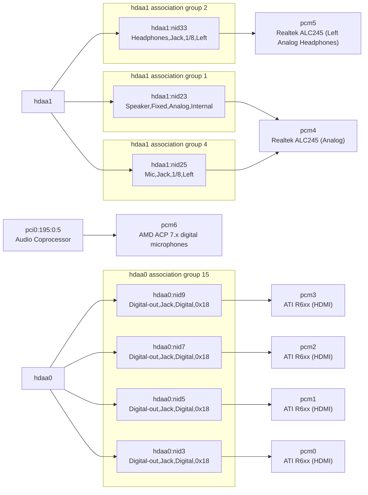

# hdaa2dot example: HP ZBook audio topology

Output of `hdaa2dot -m`: two HDA codecs (ATI HDMI, Realtek ALC245) and the AMD ACP digital microphones attached directly to PCI.

```mermaid
flowchart LR
  subgraph as_1_2 ["hdaa1 association group 2"]
    hdaa1_nid33["hdaa1:nid33<br/>Headphones,Jack,1/8,Left"]
  end
  subgraph as_1_1 ["hdaa1 association group 1"]
    hdaa1_nid23["hdaa1:nid23<br/>Speaker,Fixed,Analog,Internal"]
  end
  subgraph as_1_4 ["hdaa1 association group 4"]
    hdaa1_nid25["hdaa1:nid25<br/>Mic,Jack,1/8,Left"]
  end
  subgraph as_0_15 ["hdaa0 association group 15"]
    hdaa0_nid9["hdaa0:nid9<br/>Digital-out,Jack,Digital,0x18"]
    hdaa0_nid7["hdaa0:nid7<br/>Digital-out,Jack,Digital,0x18"]
    hdaa0_nid5["hdaa0:nid5<br/>Digital-out,Jack,Digital,0x18"]
    hdaa0_nid3["hdaa0:nid3<br/>Digital-out,Jack,Digital,0x18"]
  end
  pci0_195_0_5["pci0:195:0:5<br/>Audio Coprocessor"] --> pcm6["pcm6<br/>AMD ACP 7.x digital microphones"]
  hdaa1["hdaa1"] --> hdaa1_nid33["hdaa1:nid33<br/>Headphones,Jack,1/8,Left"]
  hdaa1_nid33["hdaa1:nid33<br/>Headphones,Jack,1/8,Left"] --> pcm5["pcm5<br/>Realtek ALC245 (Left Analog Headphones)"]
  hdaa1["hdaa1"] --> hdaa1_nid23["hdaa1:nid23<br/>Speaker,Fixed,Analog,Internal"]
  hdaa1_nid23["hdaa1:nid23<br/>Speaker,Fixed,Analog,Internal"] --> pcm4["pcm4<br/>Realtek ALC245 (Analog)"]
  hdaa1["hdaa1"] --> hdaa1_nid25["hdaa1:nid25<br/>Mic,Jack,1/8,Left"]
  hdaa1_nid25["hdaa1:nid25<br/>Mic,Jack,1/8,Left"] --> pcm4["pcm4<br/>Realtek ALC245 (Analog)"]
  hdaa0["hdaa0"] --> hdaa0_nid9["hdaa0:nid9<br/>Digital-out,Jack,Digital,0x18"]
  hdaa0_nid9["hdaa0:nid9<br/>Digital-out,Jack,Digital,0x18"] --> pcm3["pcm3<br/>ATI R6xx (HDMI)"]
  hdaa0["hdaa0"] --> hdaa0_nid7["hdaa0:nid7<br/>Digital-out,Jack,Digital,0x18"]
  hdaa0_nid7["hdaa0:nid7<br/>Digital-out,Jack,Digital,0x18"] --> pcm2["pcm2<br/>ATI R6xx (HDMI)"]
  hdaa0["hdaa0"] --> hdaa0_nid5["hdaa0:nid5<br/>Digital-out,Jack,Digital,0x18"]
  hdaa0_nid5["hdaa0:nid5<br/>Digital-out,Jack,Digital,0x18"] --> pcm1["pcm1<br/>ATI R6xx (HDMI)"]
  hdaa0["hdaa0"] --> hdaa0_nid3["hdaa0:nid3<br/>Digital-out,Jack,Digital,0x18"]
  hdaa0_nid3["hdaa0:nid3<br/>Digital-out,Jack,Digital,0x18"] --> pcm0["pcm0<br/>ATI R6xx (HDMI)"]
```
