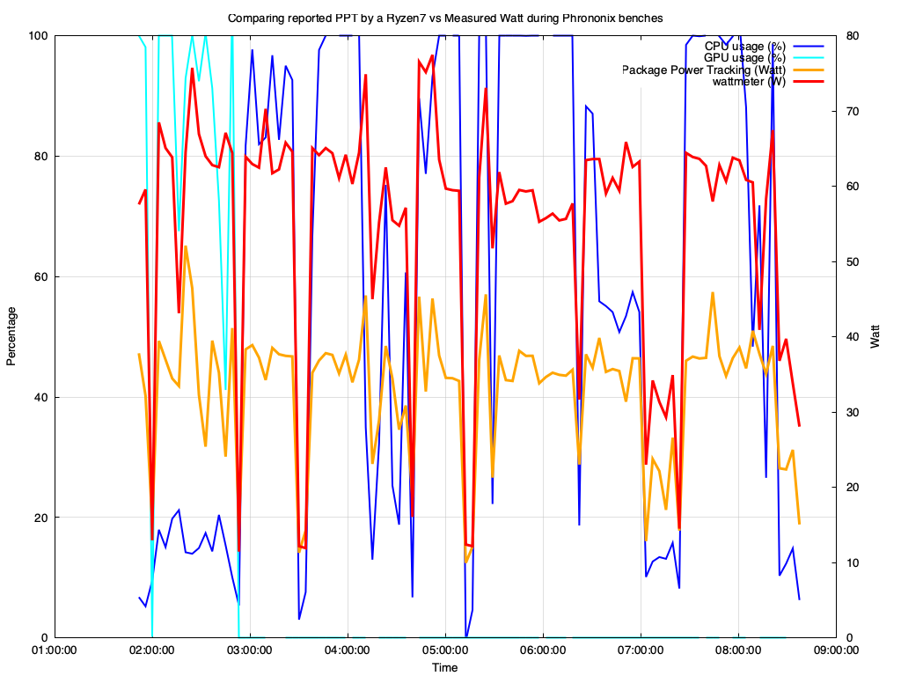

# sysload

Read drm drivers values to display CPU/GPU/RAM/VRAM usage using csv format

## Example

```
$ ./sysload -h
./sysload [-m] [-g] [-h] [-s hostname]
-h : display this message
-m : ministat mode, display avg values after 30 seconds of run
-s hostname: Get powe usage from a Shelly plug S
-t : Add timestamp (Epoc)
olivier@ryzen7:~/myscripts/Linux$ ./sysload -t
Epoc, CPU usage (%), CPU avg scaling freq (MHz), CPU max freq reached (%), mem Tot (MiB), mem Free (MiB), mem Used (MiB), mem Used (%), Package Power Tracking (Watt), CPU Temp (°C), GPU usage (%), GPU VRAM (mb), GPU VRAM usage (mb), GPU VRAM usage (%), GPU GTT (mb), GPU GTT usage (mb), GPU GTT usage (%),
1707751076, 9.1, 1682461.7, 34.8, 60001.9, 57899.6, 1580.3, 0.03, 13.1, 42, 0, 4096, 195, 0.0, 30000, 41, 0.0,
1707751077, 8.3, 1546423.0, 32.0, 60001.9, 57897.4, 1582.5, 0.03, 10.1, 42, 0, 4096, 195, 0.0, 30000, 41, 0.0,
1707751078, 9.1, 1452212.5, 30.1, 60001.9, 57895.2, 1584.7, 0.03, 13.0, 42, 0, 4096, 195, 0.0, 30000, 41, 0.0,
```

Check the [gnuplot example](ryzen7.gnuplot) to generate graph like this one:

