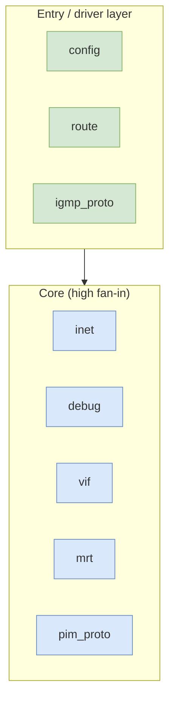
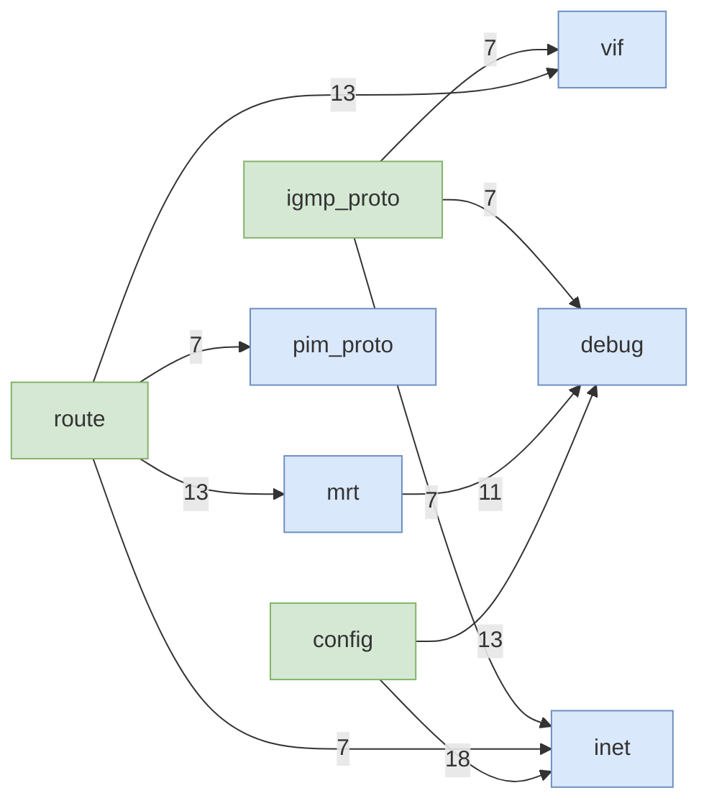
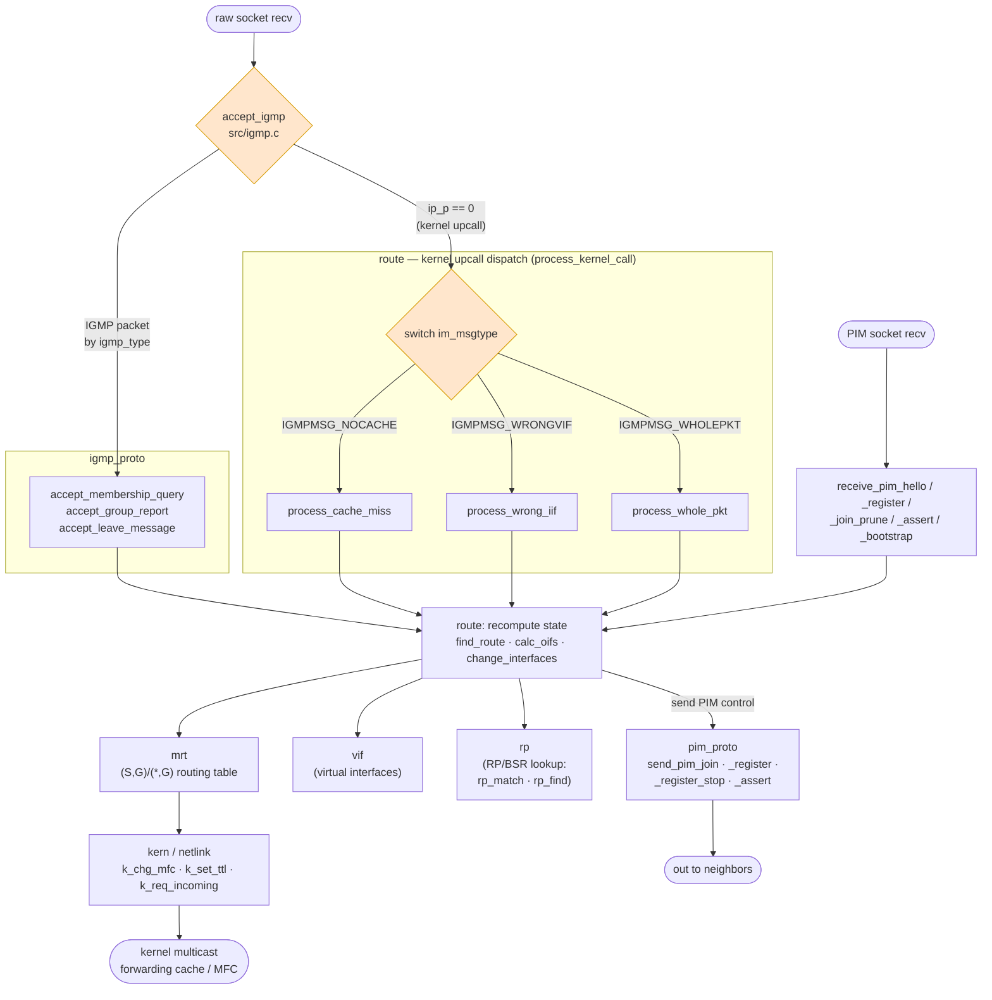
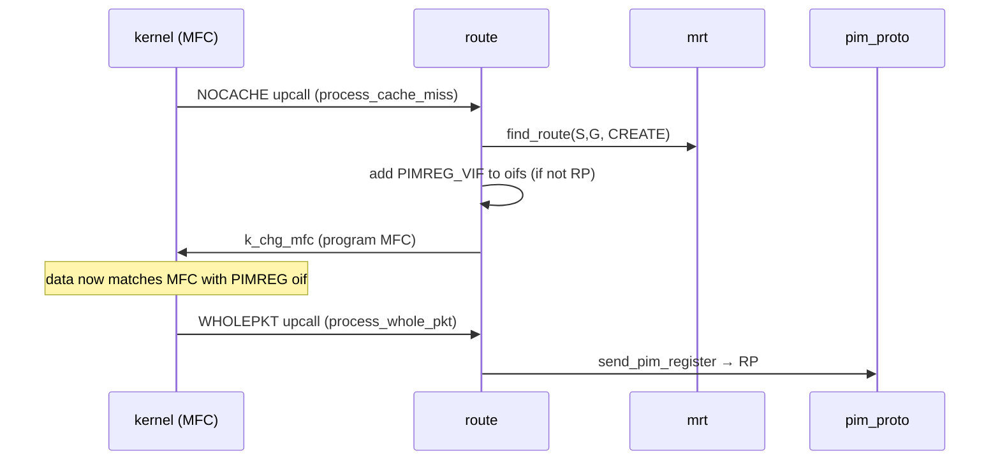

# pimd — Architecture Overview

`pimd` is a **PIM-SM** (Protocol Independent Multicast — Sparse Mode) multicast
routing daemon written in C. It is portable across many Unix platforms (FreeBSD,
NetBSD, OpenBSD, DragonFly, Linux, SunOS) via per-OS include shims.

> Generated from a structural analysis of the source tree (`src/` = 59 C files).
> Regenerate/verify against the code before relying on any detail here.

---

## Binaries (entry points)

| Binary   | Source          | Role                                                      |
|----------|-----------------|-----------------------------------------------------------|
| `pimd`   | `src/main.c`    | The multicast routing daemon.                             |
| `pimctl` | `src/pimctl.c`  | CLI control tool; talks to the daemon over an IPC socket. |

---

## Layered structure



The call graph splits into three tiers.

### Core (high fan-in — called by everything)

| Module      | Role                                          | Fan-in |
|-------------|-----------------------------------------------|--------|
| `inet`      | IP address formatting, checksums, validation  | 32     |
| `debug`     | logging (`logit`)                             | 31     |
| `vif`       | virtual interface (multicast iface) management| 20     |
| `mrt`       | multicast routing table (`find_route`)        | 13 in / 11 out |
| `pim_proto` | PIM protocol constants / helpers              | 7      |

### Entry / driver layer (only outbound calls — they orchestrate)

- `config` — parses the config file + kernel vif discovery.
- `route` — route computation; drives `vif` + `mrt` + `pim_proto`.
- `igmp_proto` — IGMP message handling (group joins/leaves).

---

## De-facto modules (graph clustering)

`src/` is a flat directory, so the functional seams below (from community
detection over the call graph) matter more than the folder layout.

1. **PIM route engine** — `find_route`, `receive_pim_join_prune`,
   `receive_pim_register`, `change_interfaces`
2. **IGMP membership** — `accept_igmp`, `accept_group_report`,
   `accept_leave_message`
3. **Daemon lifecycle** — `main`, `restart`, `init_igmp`, `init_pim`, `timer_set`
4. **Config parsing** — `config_vifs_from_file`, `next_word`, `parse_rp_candidate`
5. **PIM neighbor/hello** — `receive_pim_hello`, `delete_pim_nbr`, `send_pim`,
   `stop_vif`
6. **RP / bootstrap (BSR)** — `add_rp_grp_entry`, `receive_pim_bootstrap`,
   `remap_grpentry`, `rp_match`, `rp_find` (called inline from the PIM handlers)
7. **IPC / pimctl** — `ipc_handle`, `ipc_send`, `ipc_show` (daemon side) +
   `ipc_fetch`, `ipc_connect` (client side)
8. **Kernel interface** — `kern` (`k_chg_mfc`, `k_set_ttl`, `k_req_incoming`)
   and `netlink`: the layer that programs the kernel multicast forwarding
   cache (MFC). This is the sink of the forwarding-state control flow.

---

## Key cross-module dependencies (call boundaries)

Edge labels = number of distinct call sites.



Blue = core (high fan-in), green = entry/driver (only outbound calls).

---

## Data / control flow (the heart of the daemon)

*Verified against `src/igmp.c:183` (`accept_igmp`), `src/route.c:874`
(`process_kernel_call`), and the `receive_pim_*` handlers.*

The daemon reads two kinds of datagram off its raw sockets, and
**`accept_igmp` is the demultiplexer for both**:

- `ip->ip_p == 0` → the datagram is a **kernel upcall** (the forwarding
  plane asking the daemon to make a decision) → `process_kernel_call()`.
- otherwise → a real **IGMP** packet, dispatched by `igmp_type`.

PIM packets arrive on their own socket and enter via the `receive_pim_*`
handlers directly.



**Reading it (source-verified against `process_cache_miss`, `src/route.c:903`):**

- **`NOCACHE` = birth of forwarding state, not the Register send.** At the DR
  (`uv_flags & VIFF_DR` and the source is directly connected),
  `process_cache_miss` creates the `(S,G)` entry (`find_route(... CREATE)`) and
  — only if this router is *not* the RP for the group — adds the virtual
  register interface **`PIMREG_VIF`** to the entry's outgoing-interface set
  (`PIMD_VIFM_SET`). `k_chg_mfc` then programs that oif list into the kernel
  MFC. No packet is encapsulated here.
- **`WHOLEPKT` = the actual Register send.** Because `PIMREG_VIF` is now an oif,
  the kernel encapsulates matching data packets and sends them back up as
  `IGMPMSG_WHOLEPKT` upcalls; `process_whole_pkt` calls **`send_pim_register`**
  (its only callee) to unicast the PIM Register to the RP.
- **`WRONGVIF`** → `process_wrong_iif` drives PIM Asserts.
- Control-plane PIM packets (`receive_pim_*`) feed the same
  `route`→`mrt`/`vif`/`rp` recompute and loop back out through `pim_proto`
  senders.

The DR Register path therefore spans **two** upcalls:



### `send_pim_register` — Register-Suppression gate + caveats

`send_pim_register` (`src/pim_proto.c:904`) re-checks the DR/RP guards, gets or
creates the `(S,G)` entry, and encapsulates the data packet **only if the
Register-Suppression timer is not running** (`IF_TIMER_NOT_SET(rs_timer)`).
When the RP has native `(S,G)` forwarding it returns a Register-Stop, which
arms `rs_timer`; while that timer runs the DR refreshes state but skips the
encapsulate-and-send, suppressing redundant Registers.

Two source-level caveats observed while reading this function (neither is a
known bug; recorded for future work):

- **MTU is the source-side vif MTU, not the PMTU to the RP.**
  `reg_mtu = uvifs[vifi].uv_mtu;` carries an in-source `XXX: Use PMTU to RP
  instead!`. A large data packet toward a smaller-MTU path to the RP can
  fragment.
- **The payload copy is unbounded.** `memcpy(buf, ip, ntohs(ip->ip_len))`
  copies the original datagram into the fixed-size `pim_send_buf` with no
  length check against the buffer — it trusts the kernel's WHOLEPKT `ip_len`.

Buffer layout assembled across `send_pim_register` + `send_pim_unicast`:

```
pim_send_buf: [ struct ip ][ pim_header_t ][ pim_register_t ][ copied original IP datagram ]
              └─ added by send_pim_unicast/send_pim ─┘        └──── written by send_pim_register ────┘
```

---

## Portability layer

- Per-OS `include/*` directories: `freebsd`, `freebsd2`, `netbsd`, `openbsd`,
  `linux`, `dragonfly`, `sunos-cc`, `sunos-gcc` — each ~30-50 nodes wrapping
  platform kernel multicast APIs.
- Very macro-heavy (typical of a portable network daemon): the bulk of the
  symbol count is C macros and struct fields spread across these shims.

---

## Tests

- `test/` — network-topology integration tests (`topo`, `create_vpair`,
  `ifsetup`) with high cohesion (self-contained).
- `mping` — a multicast-ping helper used by the tests (`send_mping`,
  `sender_listen_loop`).

---

## Hotspots (most-called functions)

| Function          | Module | Fan-in |
|-------------------|--------|--------|
| `logit`           | debug  | 117    |
| `inet_fmt`        | inet   | 83     |
| `strlcpy`         | lib    | 15     |
| `local_address`   | vif    | 14     |
| `next_word`       | config | 13     |
| `find_route`      | mrt    | 12     |
| `change_interfaces` | route | 12     |
